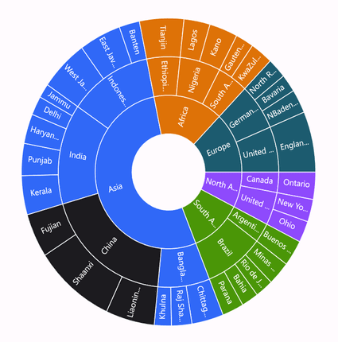
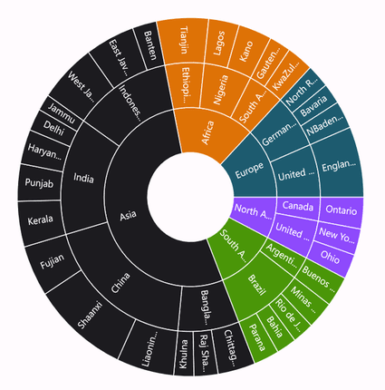
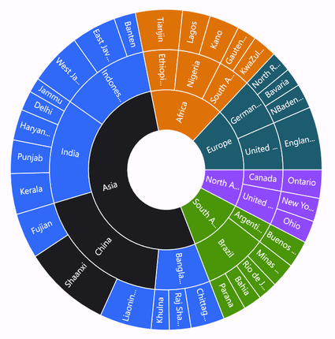
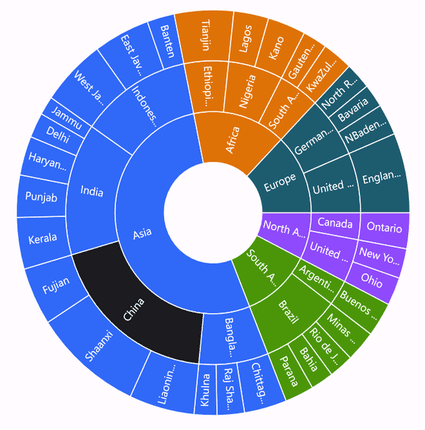
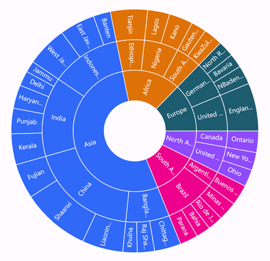
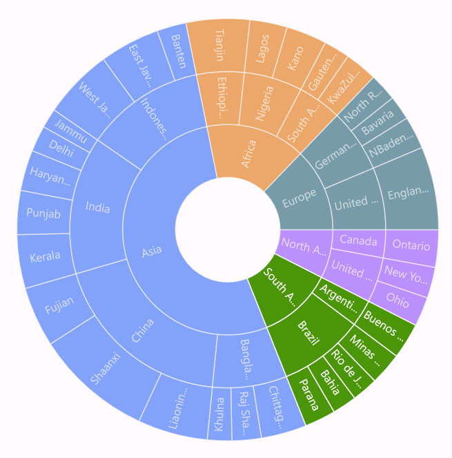
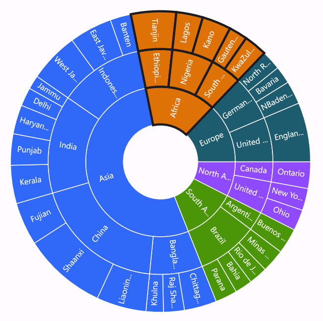

# Selection in .NET MAUI Sunburst Chart

The Sunburst Chart supports segment selection and visual highlighting. Selection is triggered by tapping (touch) or clicking (mouse) a segment, enabling users to interact with hierarchical data. Selection requires the chart to be bound to data via the [ItemsSource](https://help.syncfusion.com/cr/maui/Syncfusion.Maui.SunburstChart.SfSunburstChart.html#Syncfusion_Maui_SunburstChart_SfSunburstChart_ItemsSource), [ValueMemberPath](https://help.syncfusion.com/cr/maui/Syncfusion.Maui.SunburstChart.SfSunburstChart.html#Syncfusion_Maui_SunburstChart_SfSunburstChart_ValueMemberPath), and [Levels](https://help.syncfusion.com/cr/maui/Syncfusion.Maui.SunburstChart.SfSunburstChart.html#Syncfusion_Maui_SunburstChart_SfSunburstChart_Levels) properties.

N> **Prerequisite:** Ensure that the required NuGet package is installed, the necessary namespaces are imported, and the **Sunburst Chart** control is properly configured in your application. For detailed setup and configuration instructions, refer to the **[Getting Started](https://help.syncfusion.com/maui/sunburstchart/getting-started)** guide.

To enable selection, create an instance of the [SunburstSelectionSettings](https://help.syncfusion.com/cr/maui/Syncfusion.Maui.SunburstChart.SunburstSelectionSettings.html) class and assign it to the [SelectionSettings](https://help.syncfusion.com/cr/maui/Syncfusion.Maui.SunburstChart.SfSunburstChart.html#Syncfusion_Maui_SunburstChart_SfSunburstChart_SelectionSettings) property of the [SfSunburstChart](https://help.syncfusion.com/cr/maui/Syncfusion.Maui.SunburstChart.SfSunburstChart.html). The `Type` and `DisplayMode` properties of `SunburstSelectionSettings` are independent and can be combined.

## Selection Type

The [Type](https://help.syncfusion.com/cr/maui/Syncfusion.Maui.SunburstChart.SunburstSelectionSettings.html#Syncfusion_Maui_SunburstChart_SunburstSelectionSettings_Type) property of the [SunburstSelectionSettings](https://help.syncfusion.com/cr/maui/Syncfusion.Maui.SunburstChart.SunburstSelectionSettings.html) class configures which segments are highlighted when a segment is selected, using the [SunburstSelectionType](https://help.syncfusion.com/cr/maui/Syncfusion.Maui.SunburstChart.SunburstSelectionType.html) enum with the following values:

* [Child](https://help.syncfusion.com/cr/maui/Syncfusion.Maui.SunburstChart.SunburstSelectionType.html#Syncfusion_Maui_SunburstChart_SunburstSelectionType_Child): Highlights the selected segment along with its children in all levels.
* [Group](https://help.syncfusion.com/cr/maui/Syncfusion.Maui.SunburstChart.SunburstSelectionType.html#Syncfusion_Maui_SunburstChart_SunburstSelectionType_Group): Highlights the entire group of the selected segment in a hierarchy.
* [Parent](https://help.syncfusion.com/cr/maui/Syncfusion.Maui.SunburstChart.SunburstSelectionType.html#Syncfusion_Maui_SunburstChart_SunburstSelectionType_Parent): Highlights the parent of the selected segment in the hierarchy.
* [Single](https://help.syncfusion.com/cr/maui/Syncfusion.Maui.SunburstChart.SunburstSelectionType.html#Syncfusion_Maui_SunburstChart_SunburstSelectionType_Single): Highlights the selected segment alone.

The default value of the [Type](https://help.syncfusion.com/cr/maui/Syncfusion.Maui.SunburstChart.SunburstSelectionSettings.html#Syncfusion_Maui_SunburstChart_SunburstSelectionSettings_Type) property is [Single](https://help.syncfusion.com/cr/maui/Syncfusion.Maui.SunburstChart.SunburstSelectionType.html#Syncfusion_Maui_SunburstChart_SunburstSelectionType_Single). The following example shows the [Child](https://help.syncfusion.com/cr/maui/Syncfusion.Maui.SunburstChart.SunburstSelectionType.html#Syncfusion_Maui_SunburstChart_SunburstSelectionType_Child) selection type; the examples for `Group`, `Parent`, and `Single` differ only in the `Type` value.





<sunburst:SfSunburstChart>
    <sunburst:SfSunburstChart.SelectionSettings>
        <sunburst:SunburstSelectionSettings Type="Child"/>
    </sunburst:SfSunburstChart.SelectionSettings>
    <!-- code omitted for brevity -->
</sunburst:SfSunburstChart>





SfSunburstChart sunburstChart = new SfSunburstChart();
// code omitted for brevity
SunburstSelectionSettings selectionSettings = new SunburstSelectionSettings
{
    Type = SunburstSelectionType.Child
};
sunburstChart.SelectionSettings = selectionSettings;
this.Content = sunburstChart;





## Highlight Mode

The [DisplayMode](https://help.syncfusion.com/cr/maui/Syncfusion.Maui.SunburstChart.SunburstSelectionSettings.html#Syncfusion_Maui_SunburstChart_SunburstSelectionSettings_DisplayMode) property of the [SunburstSelectionSettings](https://help.syncfusion.com/cr/maui/Syncfusion.Maui.SunburstChart.SunburstSelectionSettings.html) class configures how segments are visually highlighted, using the [SunburstSelectionDisplayMode](https://help.syncfusion.com/cr/maui/Syncfusion.Maui.SunburstChart.SunburstSelectionDisplayMode.html) enum with the following values:

* [HighlightByBrush](https://help.syncfusion.com/cr/maui/Syncfusion.Maui.SunburstChart.SunburstSelectionDisplayMode.html#Syncfusion_Maui_SunburstChart_SunburstSelectionDisplayMode_HighlightByBrush): Highlights the selected segment using a brush (default).
* [HighlightByOpacity](https://help.syncfusion.com/cr/maui/Syncfusion.Maui.SunburstChart.SunburstSelectionDisplayMode.html#Syncfusion_Maui_SunburstChart_SunburstSelectionDisplayMode_HighlightByOpacity): Highlights the selected segment at full opacity and dims unselected segments.
* [HighlightByStroke](https://help.syncfusion.com/cr/maui/Syncfusion.Maui.SunburstChart.SunburstSelectionDisplayMode.html#Syncfusion_Maui_SunburstChart_SunburstSelectionDisplayMode_HighlightByStroke): Highlights the selected segment by applying a stroke to it.

The default value of the [DisplayMode](https://help.syncfusion.com/cr/maui/Syncfusion.Maui.SunburstChart.SunburstSelectionSettings.html#Syncfusion_Maui_SunburstChart_SunburstSelectionSettings_DisplayMode) property is [HighlightByBrush](https://help.syncfusion.com/cr/maui/Syncfusion.Maui.SunburstChart.SunburstSelectionDisplayMode.html#Syncfusion_Maui_SunburstChart_SunburstSelectionDisplayMode_HighlightByBrush).

### Brush

This mode highlights the selected segment using the brush defined in the [Fill](https://help.syncfusion.com/cr/maui/Syncfusion.Maui.SunburstChart.SunburstSelectionSettings.html#Syncfusion_Maui_SunburstChart_SunburstSelectionSettings_Fill) property of the [SunburstSelectionSettings](https://help.syncfusion.com/cr/maui/Syncfusion.Maui.SunburstChart.SunburstSelectionSettings.html) class.





<sunburst:SfSunburstChart>
    <sunburst:SfSunburstChart.SelectionSettings>
        <sunburst:SunburstSelectionSettings Fill="DarkRed" DisplayMode="HighlightByBrush" Type="Child"/>
    </sunburst:SfSunburstChart.SelectionSettings>
    <!-- code omitted for brevity -->
</sunburst:SfSunburstChart>





SfSunburstChart sunburstChart = new SfSunburstChart();
// code omitted for brevity
SunburstSelectionSettings selectionSettings = new SunburstSelectionSettings
{
    Fill = Colors.DarkRed,
    DisplayMode = SunburstSelectionDisplayMode.HighlightByBrush,
    Type = SunburstSelectionType.Child
};
sunburstChart.SelectionSettings = selectionSettings;
this.Content = sunburstChart;





### Opacity

This mode renders the selected segment at full opacity (1) and dims the unselected segments to the [Opacity](https://help.syncfusion.com/cr/maui/Syncfusion.Maui.SunburstChart.SunburstSelectionSettings.html#Syncfusion_Maui_SunburstChart_SunburstSelectionSettings_Opacity) value. The default Opacity value is `0.6`.





<sunburst:SfSunburstChart>
    <sunburst:SfSunburstChart.SelectionSettings>
        <sunburst:SunburstSelectionSettings Opacity="0.6" DisplayMode="HighlightByOpacity" Type="Child"/>
    </sunburst:SfSunburstChart.SelectionSettings>
    <!-- code omitted for brevity -->
</sunburst:SfSunburstChart>





SfSunburstChart sunburstChart = new SfSunburstChart();
// code omitted for brevity
SunburstSelectionSettings selectionSettings = new SunburstSelectionSettings
{
    Opacity = 0.6,
    DisplayMode = SunburstSelectionDisplayMode.HighlightByOpacity,
    Type = SunburstSelectionType.Child
};
sunburstChart.SelectionSettings = selectionSettings;
this.Content = sunburstChart;





### Stroke

This mode highlights the selected segment by applying a stroke to it. The color and thickness of the stroke can be customized using the [Stroke](https://help.syncfusion.com/cr/maui/Syncfusion.Maui.SunburstChart.SunburstSelectionSettings.html#Syncfusion_Maui_SunburstChart_SunburstSelectionSettings_Stroke) and [StrokeWidth](https://help.syncfusion.com/cr/maui/Syncfusion.Maui.SunburstChart.SunburstSelectionSettings.html#Syncfusion_Maui_SunburstChart_SunburstSelectionSettings_StrokeWidth) properties. The default StrokeWidth value is `2`.





<sunburst:SfSunburstChart>
    <sunburst:SfSunburstChart.SelectionSettings>
        <sunburst:SunburstSelectionSettings Stroke="Black" StrokeWidth="3" DisplayMode="HighlightByStroke" Type="Child"/>
    </sunburst:SfSunburstChart.SelectionSettings>
    <!-- code omitted for brevity -->
</sunburst:SfSunburstChart>





SfSunburstChart sunburstChart = new SfSunburstChart();
// code omitted for brevity
SunburstSelectionSettings selectionSettings = new SunburstSelectionSettings
{
    Stroke = Colors.Black,
    StrokeWidth = 3,
    DisplayMode = SunburstSelectionDisplayMode.HighlightByStroke,
    Type = SunburstSelectionType.Child
};
sunburstChart.SelectionSettings = selectionSettings;
this.Content = sunburstChart;





## Events

The Sunburst Chart raises events before and after a segment is selected or deselected.

### SelectionChanging

The [SelectionChanging](https://help.syncfusion.com/cr/maui/Syncfusion.Maui.SunburstChart.SunburstSelectionChangingEventArgs.html) event is triggered when a segment is about to be selected. This is a cancelable event. The following properties are contained in the event arguments:

* [NewSegment](https://help.syncfusion.com/cr/maui/Syncfusion.Maui.SunburstChart.SunburstSelectionChangingEventArgs.html#Syncfusion_Maui_SunburstChart_SunburstSelectionChangingEventArgs_NewSegment): Gets the segment that will be selected.
* [OldSegment](https://help.syncfusion.com/cr/maui/Syncfusion.Maui.SunburstChart.SunburstSelectionChangingEventArgs.html#Syncfusion_Maui_SunburstChart_SunburstSelectionChangingEventArgs_OldSegment): Gets the segment that was previously selected or deselected.
* [Cancel](https://help.syncfusion.com/cr/maui/Syncfusion.Maui.SunburstChart.SunburstSelectionChangingEventArgs.html#Syncfusion_Maui_SunburstChart_SunburstSelectionChangingEventArgs_Cancel): Gets or sets a value indicating whether to cancel the selection.





<sunburst:SfSunburstChart SelectionChanging="SunburstChart_SelectionChanging">
    <!-- code omitted for brevity -->
</sunburst:SfSunburstChart>





SfSunburstChart sunburstChart = new SfSunburstChart();
sunburstChart.SelectionChanging += SunburstChart_SelectionChanging;
// code omitted for brevity
this.Content = sunburstChart;

private void SunburstChart_SelectionChanging(object sender, SunburstSelectionChangingEventArgs e)
{
    e.Cancel = false;
}





### SelectionChanged

The [SelectionChanged](https://help.syncfusion.com/cr/maui/Syncfusion.Maui.SunburstChart.SunburstSelectionChangedEventArgs.html) event occurs after a segment is selected or deselected. The following properties are contained in the event arguments:

* [IsSelected](https://help.syncfusion.com/cr/maui/Syncfusion.Maui.SunburstChart.SunburstSelectionChangedEventArgs.html#Syncfusion_Maui_SunburstChart_SunburstSelectionChangedEventArgs_IsSelected): Indicates whether a segment is selected.
* [NewSegment](https://help.syncfusion.com/cr/maui/Syncfusion.Maui.SunburstChart.SunburstSelectionChangedEventArgs.html#Syncfusion_Maui_SunburstChart_SunburstSelectionChangedEventArgs_NewSegment): Gets the segment that was selected.
* [OldSegment](https://help.syncfusion.com/cr/maui/Syncfusion.Maui.SunburstChart.SunburstSelectionChangedEventArgs.html#Syncfusion_Maui_SunburstChart_SunburstSelectionChangedEventArgs_OldSegment): Gets the segment that was previously selected or deselected.





<sunburst:SfSunburstChart SelectionChanged="SunburstChart_SelectionChanged">
    <!-- code omitted for brevity -->
</sunburst:SfSunburstChart>





SfSunburstChart sunburstChart = new SfSunburstChart();
sunburstChart.SelectionChanged += SunburstChart_SelectionChanged;
// code omitted for brevity
this.Content = sunburstChart;

private void SunburstChart_SelectionChanged(object sender, SunburstSelectionChangedEventArgs e)
{
    var isSelected = e.IsSelected;
}




