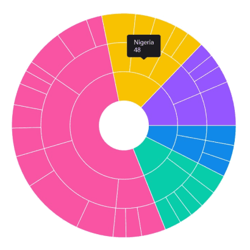
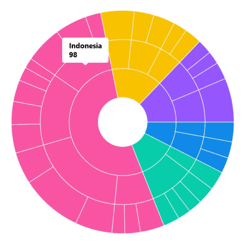
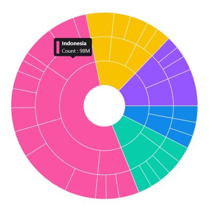

# Tooltip in .NET MAUI Sunburst Chart 

Tooltips provide additional information about segments in the sunburst chart. A tooltip is displayed when tapping on a segment. By default, the tooltip displays the corresponding segment's category and value.

## Enable Tooltip

To enable tooltips in the chart, set the [EnableTooltip](https://help.syncfusion.com/cr/maui/Syncfusion.Maui.SunburstChart.SfSunburstChart.html#Syncfusion_Maui_SunburstChart_SfSunburstChart_EnableTooltip) property of [SfSunburstChart](https://help.syncfusion.com/cr/maui/Syncfusion.Maui.SunburstChart.SfSunburstChart.html) to true. The default value of the EnableTooltip property is `False`.





<sunburst:SfSunburstChart EnableTooltip="True">
. . .
</sunburst:SfSunburstChart>





SfSunburstChart sunburst = new SfSunburstChart();
. . .      
sunburst.EnableTooltip = true;
this.Content = sunburst;





## Customization

The appearance of the tooltip can be customized using the following properties:

* [Background](https://help.syncfusion.com/cr/maui/Syncfusion.Maui.SunburstChart.SunburstTooltipSettings.html#Syncfusion_Maui_SunburstChart_SunburstTooltipSettings_Background) of type `Brush`, specifies the background color of the tooltip.
* [FontAttributes](https://help.syncfusion.com/cr/maui/Syncfusion.Maui.SunburstChart.SunburstTooltipSettings.html#Syncfusion_Maui_SunburstChart_SunburstTooltipSettings_FontAttributes) of type `FontAttributes`, specifies the font style of the tooltip text.
* [FontFamily](https://help.syncfusion.com/cr/maui/Syncfusion.Maui.SunburstChart.SunburstTooltipSettings.html#Syncfusion_Maui_SunburstChart_SunburstTooltipSettings_FontFamily) of type `string`, specifies the font family for the tooltip text.
* [FontSize](https://help.syncfusion.com/cr/maui/Syncfusion.Maui.SunburstChart.SunburstTooltipSettings.html#Syncfusion_Maui_SunburstChart_SunburstTooltipSettings_FontSize) of type `float`, specifies the font size of the tooltip text.
* [Duration](https://help.syncfusion.com/cr/maui/Syncfusion.Maui.SunburstChart.SunburstTooltipSettings.html#Syncfusion_Maui_SunburstChart_SunburstTooltipSettings_Duration) of type `int`, specifies how long the tooltip should be displayed (in milliseconds).
* [Margin](https://help.syncfusion.com/cr/maui/Syncfusion.Maui.SunburstChart.SunburstTooltipSettings.html#Syncfusion_Maui_SunburstChart_SunburstTooltipSettings_Margin) of type `Thickness`, specifies the margin around the tooltip content.
* [TextColor](https://help.syncfusion.com/cr/maui/Syncfusion.Maui.SunburstChart.SunburstTooltipSettings.html#Syncfusion_Maui_SunburstChart_SunburstTooltipSettings_TextColor) of type `Color`, specifies the color of the tooltip text.





<sunburst:SfSunburstChart EnableTooltip="True">
    . . .
    <sunburst:SfSunburstChart.TooltipSettings>
        <sunburst:SunburstTooltipSettings   
            Background="White" TextColor="Black"  
            FontSize="14" FontAttributes="Bold" 
            Duration="5"/>
    </sunburst:SfSunburstChart.TooltipSettings>
    . . .
</sunburst:SfSunburstChart>
    




SfSunburstChart sunburst = new SfSunburstChart();
. . .
sunburst.EnableTooltip = true;
SunburstTooltipSettings tooltipSettings = new SunburstTooltipSettings()
{
    TextColor = Colors.Black,
    Background = Brush.White,
    FontSize = 14,
    Duration = 5
};
sunburst.TooltipSettings = tooltipSettings;
. . .
this.Content = sunburst;





## Custom Template

The sunburst chart provides support for customizing the appearance of the tooltip by using the [TooltipTemplate](https://help.syncfusion.com/cr/maui/Syncfusion.Maui.SunburstChart.SfSunburstChart.html#Syncfusion_Maui_SunburstChart_SfSunburstChart_TooltipTemplate) property.





<sunburst:SfSunburstChart EnableTooltip="True" 
                          TooltipTemplate="{StaticResource template1}">
    . . .
    <sunburst:SfSunburstChart.Resources>
        <ResourceDictionary>
            <DataTemplate x:Key="template1">
                <StackLayout Orientation="Horizontal">
                    <Rectangle HeightRequest="30" WidthRequest="8" Fill="{Binding Fill}"/>
                    <StackLayout Orientation="Vertical">
                        <Label Text="{Binding Item[0]}" 
                               TextColor="White" FontFamily="Helvetica" 
                               FontSize="12.5" Padding="5,0,0,0"
                               FontAttributes="Bold"/>
                        <Label Text="{Binding Item[1],StringFormat='Count : {0}M'}" 
                               TextColor="White" FontFamily="Helvetica" 
                               FontSize="12" Padding="5,0,0,0" Margin="0,2,0,0"/>
                    </StackLayout>
                </StackLayout>
            </DataTemplate>
        </ResourceDictionary>
    </sunburst:SfSunburstChart.Resources>
    . . .
</sunburst:SfSunburstChart>
    




SfSunburstChart sunburst = new SfSunburstChart();
. . .
sunburst.EnableTooltip = true;
sunburst.TooltipTemplate = (DataTemplate)sunburst.Resources["template1"];
. . .
this.Content = sunburst;





