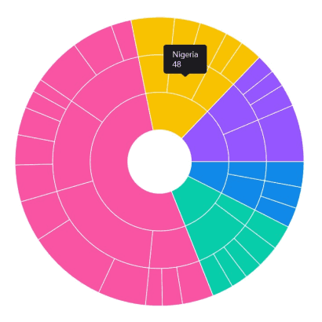
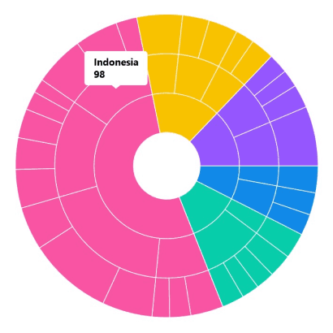
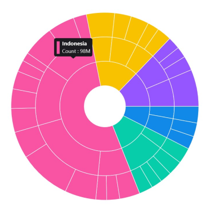

# Tooltip in .NET MAUI Sunburst Chart

Tooltips provide additional information about segments in the sunburst chart. A tooltip is displayed when a segment is tapped or clicked. By default, the tooltip displays the corresponding segment's category (from the `Levels` group property) and value (from the `ValueMemberPath` property).

N> **Prerequisite:** Ensure that the required NuGet package is installed, the necessary namespaces are imported, and the **Sunburst Chart** control is properly configured in your application. For detailed setup and configuration instructions, refer to the **[Getting Started](https://help.syncfusion.com/maui/sunburstchart/getting-started)** guide.

## Enable tooltip

To enable tooltips in the chart, set the [EnableTooltip](https://help.syncfusion.com/cr/maui/Syncfusion.Maui.SunburstChart.SfSunburstChart.html#Syncfusion_Maui_SunburstChart_SfSunburstChart_EnableTooltip) property of [SfSunburstChart](https://help.syncfusion.com/cr/maui/Syncfusion.Maui.SunburstChart.SfSunburstChart.html) to `true`. The default value of the EnableTooltip property is `false`.





<sunburst:SfSunburstChart EnableTooltip="True">
    <!-- code omitted for brevity -->
</sunburst:SfSunburstChart>





SfSunburstChart sunburst = new SfSunburstChart();
// code omitted for brevity
sunburst.EnableTooltip = true;
this.Content = sunburst;





## Customization

To customize the tooltip, create an instance of the [SunburstTooltipSettings](https://help.syncfusion.com/cr/maui/Syncfusion.Maui.SunburstChart.SunburstTooltipSettings.html) class and assign it to the [TooltipSettings](https://help.syncfusion.com/cr/maui/Syncfusion.Maui.SunburstChart.SfSunburstChart.html#Syncfusion_Maui_SunburstChart_SfSunburstChart_TooltipSettings) property of the [SfSunburstChart](https://help.syncfusion.com/cr/maui/Syncfusion.Maui.SunburstChart.SfSunburstChart.html). The following properties of [SunburstTooltipSettings](https://help.syncfusion.com/cr/maui/Syncfusion.Maui.SunburstChart.SunburstTooltipSettings.html) are used to customize the tooltip appearance:

* [Background](https://help.syncfusion.com/cr/maui/Syncfusion.Maui.SunburstChart.SunburstTooltipSettings.html#Syncfusion_Maui_SunburstChart_SunburstTooltipSettings_Background), of type `Brush`, specifies the background color of the tooltip.
* [FontAttributes](https://help.syncfusion.com/cr/maui/Syncfusion.Maui.SunburstChart.SunburstTooltipSettings.html#Syncfusion_Maui_SunburstChart_SunburstTooltipSettings_FontAttributes), of type `FontAttributes`, specifies the font style of the tooltip text.
* [FontFamily](https://help.syncfusion.com/cr/maui/Syncfusion.Maui.SunburstChart.SunburstTooltipSettings.html#Syncfusion_Maui_SunburstChart_SunburstTooltipSettings_FontFamily), of type `string`, specifies the font family for the tooltip text.
* [FontSize](https://help.syncfusion.com/cr/maui/Syncfusion.Maui.SunburstChart.SunburstTooltipSettings.html#Syncfusion_Maui_SunburstChart_SunburstTooltipSettings_FontSize), of type `float`, specifies the font size of the tooltip text.
* [Duration](https://help.syncfusion.com/cr/maui/Syncfusion.Maui.SunburstChart.SunburstTooltipSettings.html#Syncfusion_Maui_SunburstChart_SunburstTooltipSettings_Duration), of type `int`, specifies how long the tooltip should be displayed (in seconds). The default value is `5`.
* [Margin](https://help.syncfusion.com/cr/maui/Syncfusion.Maui.SunburstChart.SunburstTooltipSettings.html#Syncfusion_Maui_SunburstChart_SunburstTooltipSettings_Margin), of type `Thickness`, specifies the margin around the tooltip content.
* [TextColor](https://help.syncfusion.com/cr/maui/Syncfusion.Maui.SunburstChart.SunburstTooltipSettings.html#Syncfusion_Maui_SunburstChart_SunburstTooltipSettings_TextColor), of type `Color`, specifies the color of the tooltip text.
* `Stroke`, of type `Brush`, specifies the border color of the tooltip.
* `StrokeWidth`, of type `double`, specifies the thickness of the tooltip border.
* `UseSeriesFillColor`, of type `bool`, specifies whether the tooltip background should use the fill color of the associated segment. When set to `true`, the tooltip adopts the segment color as its background.





<sunburst:SfSunburstChart EnableTooltip="True">
    <sunburst:SfSunburstChart.TooltipSettings>
        <sunburst:SunburstTooltipSettings
                                        Background="White"
                                        TextColor="Black"
                                        FontSize="14"
                                        FontAttributes="Bold"
                                        Duration="5"/>
    </sunburst:SfSunburstChart.TooltipSettings>
    <!-- code omitted for brevity -->
</sunburst:SfSunburstChart>





SfSunburstChart sunburst = new SfSunburstChart();
// code omitted for brevity
sunburst.EnableTooltip = true;
SunburstTooltipSettings tooltipSettings = new SunburstTooltipSettings()
{
    TextColor = Colors.Black,
    Background = Colors.White,
    FontSize = 14,
    Duration = 5
};
sunburst.TooltipSettings = tooltipSettings;
this.Content = sunburst;





## Custom template

Customize the tooltip appearance using the [TooltipTemplate](https://help.syncfusion.com/cr/maui/Syncfusion.Maui.SunburstChart.SfSunburstChart.html#Syncfusion_Maui_SunburstChart_SfSunburstChart_TooltipTemplate) property of [SfSunburstChart](https://help.syncfusion.com/cr/maui/Syncfusion.Maui.SunburstChart.SfSunburstChart.html), which accepts a `DataTemplate`. The data context of the template exposes the segment data, where the `Fill` property provides the segment's fill color and the `Item` collection provides the bound data values (e.g., `Item[0]` for the category and `Item[1]` for the value).





<sunburst:SfSunburstChart EnableTooltip="True"
                          TooltipTemplate="{StaticResource template1}">
    <sunburst:SfSunburstChart.Resources>
        <ResourceDictionary>
            <DataTemplate x:Key="template1">
                <HorizontalStackLayout Spacing="5">
                    <Rectangle HeightRequest="30"
                               WidthRequest="8"
                               Fill="{Binding Fill}"/>
                    <VerticalStackLayout>
                        <Label Text="{Binding Item[0]}"
                               TextColor="White"
                               FontFamily="Helvetica"
                               FontSize="12.5"
                               Padding="5,0,0,0"
                               FontAttributes="Bold"/>
                        <Label Text="{Binding Item[1], StringFormat='Count : {0}M'}"
                               TextColor="White"
                               FontFamily="Helvetica"
                               FontSize="12"
                               Padding="5,0,0,0"
                               Margin="0,2,0,0"/>
                    </VerticalStackLayout>
                </HorizontalStackLayout>
            </DataTemplate>
        </ResourceDictionary>
    </sunburst:SfSunburstChart.Resources>
    <!-- code omitted for brevity -->
</sunburst:SfSunburstChart>





SfSunburstChart sunburst = new SfSunburstChart();
// code omitted for brevity
sunburst.EnableTooltip = true;
sunburst.TooltipTemplate = (DataTemplate)sunburst.Resources["template1"];

this.Content = sunburst;





