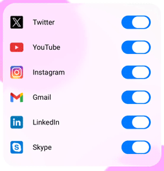

# Liquid Glass Support in .NET MAUI Switch

## Prerequisites

Before using the [`SfSwitch`](https://help.syncfusion.com/cr/maui/Syncfusion.Maui.Buttons.SfSwitch.html), ensure the following NuGet package is installed in your .NET MAUI project:

- `Syncfusion.Maui.Buttons`

For a step-by-step setup, refer to the [Getting Started](https://help.syncfusion.com/maui/switch/getting-started) documentation.

The [SfSwitch](https://help.syncfusion.com/cr/maui/Syncfusion.Maui.Buttons.SfSwitch.html) control renders a glass (also called acrylic or glass morphism) effect on the track and thumb when the [`EnableLiquidGlassEffect`](https://help.syncfusion.com/cr/maui/Syncfusion.Maui.Buttons.SfSwitch.html#Syncfusion_Maui_Buttons_SfSwitch_EnableLiquidGlassEffect) property is set to `true`. The effect is visible against vibrant images or colorful backgrounds and updates on user interaction.

* [`EnableLiquidGlassEffect`](https://help.syncfusion.com/cr/maui/Syncfusion.Maui.Buttons.SfSwitch.html#Syncfusion_Maui_Buttons_SfSwitch_EnableLiquidGlassEffect): A `bool` property that enables the Liquid Glass effect on the Switch. The default value is `false`.

N> This feature is supported only on `.NET 10` together with `iOS 26` and `macOS 26`. It is not supported on Android, Windows, or earlier versions of iOS and macOS.

N> The `EnableLiquidGlassEffect` property is available in Syncfusion® .NET MAUI Buttons package version 30.2.4.x or later.




<Grid>
    <!-- Background to make the glass effect visible while pressing the switch -->
    <Image Source="wallpaper.jpg" Aspect="AspectFill" />
    <syncfusion:SfSwitch x:Name="sfSwitch" EnableLiquidGlassEffect="True" />
</Grid>




SfSwitch sfSwitch = new SfSwitch
{
    EnableLiquidGlassEffect = true
};
this.Content = sfSwitch;




## Behavior

- The glass effect is applied during rendering and on every user interaction.
- The effect is most visible when the Switch is placed over visually rich content such as images, gradients, or color blocks.
- The Liquid Glass effect can be combined with the [`SwitchSettings`](https://help.syncfusion.com/cr/maui/Syncfusion.Maui.Buttons.SwitchSettings.html) properties, and the [`AllowIndeterminateState`](https://help.syncfusion.com/cr/maui/Syncfusion.Maui.Buttons.SfSwitch.html#Syncfusion_Maui_Buttons_SfSwitch_AllowIndeterminateState) property.

## Tips

- Use an image with sufficient detail so that the glass effect is noticeable. A solid color background will hide the effect.
- Keep background file sizes reasonable to avoid affecting the app's memory usage on mobile devices.
- Verify the effect on a physical iOS or macOS device, since the simulator may render glass effects differently.

The following GIF demonstrates the Liquid Glass effect on the Switch.

