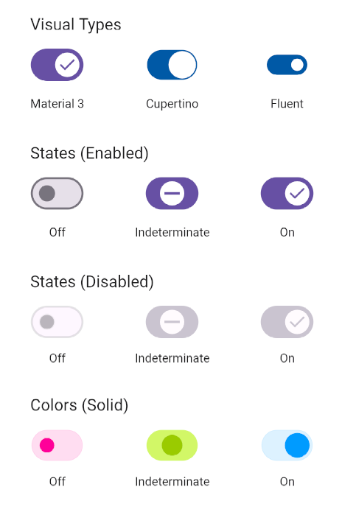

# .NET MAUI Switch (SfSwitch) Overview

The .NET MAUI Switch control provides an efficient way to toggle between states based on the selected value.

## Business use cases

- Settings screens that allow users to **enable or disable application features using toggle switches**.  
- Mobile and desktop applications that require **quick on and off interactions for preferences or options**.  
- Forms and configuration panels that manage **boolean inputs such as notifications, permissions, or visibility**.  
- Business applications that require **clear and immediate state changes for user-driven actions**.  

## Key features

- **Binary state** allows toggling between on and off values with visual feedback.  
- **Indeterminate state** allows representing intermediate or undefined states when needed.  
- **Theme customization** allows applying styles such as Material, Cupertino, and Fluent for consistent UI design.  
- **Visual state management** allows controlling appearance changes based on different interaction states.  
- **Thumb customization** allows modifying the thumb content and visual appearance for enhanced UI flexibility.

   

## Globalization

The following table summarizes the globalization support available in the [SfSwitch](https://www.syncfusion.com/maui-controls/maui-switch) control.

 Full Support    
 Not Applicable

<table>
<tr>
<th align="center">Control</th>
<th align="center">Localization</th>
<th align="center">RTL</th>
<th align="center">Time zone</th>
<th align="center">Screen reader</th>
<th align="center">Keyboard navigation</th>
</tr>
<tr>
<td><a href="/maui/switch/overview">Switch</a></td>
<td align="center"></td>
<td align="center"></td>
<td align="center"></td>
<td align="center"></td>
<td align="center"></td>
</tr> 
</table>

## Related controls

- **[Radio Button](https://help.syncfusion.com/maui/radio-button/overview)** for selecting one option from a group of choices.
- **[CheckBox](https://help.syncfusion.com/maui/checkbox/overview)** for handling multiple selection inputs.  
- **[Segmented Controls](https://help.syncfusion.com/maui/segmented-control/overview)** for grouped button-based selection.

## Next steps

Explore further resources:

- [Getting Started](https://help.syncfusion.com/maui/switch/getting-started) - step-by-step guide to begin using the Switch control.
- [Customization](https://help.syncfusion.com/maui/switch/customization) - customize appearance and themes.
- [States](https://help.syncfusion.com/maui/switch/states) - configure states and behavior.
- [UI Kit](https://www.syncfusion.com/demos/maui#maui-ui-control) - explore interactive demos and ready‑made UI examples.

## Learnings

<!-- Card 1 -->
<a href="https://www.syncfusion.com/blogs/category/net-maui" class="form-card" target="_blank">
  

    <h3 class="form-title">Explore Blogs</h3>
    

      Read insights, tutorials, and developer journeys.
    

  

</a>
<!-- Card 2 -->
<a href="https://support.syncfusion.com/kb/cross-platforms/category/76" class="form-card" target="_blank">
  

    <h3 class="form-title">Explore KB's</h3>
    

      Find quick solutions and step‑by‑step guidance.
    

  

</a>
<!-- Card 3 -->
<a href="https://www.syncfusion.com/maui-controls/maui-switch" class="form-card" target="_blank">
  

    <h3 class="form-title">Feature Tour</h3>
    

      Walk through highlights and core capabilities.
    

  

</a>
<!-- Card 4 -->
<a href="https://www.syncfusion.com/tutorial-videos/maui/switch" class="form-card" target="_blank">
  

    <h3 class="form-title">Tutorial Videos</h3>
    

      Step‑by‑step guidance through video tutorials.
    

  

</a>
