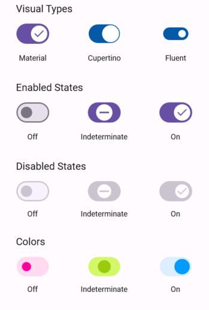

# .NET MAUI Switch (SfSwitch) Overview

The .NET MAUI Switch control provides an efficient way to toggle between states based on the selected value.

## Key features

 * Visualize an indeterminate state.
 * Customize the visuals with themes like Material, Cupertino, and Fluent.
 * Visual state manager powers the control.
 * Customize the path inside the thumb.

