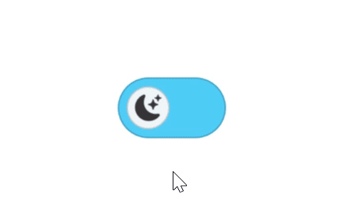

# Visual State Manager in .NET MAUI Switch (SfSwitch)

Use the `Visual State Manager (VSM)` to change Switch properties in response to visual state changes. The `CommonStates` group is automatically maintained by .NET MAUI and contains the following states:

* `On`, `Off`, `Indeterminate` — the resting states.
* `OnHovered`, `OffHovered`, `IndeterminateHovered` — applied when the pointer is over the Switch.
* `OnPressed`, `OffPressed`, `IndeterminatePressed` — applied while the Switch is being tapped or clicked.
* `OnDisabled`, `OffDisabled`, `IndeterminateDisabled` — applied when [`IsEnabled`](https://help.syncfusion.com/cr/maui/Syncfusion.Maui.Buttons.SfSwitch.html#Syncfusion_Maui_Buttons_SfSwitch_IsEnabled) is `false`.

N> Before proceeding, ensure that the Syncfusion® MAUI Buttons package is installed and the required namespace is registered. For more information, refer to the [Getting Started](Getting-Started.md) documentation.

N> The `VisualStateGroup` must be named `CommonStates` for the .NET MAUI VSM to apply the states automatically. The `Indeterminate` family of states is only active when [`AllowIndeterminateState`](https://help.syncfusion.com/cr/maui/Syncfusion.Maui.Buttons.SfSwitch.html#Syncfusion_Maui_Buttons_SfSwitch_AllowIndeterminateState) is set to `true`.

The following example shows how to apply a different [`SwitchSettings`](https://help.syncfusion.com/cr/maui/Syncfusion.Maui.Buttons.SwitchSettings.html) object to each state. For the full list of properties available on `SwitchSettings`, see [Customization in .NET MAUI Switch](customization.md).





<ContentPage xmlns:syncfusion="clr-namespace:Syncfusion.Maui.Buttons;assembly=Syncfusion.Maui.Buttons">
    <syncfusion:SfSwitch IsEnabled="True" IsOn="True">
        <VisualStateManager.VisualStateGroups>
            <VisualStateGroup x:Name="CommonStates">
                <VisualState x:Name="On">
                    <VisualState.Setters>
                        <Setter Property="SwitchSettings">
                            <Setter.Value>
                                <syncfusion:SwitchSettings
                                    ThumbBackground="#F57B31"
                                    ThumbCornerRadius="20"
                                    ThumbHeightRequest="35"
                                    ThumbStroke="#F78F50"
                                    ThumbStrokeThickness="1"
                                    ThumbWidthRequest="35"
                                    TrackBackground="#F7D40D"
                                    TrackHeightRequest="50"
                                    TrackStroke="#DABA04"
                                    TrackCornerRadius="25"
                                    TrackStrokeThickness="1"
                                    TrackWidthRequest="90"/>
                            </Setter.Value>
                        </Setter>
                    </VisualState.Setters>
                </VisualState>
                <VisualState x:Name="Off">
                    <VisualState.Setters>
                        <Setter Property="SwitchSettings">
                            <Setter.Value>
                                <syncfusion:SwitchSettings
                                    ThumbBackground="#F0F5F8"
                                    ThumbCornerRadius="20"
                                    ThumbHeightRequest="35"
                                    ThumbStroke="#C7C9C9"
                                    ThumbStrokeThickness="1"
                                    ThumbWidthRequest="35"
                                    TrackBackground="#4FCFF7"
                                    TrackHeightRequest="50"
                                    TrackStroke="#359EBF"
                                    TrackCornerRadius="25"
                                    TrackStrokeThickness="1"
                                    TrackWidthRequest="90"/>
                            </Setter.Value>
                        </Setter>
                    </VisualState.Setters>
                </VisualState>
                <VisualState x:Name="OnHovered">
                    <VisualState.Setters>
                        <Setter Property="SwitchSettings">
                            <Setter.Value>
                                <syncfusion:SwitchSettings
                                    ThumbBackground="#F57B31"
                                    ThumbCornerRadius="20"
                                    ThumbHeightRequest="35"
                                    ThumbStroke="#E7600F"
                                    ThumbStrokeThickness="1"
                                    ThumbWidthRequest="35"
                                    TrackBackground="#F7D40D"
                                    TrackHeightRequest="50"
                                    TrackStroke="#DABA04"
                                    TrackCornerRadius="25"
                                    TrackStrokeThickness="1"
                                    TrackWidthRequest="90"/>
                            </Setter.Value>
                        </Setter>
                    </VisualState.Setters>
                </VisualState>
                <VisualState x:Name="OffHovered">
                    <VisualState.Setters>
                        <Setter Property="SwitchSettings">
                            <Setter.Value>
                                <syncfusion:SwitchSettings
                                    ThumbBackground="#FFFFFF"
                                    ThumbCornerRadius="20"
                                    ThumbHeightRequest="35"
                                    ThumbStroke="#959595"
                                    ThumbStrokeThickness="1"
                                    ThumbWidthRequest="35"
                                    TrackBackground="#72D4F3"
                                    TrackHeightRequest="50"
                                    TrackStroke="#359EBF"
                                    TrackCornerRadius="25"
                                    TrackStrokeThickness="1"
                                    TrackWidthRequest="90"/>
                            </Setter.Value>
                        </Setter>
                    </VisualState.Setters>
                </VisualState>
                <VisualState x:Name="OnPressed">
                    <VisualState.Setters>
                        <Setter Property="SwitchSettings">
                            <Setter.Value>
                                <syncfusion:SwitchSettings
                                    ThumbBackground="#F57B31"
                                    ThumbCornerRadius="24"
                                    ThumbHeightRequest="48"
                                    ThumbStroke="#E7600F"
                                    ThumbStrokeThickness="1"
                                    ThumbWidthRequest="48"
                                    TrackBackground="#F7D40D"
                                    TrackHeightRequest="50"
                                    TrackStroke="#DABA04"
                                    TrackCornerRadius="25"
                                    TrackStrokeThickness="1"
                                    TrackWidthRequest="90"/>
                            </Setter.Value>
                        </Setter>
                    </VisualState.Setters>
                </VisualState>
                <VisualState x:Name="OffPressed">
                    <VisualState.Setters>
                        <Setter Property="SwitchSettings">
                            <Setter.Value>
                                <syncfusion:SwitchSettings
                                    ThumbBackground="#FFFFFF"
                                    ThumbCornerRadius="24"
                                    ThumbHeightRequest="48"
                                    ThumbStroke="#959595"
                                    ThumbStrokeThickness="1"
                                    ThumbWidthRequest="48"
                                    TrackBackground="#72D4F3"
                                    TrackHeightRequest="50"
                                    TrackStroke="#359EBF"
                                    TrackCornerRadius="25"
                                    TrackStrokeThickness="1"
                                    TrackWidthRequest="90"/>
                            </Setter.Value>
                        </Setter>
                    </VisualState.Setters>
                </VisualState>
                <VisualState x:Name="OnDisabled">
                    <VisualState.Setters>
                        <Setter Property="SwitchSettings">
                            <Setter.Value>
                                <syncfusion:SwitchSettings
                                    ThumbBackground="#B0AFB2"
                                    ThumbCornerRadius="20"
                                    ThumbHeightRequest="35"
                                    ThumbStroke="#B0AFB2"
                                    ThumbStrokeThickness="1"
                                    ThumbWidthRequest="35"
                                    TrackBackground="#FEF7FF"
                                    TrackHeightRequest="50"
                                    TrackStroke="#B0AFB2"
                                    TrackCornerRadius="25"
                                    TrackStrokeThickness="1"
                                    TrackWidthRequest="90"/>
                            </Setter.Value>
                        </Setter>
                    </VisualState.Setters>
                </VisualState>
                <VisualState x:Name="OffDisabled">
                    <VisualState.Setters>
                        <Setter Property="SwitchSettings">
                            <Setter.Value>
                                <syncfusion:SwitchSettings
                                    ThumbBackground="#B0AFB2"
                                    ThumbCornerRadius="20"
                                    ThumbHeightRequest="35"
                                    ThumbStroke="#B0AFB2"
                                    ThumbStrokeThickness="1"
                                    ThumbWidthRequest="35"
                                    TrackBackground="#FEF7FF"
                                    TrackHeightRequest="50"
                                    TrackStroke="#B0AFB2"
                                    TrackCornerRadius="25"
                                    TrackStrokeThickness="1"
                                    TrackWidthRequest="90"/>
                            </Setter.Value>
                        </Setter>
                    </VisualState.Setters>
                </VisualState>
            </VisualStateGroup>
        </VisualStateManager.VisualStateGroups>
    </syncfusion:SfSwitch>
</ContentPage>





using Microsoft.Maui.Controls;
using Microsoft.Maui.Graphics;
using Syncfusion.Maui.Buttons;

SfSwitch sfSwitch = new SfSwitch();
sfSwitch.IsEnabled = true;
sfSwitch.IsOn = true;

// Create a SwitchSettings instance for each visual state.
SwitchSettings onStyle = CreateState("#F7D40D", "#F57B31", "#DABA04", "#F78F50", 35, 20);
SwitchSettings onHoveredStyle = CreateState("#F7D40D", "#F57B31", "#DABA04", "#E7600F", 35, 20);
SwitchSettings onPressedStyle = CreateState("#F7D40D", "#F57B31", "#DABA04", "#E7600F", 48, 24);
SwitchSettings onDisabledStyle = CreateState("#FEF7FF", "#B0AFB2", "#B0AFB2", "#B0AFB2", 35, 20);

SwitchSettings offStyle = CreateState("#4FCFF7", "#F0F5F8", "#359EBF", "#C7C9C9", 35, 20);
SwitchSettings offHoveredStyle = CreateState("#72D4F3", "#FFFFFF", "#359EBF", "#959595", 35, 20);
SwitchSettings offPressedStyle = CreateState("#72D4F3", "#FFFFFF", "#359EBF", "#959595", 48, 24);
SwitchSettings offDisabledStyle = CreateState("#FEF7FF", "#B0AFB2", "#B0AFB2", "#B0AFB2", 35, 20);

// Build the CommonStates VisualStateGroup and register it with the Switch.
VisualStateGroup commonStateGroup = new VisualStateGroup();
commonStateGroup.States.Add(new VisualState { Name = "On", Setters = { new Setter { Property = SfSwitch.SwitchSettingsProperty, Value = onStyle } } });
commonStateGroup.States.Add(new VisualState { Name = "OnHovered", Setters = { new Setter { Property = SfSwitch.SwitchSettingsProperty, Value = onHoveredStyle } } });
commonStateGroup.States.Add(new VisualState { Name = "OnPressed", Setters = { new Setter { Property = SfSwitch.SwitchSettingsProperty, Value = onPressedStyle } } });
commonStateGroup.States.Add(new VisualState { Name = "OnDisabled", Setters = { new Setter { Property = SfSwitch.SwitchSettingsProperty, Value = onDisabledStyle } } });
commonStateGroup.States.Add(new VisualState { Name = "Off", Setters = { new Setter { Property = SfSwitch.SwitchSettingsProperty, Value = offStyle } } });
commonStateGroup.States.Add(new VisualState { Name = "OffHovered", Setters = { new Setter { Property = SfSwitch.SwitchSettingsProperty, Value = offHoveredStyle } } });
commonStateGroup.States.Add(new VisualState { Name = "OffPressed", Setters = { new Setter { Property = SfSwitch.SwitchSettingsProperty, Value = offPressedStyle } } });
commonStateGroup.States.Add(new VisualState { Name = "OffDisabled", Setters = { new Setter { Property = SfSwitch.SwitchSettingsProperty, Value = offDisabledStyle } } });

VisualStateManager.SetVisualStateGroups(sfSwitch, new VisualStateGroupList { commonStateGroup });
this.Content = sfSwitch;

static SwitchSettings CreateState(string trackBg, string thumbBg, string trackStroke, string thumbStroke, double thumbSize, double thumbCorner)
{
    return new SwitchSettings
    {
        TrackWidthRequest = 90,
        TrackHeightRequest = 50,
        ThumbWidthRequest = thumbSize,
        ThumbHeightRequest = thumbSize,
        TrackStrokeThickness = 1,
        ThumbStrokeThickness = 1,
        TrackCornerRadius = 25,
        ThumbCornerRadius = thumbCorner,
        TrackBackground = new SolidColorBrush(Color.FromArgb(trackBg)),
        ThumbBackground = new SolidColorBrush(Color.FromArgb(thumbBg)),
        TrackStroke = Color.FromArgb(trackStroke),
        ThumbStroke = Color.FromArgb(thumbStroke)
    };
}





The following GIF demonstrates the Visual State Manager applying different `SwitchSettings` to the Switch across the resting, hovered, pressed, and disabled states.

## Behavior

* Only one state is active at a time. The state priority is `Pressed` > `Disabled` > `Hovered` > the resting state (`On`, `Off`, or `Indeterminate`).
* On touch-only devices, the `*Hovered` states are not raised.
* A `Setter` that targets the `SwitchSettings` property replaces the entire `SwitchSettings` instance; partial updates are not supported. To inherit unchanged properties between states, copy them from a base instance.
