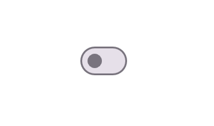
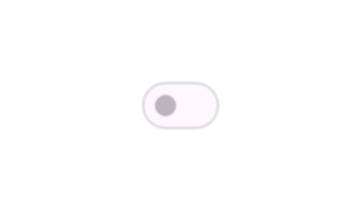

# States in .NET MAUI Switch (SfSwitch)

The .NET MAUI Switch (SfSwitch) supports the following states: `On`, `Off`, `Indeterminate`, `Disabled On`, `Disabled Off`, and `Disabled Indeterminate`.

N> Before proceeding, ensure that the Syncfusion® MAUI Buttons package is installed and the required namespace is registered. For more information, refer to the [Getting Started](Getting-Started.md) documentation.

The state of the Switch is controlled by the following properties:

* [`IsOn`](https://help.syncfusion.com/cr/maui/Syncfusion.Maui.Buttons.SfSwitch.html#Syncfusion_Maui_Buttons_SfSwitch_IsOn): A `bool?` property that sets the current state. The default value is `false` (`Off`).
* [`AllowIndeterminateState`](https://help.syncfusion.com/cr/maui/Syncfusion.Maui.Buttons.SfSwitch.html#Syncfusion_Maui_Buttons_SfSwitch_AllowIndeterminateState): A `bool` property that allows the Switch to display the `Indeterminate` state when `IsOn` is `null`. The default value is `false`.
* [`IsEnabled`](https://help.syncfusion.com/cr/maui/Syncfusion.Maui.Buttons.SfSwitch.html#Syncfusion_Maui_Buttons_SfSwitch_IsEnabled): A `bool` property that controls whether the Switch is interactive. The default value is `true`.

N> The [`StateChanged`](Events.md) and [`StateChanging`](Events.md) events are raised when the `IsOn` property changes.

## On state

Set the [`IsOn`](https://help.syncfusion.com/cr/maui/Syncfusion.Maui.Buttons.SfSwitch.html#Syncfusion_Maui_Buttons_SfSwitch_IsOn) property to `true` or tap the Switch to put it in the `On` state.





<ContentPage xmlns:syncfusion="clr-namespace:Syncfusion.Maui.Buttons;assembly=Syncfusion.Maui.Buttons">
    <syncfusion:SfSwitch x:Name="sfSwitch" IsOn="true" />
</ContentPage>





using Syncfusion.Maui.Buttons;

SfSwitch sfSwitch = new SfSwitch();
sfSwitch.IsOn = true;
this.Content = sfSwitch;





The Switch rendered in the `On` state.

## Off state

Set the [`IsOn`](https://help.syncfusion.com/cr/maui/Syncfusion.Maui.Buttons.SfSwitch.html#Syncfusion_Maui_Buttons_SfSwitch_IsOn) property to `false` or tap the Switch to put it in the `Off` state. This is the default state.





<ContentPage xmlns:syncfusion="clr-namespace:Syncfusion.Maui.Buttons;assembly=Syncfusion.Maui.Buttons">
    <syncfusion:SfSwitch x:Name="sfSwitch" IsOn="false" />
</ContentPage>





using Syncfusion.Maui.Buttons;

SfSwitch sfSwitch = new SfSwitch();
sfSwitch.IsOn = false;
this.Content = sfSwitch;





The Switch rendered in the `Off` state.

## Indeterminate state

Use the `Indeterminate` state to display in-progress work, such as a partially completed task. Enable it by setting [`AllowIndeterminateState`](https://help.syncfusion.com/cr/maui/Syncfusion.Maui.Buttons.SfSwitch.html#Syncfusion_Maui_Buttons_SfSwitch_AllowIndeterminateState) to `true` and [`IsOn`](https://help.syncfusion.com/cr/maui/Syncfusion.Maui.Buttons.SfSwitch.html#Syncfusion_Maui_Buttons_SfSwitch_IsOn) to `null`.

N> The `Indeterminate` state requires the `AllowIndeterminateState` property to be set to `true` before the Switch is added to the visual tree, otherwise the Switch will fall back to the `Off` state.





<ContentPage xmlns:syncfusion="clr-namespace:Syncfusion.Maui.Buttons;assembly=Syncfusion.Maui.Buttons"
             xmlns:x="http://schemas.microsoft.com/winfx/2009/xaml">
    <syncfusion:SfSwitch x:Name="sfSwitch" IsOn="{x:Null}" AllowIndeterminateState="True" />
</ContentPage>





using Syncfusion.Maui.Buttons;

SfSwitch sfSwitch = new SfSwitch();
sfSwitch.AllowIndeterminateState = true;
sfSwitch.IsOn = null;
this.Content = sfSwitch;





The Switch rendered in the `Indeterminate` state.

## Disabled On state

Set the [`IsOn`](https://help.syncfusion.com/cr/maui/Syncfusion.Maui.Buttons.SfSwitch.html#Syncfusion_Maui_Buttons_SfSwitch_IsOn) property to `true` and the [`IsEnabled`](https://help.syncfusion.com/cr/maui/Syncfusion.Maui.Buttons.SfSwitch.html#Syncfusion_Maui_Buttons_SfSwitch_IsEnabled) property to `false` to put the Switch in the disabled `On` state.





<ContentPage xmlns:syncfusion="clr-namespace:Syncfusion.Maui.Buttons;assembly=Syncfusion.Maui.Buttons">
    <syncfusion:SfSwitch x:Name="sfSwitch" IsOn="true" IsEnabled="false" />
</ContentPage>





using Syncfusion.Maui.Buttons;

SfSwitch sfSwitch = new SfSwitch();
sfSwitch.IsOn = true;
sfSwitch.IsEnabled = false;
this.Content = sfSwitch;





The Switch rendered in the disabled `On` state.

## Disabled Off state

Set the [`IsOn`](https://help.syncfusion.com/cr/maui/Syncfusion.Maui.Buttons.SfSwitch.html#Syncfusion_Maui_Buttons_SfSwitch_IsOn) property to `false` and the [`IsEnabled`](https://help.syncfusion.com/cr/maui/Syncfusion.Maui.Buttons.SfSwitch.html#Syncfusion_Maui_Buttons_SfSwitch_IsEnabled) property to `false` to put the Switch in the disabled `Off` state.





<ContentPage xmlns:syncfusion="clr-namespace:Syncfusion.Maui.Buttons;assembly=Syncfusion.Maui.Buttons">
    <syncfusion:SfSwitch x:Name="sfSwitch" IsOn="false" IsEnabled="false" />
</ContentPage>





using Syncfusion.Maui.Buttons;

SfSwitch sfSwitch = new SfSwitch();
sfSwitch.IsOn = false;
sfSwitch.IsEnabled = false;
this.Content = sfSwitch;





The Switch rendered in the disabled `Off` state.

## Disabled Indeterminate state

Set [`AllowIndeterminateState`](https://help.syncfusion.com/cr/maui/Syncfusion.Maui.Buttons.SfSwitch.html#Syncfusion_Maui_Buttons_SfSwitch_AllowIndeterminateState) to `true`, [`IsOn`](https://help.syncfusion.com/cr/maui/Syncfusion.Maui.Buttons.SfSwitch.html#Syncfusion_Maui_Buttons_SfSwitch_IsOn) to `null`, and [`IsEnabled`](https://help.syncfusion.com/cr/maui/Syncfusion.Maui.Buttons.SfSwitch.html#Syncfusion_Maui_Buttons_SfSwitch_IsEnabled) to `false` to put the Switch in the disabled `Indeterminate` state.





<ContentPage xmlns:syncfusion="clr-namespace:Syncfusion.Maui.Buttons;assembly=Syncfusion.Maui.Buttons"
             xmlns:x="http://schemas.microsoft.com/winfx/2009/xaml">
    <syncfusion:SfSwitch x:Name="sfSwitch" AllowIndeterminateState="True" IsOn="{x:Null}" IsEnabled="False" />
</ContentPage>





using Syncfusion.Maui.Buttons;

SfSwitch sfSwitch = new SfSwitch();
sfSwitch.AllowIndeterminateState = true;
sfSwitch.IsOn = null;
sfSwitch.IsEnabled = false;
this.Content = sfSwitch;





The Switch rendered in the disabled `Indeterminate` state.

