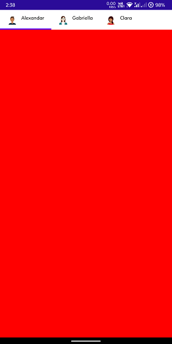

# Configure the appearance of Tab Item in .NET MAUI Tab View (SfTabView)

A tab item consists of the following elements that can be customized.

* **Header** - Holds the text of the tab item that is displayed in the tab bar.

* **ImageSource** - The image to be displayed in the tab bar representing the tab item.

* **Content** - The assigned view will get displayed in the main area of the Tab View.

* **ImagePosition** - Determines the Image text relation of the tab item.

* **TextColor** - The text color of the tab item displayed in the tab bar.

* **FontFamily** - Font family of the tab item text displayed in the tab bar.

* **FontAttribute** - The font style of the text of each tab item in the tab bar.

* **FontSize** - The size of the text of each tab item in the tab bar.

* **IsSelected** - Indicates whether the tab item is active or not.

## Tab Image Position

The .NET MAUI Tab View provides four options that determine how the image of the tab aligns relative to the text. The options are left, top, right and bottom. It can be achieved using the [ImagePosition](https://help.syncfusion.com/cr/maui/Syncfusion.Maui.TabView.TabImagePosition.html) property of [SfTabItem](https://help.syncfusion.com/cr/maui/Syncfusion.Maui.TabView.SfTabItem.html) of type TabImagePosition.

N> Each tab item can be set with different image positions. Visual State Manager can be used to apply same value to all tabs.

### Top

The image will be placed above the text vertically.

 

### Bottom

The image will be placed below the text vertically.

 

### Left

The image will be placed before the text horizontally.

 

### Right

The image will be placed to the right side of the text horizontally.

 





<ContentPage xmlns="http://schemas.microsoft.com/dotnet/2021/maui"
             xmlns:x="http://schemas.microsoft.com/winfx/2009/xaml"
             x:Class="TabViewMauiSample.MainPage"
             xmlns:tabView="http://schemas.syncfusion.com/maui"
             BackgroundColor="{DynamicResource SecondaryColor}">
    <ContentPage.Content>
        <tabView:SfTabView>
            <tabView:SfTabItem Header="Alexandar" ImageSource="alexandar" TabImagePosition="Left">
                <tabView:SfTabItem.Content>
                    <ListView RowHeight="50">
                        ...
                    </ListView>
                </tabView:SfTabItem.Content>
            </tabView:SfTabItem>
            <tabView:SfTabItem Header="Gabriella" ImageSource="gabriella" TabImagePosition="Left">
                <tabView:SfTabItem.Content>
                    <ListView RowHeight="50">
                       ...
                    </ListView>
                </tabView:SfTabItem.Content>
            </tabView:SfTabItem>
            <tabView:SfTabItem Header="Clara" ImageSource="clara" TabImagePosition="Left">
                <tabView:SfTabItem.Content>
                    <ListView RowHeight="50">
                        ...
                    </ListView>
                </tabView:SfTabItem.Content>
            </tabView:SfTabItem>
        </tabView:SfTabView>
    </ContentPage.Content>
</ContentPage>





using Syncfusion.Maui.TabView;

namespace TabViewMauiSample
{
	public partial class TabView : ContentPage
	{
        SfTabView tabView;
		public TabView ()
		{
			InitializeComponent ();
            var tabView = new SfTabView();
            var tabItems = new TabItemCollection
            {
                new SfTabItem()
                {
                    Header = "Calls",
                    TabImagePosition = TabImagePosition.Left,
                    Content = new ListView()
                    {
                        //// code
                    },
                },
                new SfTabItem()
                {
                    Header = "Favorites",
                    TabImagePosition = TabImagePosition.Left,
                    Content = new ListView()
                    {
                        //// code
                    },
                },
                new SfTabItem()
                {
                    Header = "Contacts",
                    TabImagePosition = TabImagePosition.Left,
                    Content = new ListView()
                    {
                        //// code
                    },
                }
            };

            tabView.Items = tabItems;
            this.Content = tabView;
		}
	}
}





 

N> View [sample](https://github.com/SyncfusionExamples/maui-tabview-samples/tree/main/ConfigureTabItem) in GitHub