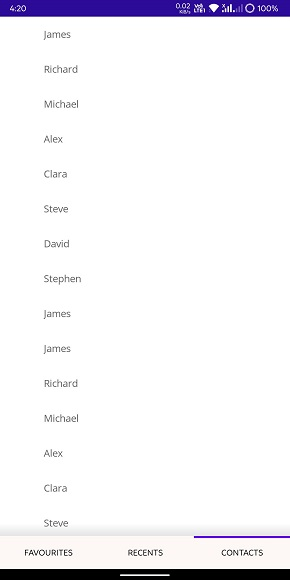

# Customize the tab bar in .NET MAUI Tab View(SfTabView)

## Tab Bar Placement

The .NET MAUI Tab View provides two options that determine how the tab bar aligns relative to the tab content. The options are top and bottom. It can be done by using [TabBarPlacement](https://help.syncfusion.com/cr/maui/Syncfusion.Maui.TabView.TabBarPlacement.html) property.

### Top

Tab bar will be placed above the content region of the Tab View control.

 

### Bottom

Tab bar will be placed below the content region of the Tab View control. 

 

## Customize the tab bar height

The height of the tab bar can be customized by setting the [TabBarHeight](https://help.syncfusion.com/cr/maui/Syncfusion.Maui.TabView.SfTabView.html#Syncfusion_Maui_TabView_SfTabView_TabBarHeight) property. The default height is 48.

N> It is recommended to set the TabBarHeight as 72 while displaying image and text with ImagePosition as either Top or Bottom.

## Customize the background

The tab bar background can be customized using the [TabBarBackground](https://help.syncfusion.com/cr/maui/Syncfusion.Maui.TabView.SfTabView.html#Syncfusion_Maui_TabView_SfTabView_TabBarBackground) property which is of type `Brush`.

## Indicator Placement

The .NET MAUI Tab View provides three options that determine how selection indicator aligns relative to the tab header item. The options are top, bottom, and fill. This can be done by setting the [IndicatorPlacement](https://help.syncfusion.com/cr/maui/Syncfusion.Maui.TabView.TabIndicatorPlacement.html) property of SfTabView.

### Top

The indicator will be placed at the top of the selected tab.

 

### Bottom

The indicator will be placed at the bottom of the selected tab.

 

### Fill

The indicator will fill the selected tab.

 

## Indicator Background

The background of the indicator can be customized using [IndicatorBackground](https://help.syncfusion.com/cr/maui/Syncfusion.Maui.TabView.SfTabView.html#Syncfusion_Maui_TabView_SfTabView_IndicatorBackground) property of SfTabView.





<ContentPage xmlns="http://schemas.microsoft.com/dotnet/2021/maui"
             xmlns:x="http://schemas.microsoft.com/winfx/2009/xaml"
             x:Class="TabViewMauiSample.MainPage"
             xmlns:tabView="http://schemas.syncfusion.com/maui"
             BackgroundColor="{DynamicResource SecondaryColor}">
    <ContentPage.Content>
         <tabView:SfTabView TabBarPlacement="Bottom"
                           IndicatorPlacement="Top"
                           IndicatorBackground="Blue">
            <tabView:SfTabItem Header="FAVORITES">
                <tabView:SfTabItem.Content>
                    <ListView RowHeight="50">
                        ...
                    </ListView>
                </tabView:SfTabItem.Content>
            </tabView:SfTabItem>
            <tabView:SfTabItem Header="RECENTS">
                <tabView:SfTabItem.Content>
                    <ListView RowHeight="50">
                       ...
                    </ListView>
                </tabView:SfTabItem.Content>
            </tabView:SfTabItem>
            <tabView:SfTabItem Header="CONTACTS">
                <tabView:SfTabItem.Content>
                    <ListView RowHeight="50">
                        ...
                    </ListView>
                </tabView:SfTabItem.Content>
            </tabView:SfTabItem>
        </tabView:SfTabView>
    </ContentPage.Content>
</ContentPage>





using Syncfusion.Maui.TabView;

namespace TabViewMauiSample
{
	public partial class TabView : ContentPage
	{
        SfTabView tabView;
		public TabView ()
		{
			InitializeComponent ();
            var tabView = new SfTabView();
            Grid allContactsGrid = new Grid { BackgroundColor = Color.Red };
            Grid favoritesGrid = new Grid { BackgroundColor = Color.Green };
            Grid contactsGrid = new Grid { BackgroundColor = Color.Blue };
            var tabItems = new TabItemCollection
            {
                new SfTabItem()
                {
                    Header = "FAVORITES",
                    Content = new ListView()
                    {
                        //// code
                    },
                },
                new SfTabItem()
                {
                    Header = "RECENTS",
                    Content = new ListView()
                    {
                        //// code
                    },
                },
                new SfTabItem()
                {
                    Header = "CONTACTS",
                    Content = new ListView()
                    {
                        //// code
                    },
                }
            };

            tabView.Items = tabItems;
            tabView.TabBarPlacement = TabBarPlacement.Top;
            tabView.IndicatorPlacement = IndicatorPlacement.Bottom;
            tabView.IndicatorBackground = Color.Blue;
            this.Content = tabView;
		}
	}
}





 

N> View [sample](https://github.com/SyncfusionExamples/maui-tabview-samples/tree/main/TabBarCustomization) in GitHub