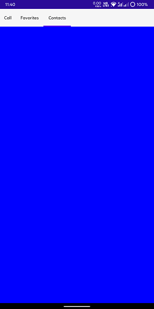
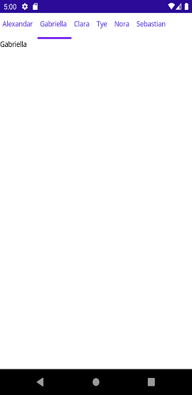

# Getting Started with .NET MAUI Tab View (SfTabView)

This section explains the steps required to configure the [.NET MAUI Tab View](https://help.syncfusion.com/cr/maui/Syncfusion.Maui.TabView.SfTabView.html?tabs=tabid-1) control and customize its elements.

To get start quickly with our .NET MAUI Tab View, you can check the below video.

{% youtube "https://www.youtube.com/watch?v=DYJmZ3eKfsc&ab_channel=Syncfusion%2CInc" %}

## Adding a .NET MAUI Tab View reference

Syncfusion .NET MAUI controls are available in [Nuget.org](https://www.nuget.org/). To add [.NET MAUI Tab View](https://help.syncfusion.com/cr/maui/Syncfusion.Maui.TabView.SfTabView.html?tabs=tabid-1) to your project, open the NuGet package manager in Visual Studio, search for [Syncfusion.Maui.TabView](https://www.nuget.org/packages/Syncfusion.Maui.TabView/) and then install it.

## Handler registration 

The [Syncfusion.Maui.Core](https://www.nuget.org/packages/Syncfusion.Maui.Core/) NuGet is a dependent package for all Syncfusion controls of .NET MAUI. In the MauiProgram.cs file, register the handler for Syncfusion core.


using Microsoft.Maui;
using Microsoft.Maui.Hosting;
using Microsoft.Maui.Controls.Compatibility;
using Microsoft.Maui.Controls.Hosting;
using Microsoft.Maui.Controls.Xaml;
using Syncfusion.Maui.Core.Hosting;

namespace TabViewMauiSample
{
    public static class MauiProgram
    {
        public static MauiApp CreateMauiApp()
        {
            var builder = MauiApp.CreateBuilder();
            builder
            .UseMauiApp<App>()
            .ConfigureSyncfusionCore()
            .ConfigureFonts(fonts =>
            {
                fonts.AddFont("OpenSans-Regular.ttf", "OpenSansRegular");
            });

            return builder.Build();
        }
    }
}

 

## Create a simple .NET MAUI Tab View

This section explains how to create a [.NET MAUI Tab View](https://help.syncfusion.com/cr/maui/Syncfusion.Maui.TabView.SfTabView.html?tabs=tabid-1) and configure it. The control can be configured entirely in C# code or by the XAML markup.

### Creating the project

Create a new .NET MAUI application in Visual Studio 

### Adding a .NET MAUI Tab View control

Step 1: Add the NuGet to the project as discussed in the above reference section. 

Step 2: Add the namespace as shown in the following code sample.





xmlns:tabView="clr-namespace:Syncfusion.Maui.TabView;assembly=Syncfusion.Maui.TabView"
	




using Syncfusion.Maui.TabView;





Step 3: Set the control to content in `ContentPage`.





<?xml version="1.0" encoding="utf-8" ?>
<ContentPage xmlns="http://schemas.microsoft.com/dotnet/2021/maui"
            xmlns:x="http://schemas.microsoft.com/winfx/2009/xaml"
            x:Class="TabViewMauiSample.MainPage"
            xmlns:tabView="clr-namespace:Syncfusion.Maui.TabView;assembly=Syncfusion.Maui.TabView"
            BackgroundColor="{DynamicResource PageBackgroundColor}">
    <ContentPage.Content> 
        <tabView:SfTabView /> 
    </ContentPage.Content>  
</ContentPage>





using Syncfusion.Maui.TabView;

namespace TabViewMauiSample  
{  
    public partial class MainPage : ContentPage                  
    {   
        private SfTabView tabView;   
        public MainPage()   
        {   
            InitializeComponent();       
            tabView = new SfTabView();   
            this.Content = tabView;  
        }  
    }  
}  





## Populate Tab Items in .NET MAUI Tab View

Tab items can be added to the control using the [Items](https://help.syncfusion.com/cr/maui/Syncfusion.Maui.TabView.SfTabView.html#Syncfusion_Maui_TabView_SfTabView_Items) property of [SfTabView](https://help.syncfusion.com/cr/maui/Syncfusion.Maui.TabView.SfTabView.html).





<?xml version="1.0" encoding="utf-8" ?>
<ContentPage xmlns="http://schemas.microsoft.com/dotnet/2021/maui"
            xmlns:x="http://schemas.microsoft.com/winfx/2009/xaml"
            x:Class="TabViewMauiSample.MainPage"
            xmlns:tabView="clr-namespace:Syncfusion.Maui.TabView;assembly=Syncfusion.Maui.TabView"
            BackgroundColor="{DynamicResource PageBackgroundColor}">
    <ContentPage.Content> 
        <tabView:SfTabView x:Name="tabView">
            <tabView:SfTabView.Items>
                <tabView:SfTabItem Header="Call">
                    <tabView:SfTabItem.Content>
                        <Grid BackgroundColor="Red" />
                    </tabView:SfTabItem.Content>
                </tabView:SfTabItem>

                <tabView:SfTabItem Header="Favorites">
                    <tabView:SfTabItem.Content>
                        <Grid BackgroundColor="Green"/>
                    </tabView:SfTabItem.Content>
                </tabView:SfTabItem>

                <tabView:SfTabItem Header="Contacts">
                    <tabView:SfTabItem.Content>
                        <Grid BackgroundColor="Blue"/>
                    </tabView:SfTabItem.Content>
                </tabView:SfTabItem>
            </tabView:SfTabView.Items>
        </tabView:SfTabView>
    </ContentPage.Content>  
</ContentPage>





using Syncfusion.Maui.TabView;

namespace TabViewMauiSample
{
	public partial class TabView : ContentPage
	{
        SfTabView tabView;
		public TabView ()
		{
			InitializeComponent ();
            var tabView = new SfTabView();
            Grid allContactsGrid = new Grid { BackgroundColor = Color.Red };
            Grid favoritesGrid = new Grid { BackgroundColor = Color.Green };
            Grid contactsGrid = new Grid { BackgroundColor = Color.Blue };
            var tabItems = new TabItemCollection
            {
                new SfTabItem()
                {
                    Header = "Call",
                    Content = allContactsGrid
                },
                new SfTabItem()
                {
                    Header = "Favorites",
                    Content = favoritesGrid
                },
                new SfTabItem()
                {
                    Header = "Contacts",
                    Content = contactsGrid
                }
            };

            tabView.Items = tabItems;
            this.Content = tabView;
		}
	}
}





N> View [sample](https://github.com/SyncfusionExamples/maui-tabview-samples/tree/main/TabViewGettingStarted) in GitHub

## Populate ItemsSource

Items can be added to the control using the [ItemsSource](https://help.syncfusion.com/cr/maui/Syncfusion.Maui.TabView.SfTabView.html#Syncfusion_Maui_TabView_SfTabView_ItemsSource) property of [SfTabView](https://help.syncfusion.com/cr/maui/Syncfusion.Maui.TabView.SfTabView.html).

Objects of any class can be given as items for `SfTabView` by using `ItemsSource`. The views corresponding to the objects can be set using the [HeaderItemTemplate](https://help.syncfusion.com/cr/maui/Syncfusion.Maui.TabView.SfTabView.html#Syncfusion_Maui_TabView_SfTabView_HeaderItemTemplate) for the header items and [ContentItemTemplate](https://help.syncfusion.com/cr/maui/Syncfusion.Maui.TabView.SfTabView.html#Syncfusion_Maui_TabView_SfTabView_ContentItemTemplate) for the content.

Create a model class using the TabItems collection property that is initialized with the required number of data objects, as shown in the following code example.





    public class Model: INotifyPropertyChanged
    {

    public event PropertyChangedEventHandler PropertyChanged;

    protected void OnPropertyChanged(string propertyName)
    {
        var handler = PropertyChanged;
        if (handler != null)
            handler(this, new PropertyChangedEventArgs(propertyName));
    }

    private string name;

    public string Name
    {
        get { return name; }
        set
        {
            name = value;
            OnPropertyChanged("Name");
        }
    }
}









 public class TabItemsSourceViewModel:INotifyPropertyChanged
    {
    public event PropertyChangedEventHandler PropertyChanged;

    protected void OnPropertyChanged(string propertyName)
    {
        var handler = PropertyChanged;
        if (handler != null)
            handler(this, new PropertyChangedEventArgs(propertyName));
    }

    private ObservableCollection<Model> tabItems;
    public ObservableCollection<Model> TabItems
    {
        get { return tabItems; }
        set
        {
            tabItems = value;
            OnPropertyChanged("TabItems");
        }
    }
        public TabItemsSourceViewModel()
        {
            TabItems = new ObservableCollection<Model>();
            TabItems.Add(new Model() { Name = "Alexandar" });
            TabItems.Add(new Model() { Name = "Gabriella" });
            TabItems.Add(new Model() { Name = "Clara"});
            TabItems.Add(new Model() { Name = "Tye" });
            TabItems.Add(new Model() { Name = "Nora" });
            TabItems.Add(new Model() { Name = "Sebastian" });
           
        }

  }





The following code example binds the collection to the `ItemsSource` property of `SfTabView`.





    <ContentPage xmlns="http://schemas.microsoft.com/dotnet/2021/maui"
             xmlns:x="http://schemas.microsoft.com/winfx/2009/xaml"
             x:Class="ItemTemplateSample.MainPage"
             xmlns:local="clr-namespace:ItemTemplateSample"
             xmlns:tabView="clr-namespace:Syncfusion.Maui.TabView;assembly=Syncfusion.Maui.TabView"
             BackgroundColor="{DynamicResource SecondaryColor}" >

    <ContentPage.BindingContext>
    <local:TabItemsSourceViewModel />
     </ContentPage.BindingContext>
     <tabView:SfTabView ItemsSource="{Binding TabItems}" >
     </tabView:SfTabView>

    </ContentPage>

  




using Syncfusion.Maui.TabView;

namespace ItemTemplateSample;

    public partial class MainPage : ContentPage
    {
	TabItemsSourceViewModel model;
    SfTabView tabView;
	public MainPage()
	{
		InitializeComponent();
		model = new TabItemsSourceViewModel();
		this.BindingContext = model;
		tabView = new SfTabView();
        tabView.ItemsSource = model.TabItems;
		this.Content = tabView;
    } 

    }





### Header item template

By defining the `HeaderItemTemplate` of the `SfTabView`, a custom user interface(UI) can be achieved to display the tab header data items.





    <tabView:SfTabView ItemsSource="{Binding TabItems}" >
        <tabView:SfTabView.HeaderItemTemplate>
                <DataTemplate >
                    <Label  Padding="5,10,10,10"  Text="{Binding Name}"/>
                 </DataTemplate>
            </tabView:SfTabView.HeaderItemTemplate>
    </tabView:SfTabView>
    




namespace ItemTemplateSample;

    public partial class MainPage : ContentPage
    {
	
    TabItemsSourceViewModel model;
    SfTabView tabView;
	public MainPage()
	{
		InitializeComponent();
		model = new TabItemsSourceViewModel();
		this.BindingContext = model;
		tabView = new SfTabView();
		tabView.ItemsSource = model.TabItems;
		tabView.HeaderItemTemplate = new DataTemplate(() =>
		{
			var nameLabel = new Label { Padding = new Thickness("5,10,10,10")};
            nameLabel.SetBinding(Label.TextProperty, "Name");
		    
			return nameLabel;
		});
		this.Content = tabView;
    }
  }





### Content item template

By defining the `ContentItemTemplate` of the `SfTabView`, a custom user interface(UI) can be achieved to display the tab content data items.





    <tabView:SfTabView ItemsSource="{Binding TabItems}" >
        <tabView:SfTabView.HeaderItemTemplate>
                <DataTemplate >
                    <Label  Padding="5,10,10,10"  Text="{Binding Name}"/>
                 </DataTemplate>
            </tabView:SfTabView.HeaderItemTemplate>
             <tabView:SfTabView.ContentItemTemplate>
                <DataTemplate>
                     <Label TextColor="Black"  Text="{Binding Name}" />
               </DataTemplate>
        </tabView:SfTabView.ContentItemTemplate>
    </tabView:SfTabView>
    




    namespace ItemTemplateSample;

    public partial class MainPage : ContentPage
    {
	
    TabItemsSourceViewModel model;
    SfTabView tabView;
	public MainPage()
	{
		InitializeComponent();
		model = new TabItemsSourceViewModel();
		this.BindingContext = model;
		tabView = new SfTabView();
		tabView.ItemsSource = model.TabItems;
		tabView.HeaderItemTemplate = new DataTemplate(() =>
		{
			var nameLabel = new Label { Padding = new Thickness("5,10,10,10")};
            nameLabel.SetBinding(Label.TextProperty, "Name");
		    
			return nameLabel;
		});
        tabView.ContentItemTemplate = new DataTemplate(() =>
		{
			var nameLabel = new Label { TextColor=Colors.Black };
			nameLabel.SetBinding(Label.TextProperty, "Name");
			return nameLabel;
		});
		this.Content = tabView;
    }
  }





## See also 

[How to load content page to tab page in .NET MAUI Tab view?](https://support.syncfusion.com/kb/article/11416/how-to-load-content-page-to-tab-page-in-net-maui-tab-view)

[How to Load Different Content Page as Tab items content in .NET MAUI TabView?](https://support.syncfusion.com/kb/article/13619/how-to-load-different-content-page-as-tab-items-content-in-net-maui-tabview)

[How to set the BindingContext for .NET MAUI TabItem using various pages?](https://support.syncfusion.com/kb/article/14410/how-to-set-the-bindingcontext-for-net-maui-tabitem-using-various-pages)

[How to integrate .NET MAUI TabView with Android native embedding?](https://support.syncfusion.com/kb/article/16758/how-to-integrate-net-maui-tabview-with-android-native-embedding)

[How to integrate .NET MAUI TabView with iOS native embedding?](https://support.syncfusion.com/kb/article/16787/how-to-integrate-net-maui-tabview-with-ios-native-embedding)

[How to customize .NET MAUI TabView header with navigation arrows?](https://support.syncfusion.com/kb/article/17139/how-to-customize-net-maui-tabview-header-with-navigation-arrows)