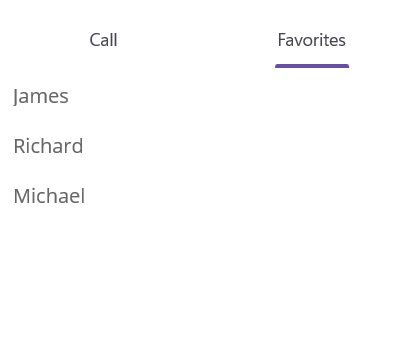

# Getting Started with .NET MAUI Tab View

This section guides you through setting up and configuring a [SfTabView](https://help.syncfusion.com/cr/maui/Syncfusion.Maui.TabView.SfTabView.html?tabs=tabid-1) in your .NET MAUI application. Follow the steps below to add a basic Tab View to your project.

To quickly get started with the .NET MAUI Tab View, watch this video.

{% youtube "https://www.youtube.com/watch?v=DYJmZ3eKfsc&ab_channel=Syncfusion%2CInc" %}




## Prerequisites
Before proceeding, ensure the following are set up:

1. Install [.NET 9 SDK](https://dotnet.microsoft.com/en-us/download/dotnet/9.0) or later.
2. Set up a .NET MAUI environment with Visual Studio 2022 v17.12 or later.

## Step 1: Create a new .NET MAUI project

1. Go to **File > New > Project** and select the **.NET MAUI App** template.
2. Name the project and choose a location. Then, click **Next**.
3. Select the .NET framework version and click **Create**.

## Step 2: Install the Syncfusion® MAUI Tab View NuGet package

1. In **Solution Explorer**, right-click the project and select **Manage NuGet Packages**.
2. Search for [Syncfusion.Maui.TabView](https://www.nuget.org/packages/Syncfusion.Maui.TabView/) and install the latest version.
3. Ensure the necessary dependencies are installed correctly, and the project is restored.




## Prerequisites

Before proceeding, ensure the following are set up:

1. Install [.NET 9 SDK](https://dotnet.microsoft.com/en-us/download/dotnet/9.0) or later.
2. Set up a .NET MAUI environment with Visual Studio Code.
3. Ensure that the .NET MAUI workloads are installed and configured as described [here](https://learn.microsoft.com/en-us/dotnet/maui/get-started/installation?view=net-maui-9.0&tabs=visual-studio-code).

## Step 1: Create a new .NET MAUI project

1. Open the command palette by pressing `Ctrl+Shift+P` and type **.NET:New Project** and enter.
2. Choose the **.NET MAUI App** template.
3. Select the project location, type the project name and press **Enter**.
4. Then choose **Create project**.

## Step 2: Install the Syncfusion® MAUI Tab View NuGet package

1. Press <kbd>Ctrl</kbd> + <kbd>`</kbd> (backtick) to open the integrated terminal in Visual Studio Code.
2. Ensure you're in the project root directory where your .csproj file is located.
3. Run the command `dotnet add package Syncfusion.Maui.TabView` to install the Syncfusion® .NET MAUI Tab View package.
4. To ensure all dependencies are installed, run `dotnet restore`.




## Prerequisites

Before proceeding, ensure the following are set up:

1. Install [.NET 9 SDK](https://dotnet.microsoft.com/en-us/download/dotnet/9.0) or later.
2. Set up a .NET MAUI environment with JetBrains Rider 2024.3 or later.
3. Make sure the MAUI workloads are installed and configured as described [here.](https://www.jetbrains.com/help/rider/MAUI.html#before-you-start)

## Step 1: Create a new .NET MAUI project

1. Go to **File > New Solution**, Select .NET (C#) and choose the **.NET MAUI App** template.
2. Enter the Project Name, Solution Name, and Location.
3. Select the .NET framework version and click **Create**.

## Step 2: Install the Syncfusion® MAUI Tab View NuGet package

1. In **Solution Explorer**, right-click the project and choose **Manage NuGet Packages**.
2. Search for [Syncfusion.Maui.TabView](https://www.nuget.org/packages/Syncfusion.Maui.TabView/) and install the latest version.
3. Ensure the necessary dependencies are installed correctly, and the project is restored. If not, open the terminal in Rider and manually run: `dotnet restore`.




## Step 3: Register Syncfusion handler

Make sure to add the namespace.



using Syncfusion.Maui.Core.Hosting;



Register the Syncfusion core handler in your `CreateMauiApp` method of `MauiProgram.cs` file to use Syncfusion controls.



builder.ConfigureSyncfusionCore();
 


## Step 4: Import TabView namespace

Add the following namespace in your XAML or C#.




xmlns:tabView="clr-namespace:Syncfusion.Maui.TabView;assembly=Syncfusion.Maui.TabView"




using Syncfusion.Maui.TabView;




## Step 5: Add the TabView Component

Configure the `TabView` control to organize content into multiple tabs, allowing you to switch between different views within a single page. Tab items can be added to the control using the [Items](https://help.syncfusion.com/cr/maui/Syncfusion.Maui.TabView.SfTabView.html#Syncfusion_Maui_TabView_SfTabView_Items) property of [SfTabView](https://help.syncfusion.com/cr/maui/Syncfusion.Maui.TabView.SfTabView.html).





<tabView:SfTabView x:Name="tabView">
    <tabView:SfTabView.Items>
        <tabView:SfTabItem Header="Call">
            <Grid BackgroundColor="Red" />
        </tabView:SfTabItem>
        <tabView:SfTabItem Header="Favorites">
            <CollectionView>
                <CollectionView.ItemsSource>
                    <x:Array Type="{x:Type x:String}">
                        <x:String>James</x:String>
                        <x:String>Richard</x:String>
                        <x:String>Michael</x:String>
                    </x:Array>
                </CollectionView.ItemsSource>
                <CollectionView.ItemTemplate>
                    <DataTemplate>
                        <Grid Margin="10,5" HeightRequest="40">
                            <Label TextColor="#666666" Text="{Binding}"/>
                        </Grid>
                    </DataTemplate>
                </CollectionView.ItemTemplate>
            </CollectionView>
        </tabView:SfTabItem>
        <tabView:SfTabItem Header="Contacts">
            <Grid BackgroundColor="Blue"/>
        </tabView:SfTabItem>
    </tabView:SfTabView.Items>
</tabView:SfTabView>





var tabView = new SfTabView();
var callTab = new SfTabItem { Header = "Call" };
tabView.Items.Add(callTab);
var favoritesTab = new SfTabItem { Header = "Favorites" };
var collectionView = new CollectionView();
var itemsSource = new string[] { "James", "Richard", "Michael" };
collectionView.ItemsSource = itemsSource;
collectionView.ItemTemplate = new DataTemplate(() =>
{
    var grid = new Grid
    {
        Margin = new Thickness(10, 5),
        HeightRequest = 40
    };
    var label = new Label
    {
        VerticalOptions = LayoutOptions.Start,
        HorizontalOptions = LayoutOptions.Start,
        TextColor = Color.FromArgb("#666666"),
        FontSize = 16
    };
    label.SetBinding(Label.TextProperty, ".");
    grid.Children.Add(label);
    return grid;
});

favoritesTab.Content = collectionView;
tabView.Items.Add(favoritesTab);
var contactsTab = new SfTabItem { Header = "Contacts" };
contactsTab.Content = new Grid
{
    BackgroundColor = Colors.Blue
};
tabView.Items.Add(contactsTab);

this.Content = tabView;





You can download the TabView Getting Started sample from [GitHub](https://github.com/SyncfusionExamples/getting-started-with-the-.net-maui-tab-view).

N> You can refer to our [.NET MAUI Tab View](https://www.syncfusion.com/maui-controls/maui-tab-view) feature tour page for its groundbreaking feature representations. You can also explore our  [.NET MAUI Tab View example](https://github.com/syncfusion/maui-demos/tree/master/MAUI/TabView) that shows you how to render the .NET MAUI Tab View.

## See also 

[How to load content page to tab page in .NET MAUI Tab View?](https://support.syncfusion.com/kb/article/11416/how-to-load-content-page-to-tab-page-in-net-maui-tab-view)

[How to Load Different Content Page as tab items content in .NET MAUI Tab View?](https://support.syncfusion.com/kb/article/13619/how-to-load-different-content-page-as-tab-items-content-in-net-maui-tabview)

[How to integrate .NET MAUI Tab View with Android native embedding?](https://support.syncfusion.com/kb/article/16758/how-to-integrate-net-maui-tabview-with-android-native-embedding)

[How to integrate .NET MAUI Tab View with iOS native embedding?](https://support.syncfusion.com/kb/article/16787/how-to-integrate-net-maui-tabview-with-ios-native-embedding)

[How to customize .NET MAUI Tab View header with navigation arrows?](https://support.syncfusion.com/kb/article/17139/how-to-customize-net-maui-tabview-header-with-navigation-arrows)
