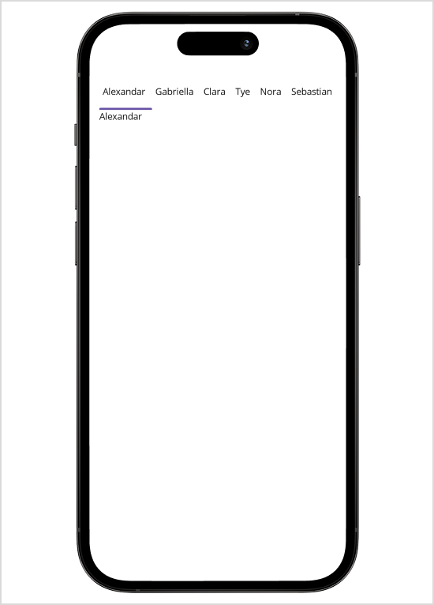

>**Notice:** After **Volume 1 2025 (Mid of March 2025)**, feature enhancements for this control will no longer be available in the Syncfusion® package. Please switch to the **Syncfusion® Toolkit for .NET MAUI** for continued support. For a smooth transition, refer to this [migration document](https://help.syncfusion.com/maui-toolkit/migration).

# Getting Started with .NET MAUI Tab View

This section guides you through setting up and configuring a [SfTabView](https://help.syncfusion.com/cr/maui/Syncfusion.Maui.TabView.SfTabView.html?tabs=tabid-1) in your .NET MAUI application. Follow the steps below to add a basic Tab View to your project.

To quickly get started with the .NET MAUI Tab View, watch this video.

{% youtube "https://www.youtube.com/watch?v=DYJmZ3eKfsc&ab_channel=Syncfusion%2CInc" %}




## Prerequisites

Before proceeding, ensure the following are set up:

1. Install [.NET 8 SDK](https://dotnet.microsoft.com/en-us/download/dotnet/8.0) or later.
2. Set up a .NET MAUI environment with Visual Studio 2022 (v17.3 or later).

## Step 1: Create a new .NET MAUI project

1. Go to **File > New > Project** and select the **.NET MAUI App** template.
2. Name the project and choose a location. Then, click **Next**.
3. Select the .NET framework version and click **Create**.

## Step 2: Install the Syncfusion® MAUI Tab View NuGet package

1. In **Solution Explorer**, right-click the project and select **Manage NuGet Packages**.
2. Search for [Syncfusion.Maui.TabView](https://www.nuget.org/packages/Syncfusion.Maui.TabView/) and install the latest version.
3. Ensure the necessary dependencies are installed correctly, and the project is restored.

## Step 3: Register the handler

[Syncfusion.Maui.Core](https://www.nuget.org/packages/Syncfusion.Maui.Core/) NuGet is a dependent package for all Syncfusion® controls of .NET MAUI. In the `MauiProgram.cs` file, register the handler for Syncfusion® core.


using Microsoft.Extensions.Logging;
using Syncfusion.Maui.Core.Hosting;

namespace TabViewGettingStarted
{
    public static class MauiProgram
    {
        public static MauiApp CreateMauiApp()
        {
            var builder = MauiApp.CreateBuilder();
            builder
            .UseMauiApp<App>()
            .ConfigureSyncfusionCore()
            .ConfigureFonts(fonts =>
            {
                fonts.AddFont("OpenSans-Regular.ttf", "OpenSansRegular");
            });

            return builder.Build();
        }
    }
}

 

## Step 4: Add a basic Tab View

1. To initialize the control, import the Tab View namespace into your code.

2. Initialize [SfTabView](https://help.syncfusion.com/cr/maui/Syncfusion.Maui.TabView.SfTabView.html?tabs=tabid-1).





<?xml version="1.0" encoding="utf-8" ?>
<ContentPage 
            ...
            xmlns:tabView="clr-namespace:Syncfusion.Maui.TabView;assembly=Syncfusion.Maui.TabView">
    <ContentPage.Content> 
        <tabView:SfTabView /> 
    </ContentPage.Content>  
</ContentPage>
	




using Syncfusion.Maui.TabView;
namespace TabViewGettingStarted
{
    public partial class MainPage : ContentPage
    {
        public MainPage()
        {
            InitializeComponent();           
            SfTabView tabView = new SfTabView();   
            this.Content = tabView; 
        }
    }   
}








## Prerequisites

Before proceeding, ensure the following are set up:

1. Install [.NET 8 SDK](https://dotnet.microsoft.com/en-us/download/dotnet/8.0) or later.
2. Set up a .NET MAUI environment with Visual Studio Code.
3. Ensure that the .NET MAUI extension is installed and configured as described [here](https://learn.microsoft.com/en-us/dotnet/maui/get-started/installation?view=net-maui-8.0&tabs=visual-studio-code).

## Step 1: Create a new .NET MAUI project

1. Open the command palette by pressing `Ctrl+Shift+P` and type **.NET:New Project** and enter.
2. Choose the **.NET MAUI App** template.
3. Select the project location, type the project name and press **Enter**.
4. Then choose **Create project**.

## Step 2: Install the Syncfusion® MAUI Tab View NuGet package

1. Press <kbd>Ctrl</kbd> + <kbd>`</kbd> (backtick) to open the integrated terminal in Visual Studio Code.
2. Ensure you're in the project root directory where your .csproj file is located.
3. Run the command `dotnet add package Syncfusion.Maui.TabView` to install the Syncfusion® .NET MAUI Tab View package.
4. To ensure all dependencies are installed, run `dotnet restore`.

## Step 3: Register the handler

[Syncfusion.Maui.Core](https://www.nuget.org/packages/Syncfusion.Maui.Core/) NuGet is a dependent package for all Syncfusion® controls of .NET MAUI. In the `MauiProgram.cs` file, register the handler for Syncfusion® core.


using Microsoft.Extensions.Logging;
using Syncfusion.Maui.Core.Hosting;

namespace TabViewGettingStarted
{
    public static class MauiProgram
    {
        public static MauiApp CreateMauiApp()
        {
            var builder = MauiApp.CreateBuilder();
            builder
            .UseMauiApp<App>()
            .ConfigureSyncfusionCore()
            .ConfigureFonts(fonts =>
            {
                fonts.AddFont("OpenSans-Regular.ttf", "OpenSansRegular");
            });

            return builder.Build();
        }
    }
}

 

## Step 4: Add a basic Tab View

1. To initialize the control, import the Tab View namespace into your code.

2. Initialize [SfTabView](https://help.syncfusion.com/cr/maui/Syncfusion.Maui.TabView.SfTabView.html?tabs=tabid-1).





<?xml version="1.0" encoding="utf-8" ?>
<ContentPage 
            ...
            xmlns:tabView="clr-namespace:Syncfusion.Maui.TabView;assembly=Syncfusion.Maui.TabView">
    <ContentPage.Content> 
        <tabView:SfTabView /> 
    </ContentPage.Content>  
</ContentPage>
	




using Syncfusion.Maui.TabView;
namespace TabViewGettingStarted
{
    public partial class MainPage : ContentPage
    {
        public MainPage()
        {
            InitializeComponent();           
            SfTabView tabView = new SfTabView();   
            this.Content = tabView; 
        }
    }   
}









## Prerequisites

Before proceeding, ensure the following are set up:

1. Ensure you have the latest version of JetBrains Rider.
2. Install [.NET 8 SDK](https://dotnet.microsoft.com/en-us/download/dotnet/8.0) or later.
3. Make sure the MAUI workloads are installed and configured as described [here](https://www.jetbrains.com/help/rider/MAUI.html#before-you-start).

## Step 1: Create a new .NET MAUI project

1. Go to **File > New Solution**, Select .NET (C#) and choose the **.NET MAUI App** template.
2. Enter the Project Name, Solution Name, and Location.
3. Select the .NET framework version and click **Create**.

## Step 2: Install the Syncfusion® MAUI Tab View NuGet package

1. In **Solution Explorer**, right-click the project and choose **Manage NuGet Packages**.
2. Search for [Syncfusion.Maui.TabView](https://www.nuget.org/packages/Syncfusion.Maui.TabView/) and install the latest version.
3. Ensure the necessary dependencies are installed correctly, and the project is restored. If not, open the terminal in Rider and manually run: `dotnet restore`.

## Step 3: Register the handler

[Syncfusion.Maui.Core](https://www.nuget.org/packages/Syncfusion.Maui.Core/) NuGet is a dependent package for all Syncfusion® controls of .NET MAUI. In the `MauiProgram.cs` file, register the handler for Syncfusion® core.


using Microsoft.Extensions.Logging;
using Syncfusion.Maui.Core.Hosting;

namespace TabViewGettingStarted
{
    public static class MauiProgram
    {
        public static MauiApp CreateMauiApp()
        {
            var builder = MauiApp.CreateBuilder();
            builder
            .UseMauiApp<App>()
            .ConfigureSyncfusionCore()
            .ConfigureFonts(fonts =>
            {
                fonts.AddFont("OpenSans-Regular.ttf", "OpenSansRegular");
            });

            return builder.Build();
        }
    }
}

 

## Step 4: Add a basic Tab View

1. To initialize the control, import the Tab View namespace into your code.

2. Initialize [SfTabView](https://help.syncfusion.com/cr/maui/Syncfusion.Maui.TabView.SfTabView.html?tabs=tabid-1).





<?xml version="1.0" encoding="utf-8" ?>
<ContentPage 
            ...
            xmlns:tabView="clr-namespace:Syncfusion.Maui.TabView;assembly=Syncfusion.Maui.TabView">
    <ContentPage.Content> 
        <tabView:SfTabView /> 
    </ContentPage.Content>  
</ContentPage>
	




using Syncfusion.Maui.TabView;
namespace TabViewGettingStarted
{
    public partial class MainPage : ContentPage
    {
        public MainPage()
        {
            InitializeComponent();           
            SfTabView tabView = new SfTabView();   
            this.Content = tabView; 
        }
    }   
}








## Populate tab items in .NET MAUI Tab View

Tab items can be added to the control using the [Items](https://help.syncfusion.com/cr/maui/Syncfusion.Maui.TabView.SfTabView.html#Syncfusion_Maui_TabView_SfTabView_Items) property of [SfTabView](https://help.syncfusion.com/cr/maui/Syncfusion.Maui.TabView.SfTabView.html).





<?xml version="1.0" encoding="utf-8" ?>
<ContentPage 
. . .
             xmlns:tabView="clr-namespace:Syncfusion.Maui.TabView;assembly=Syncfusion.Maui.TabView">

    <tabView:SfTabView x:Name="tabView">
        <tabView:SfTabView.Items>
            <tabView:SfTabItem Header="Call">
                <tabView:SfTabItem.Content>
                    <Grid BackgroundColor="Red" />
                </tabView:SfTabItem.Content>
            </tabView:SfTabItem>

            <tabView:SfTabItem Header="Favorites">
                <tabView:SfTabItem.Content>
                    <CollectionView>
                        <CollectionView.ItemsSource>
                            <x:Array Type="{x:Type x:String}">
                                <x:String>James</x:String>
                                <x:String>Richard</x:String>
                                <x:String>Michael</x:String>
                                <x:String>Alex</x:String>
                                <x:String>Clara</x:String>
                            </x:Array>
                        </CollectionView.ItemsSource>
                        <CollectionView.ItemTemplate>
                            <DataTemplate>
                                    <Grid Margin="10,5" HeightRequest="40">
                                        <Label
                                            VerticalOptions="Start"
                                            HorizontalOptions="Start"
                                            TextColor="#666666"
                                            FontSize="16"
                                            Text="{Binding}"/>
                                    </Grid>
                            </DataTemplate>
                        </CollectionView.ItemTemplate>
                    </CollectionView>
                </tabView:SfTabItem.Content>
            </tabView:SfTabItem>

            <tabView:SfTabItem Header="Contacts">
                <tabView:SfTabItem.Content>
                    <Grid BackgroundColor="Blue"/>
                </tabView:SfTabItem.Content>
            </tabView:SfTabItem>
        </tabView:SfTabView.Items>
    </tabView:SfTabView>

</ContentPage>





using Syncfusion.Maui.TabView;

namespace TabViewGettingStarted
{
    public partial class TabView : ContentPage
    {
        public TabView ()
        {
            InitializeComponent ();
            var tabView = new SfTabView();

            // First tab: Call
            var callTab = new SfTabItem { Header = "Call" };
            callTab.Content = new Grid
            {
                BackgroundColor = Colors.Red
            };
            tabView.Items.Add(callTab);

            // Second tab: Favorites
            var favoritesTab = new SfTabItem { Header = "Favorites" };
            var collectionView = new CollectionView();

            // Items source
            var itemsSource = new string[] { "James", "Richard", "Michael", "Alex", "Clara" };
            collectionView.ItemsSource = itemsSource;

            // Item template
            collectionView.ItemTemplate = new DataTemplate(() =>
            {
                var grid = new Grid
                {
                    Margin = new Thickness(10, 5),
                    HeightRequest = 40
                };
                var label = new Label
                {
                    VerticalOptions = LayoutOptions.Start,
                    HorizontalOptions = LayoutOptions.Start,
                    TextColor = Color.FromArgb("#666666"),
                    FontSize = 16
                };
                label.SetBinding(Label.TextProperty, ".");
                grid.Children.Add(label);
                return grid;
            });

            favoritesTab.Content = collectionView;
            tabView.Items.Add(favoritesTab);

            // Third tab: Contacts
            var contactsTab = new SfTabItem { Header = "Contacts" };
            contactsTab.Content = new Grid
            {
                BackgroundColor = Colors.Blue
            };
            tabView.Items.Add(contactsTab);

            this.Content = tabView;
        }
    }
}





N> You can download the getting started project of this demo from [GitHub](https://github.com/SyncfusionExamples/Getting-Started-with-.NET-MAUI-TabView/tree/master/TabViewGettingStarted)

## Populate ItemsSource

Items can be added to the control using the [ItemsSource](https://help.syncfusion.com/cr/maui/Syncfusion.Maui.TabView.SfTabView.html#Syncfusion_Maui_TabView_SfTabView_ItemsSource) property of [SfTabView](https://help.syncfusion.com/cr/maui/Syncfusion.Maui.TabView.SfTabView.html).

Objects of any class can be provided as items for `SfTabView` using `ItemsSource`. The views corresponding to the objects can be set using the [HeaderItemTemplate](https://help.syncfusion.com/cr/maui/Syncfusion.Maui.TabView.SfTabView.html#Syncfusion_Maui_TabView_SfTabView_HeaderItemTemplate) for the header items and [ContentItemTemplate](https://help.syncfusion.com/cr/maui/Syncfusion.Maui.TabView.SfTabView.html#Syncfusion_Maui_TabView_SfTabView_ContentItemTemplate) for the content.

Create a **Model** class using the TabItems collection property, initialized with the required number of data objects, as shown in the following code examples.





public class Model: INotifyPropertyChanged
{

    public event PropertyChangedEventHandler PropertyChanged;

    protected void OnPropertyChanged(string propertyName)
    {
        var handler = PropertyChanged;
        if (handler != null)
            handler(this, new PropertyChangedEventArgs(propertyName));
    }

    private string name;

    public string Name
    {
        get { return name; }
        set
        {
            name = value;
            OnPropertyChanged("Name");
        }
    }
}









public class TabItemsSourceViewModel:INotifyPropertyChanged
{
    public event PropertyChangedEventHandler PropertyChanged;

    protected void OnPropertyChanged(string propertyName)
    {
        var handler = PropertyChanged;
        if (handler != null)
            handler(this, new PropertyChangedEventArgs(propertyName));
    }

    private ObservableCollection<Model> tabItems;
    public ObservableCollection<Model> TabItems
    {
        get { return tabItems; }
        set
        {
            tabItems = value;
            OnPropertyChanged("TabItems");
        }
    }
    public TabItemsSourceViewModel()
    {
        TabItems = new ObservableCollection<Model>();
        TabItems.Add(new Model() { Name = "Alexandar" });
        TabItems.Add(new Model() { Name = "Gabriella" });
        TabItems.Add(new Model() { Name = "Clara"});
        TabItems.Add(new Model() { Name = "Tye" });
        TabItems.Add(new Model() { Name = "Nora" });
        TabItems.Add(new Model() { Name = "Sebastian" });
        
    }

}





The following code example binds the collection to the `ItemsSource` property of `SfTabView`.





    <ContentPage xmlns="http://schemas.microsoft.com/dotnet/2021/maui"
             xmlns:x="http://schemas.microsoft.com/winfx/2009/xaml"
             x:Class="TabViewItemTemplateSample.MainPage"
             xmlns:local="clr-namespace:TabViewItemTemplateSample"
             xmlns:tabView="clr-namespace:Syncfusion.Maui.TabView;assembly=Syncfusion.Maui.TabView">

    <ContentPage.BindingContext>
        <local:TabItemsSourceViewModel />
    </ContentPage.BindingContext>
    <tabView:SfTabView ItemsSource="{Binding TabItems}" >
    </tabView:SfTabView>

    </ContentPage>

  




using Syncfusion.Maui.TabView;

namespace TabViewItemTemplateSample;

public partial class MainPage : ContentPage
{
    TabItemsSourceViewModel model;
    SfTabView tabView;
    public MainPage()
    {
        InitializeComponent();
        model = new TabItemsSourceViewModel();
        this.BindingContext = model;
        tabView = new SfTabView();
        tabView.ItemsSource = model.TabItems;
        this.Content = tabView;
    } 
}





### HeaderItemTemplate

By defining the `HeaderItemTemplate` of the `SfTabView`, a custom user interface(UI) can be achieved to display the tab header data items.





    <tabView:SfTabView ItemsSource="{Binding TabItems}" >
        <tabView:SfTabView.HeaderItemTemplate>
                <DataTemplate >
                    <Label  Padding="5,10,10,10"  Text="{Binding Name}"/>
                 </DataTemplate>
            </tabView:SfTabView.HeaderItemTemplate>
    </tabView:SfTabView>
    




namespace TabViewItemTemplateSample;

public partial class MainPage : ContentPage
{
	
    TabItemsSourceViewModel model;
    SfTabView tabView;
    public MainPage()
    {
        InitializeComponent();
        model = new TabItemsSourceViewModel();
        this.BindingContext = model;
        tabView = new SfTabView();
        tabView.ItemsSource = model.TabItems;
        tabView.HeaderItemTemplate = new DataTemplate(() =>
        {
            var nameLabel = new Label { Padding = new Thickness(5,10,10,10)};
            nameLabel.SetBinding(Label.TextProperty, "Name");
            return nameLabel;
        });
        this.Content = tabView;
    }
}





### ContentItemTemplate

By defining the `ContentItemTemplate` of the `SfTabView`, a custom user interface(UI) can be achieved to display the tab content data items.





    <tabView:SfTabView ItemsSource="{Binding TabItems}" >
        <tabView:SfTabView.HeaderItemTemplate>
                <DataTemplate >
                    <Label  Padding="5,10,10,10"  Text="{Binding Name}"/>
                 </DataTemplate>
            </tabView:SfTabView.HeaderItemTemplate>
             <tabView:SfTabView.ContentItemTemplate>
                <DataTemplate>
                     <Label TextColor="Black"  Text="{Binding Name}" />
               </DataTemplate>
        </tabView:SfTabView.ContentItemTemplate>
    </tabView:SfTabView>
    




namespace TabViewItemTemplateSample;

public partial class MainPage : ContentPage
{

    TabItemsSourceViewModel model;
    SfTabView tabView;
    public MainPage()
    {
        InitializeComponent();
        model = new TabItemsSourceViewModel();
        this.BindingContext = model;
        tabView = new SfTabView();
        tabView.ItemsSource = model.TabItems;
        tabView.HeaderItemTemplate = new DataTemplate(() =>
        {
            var nameLabel = new Label { Padding = new Thickness(5,10,10,10)};
            nameLabel.SetBinding(Label.TextProperty, "Name");
            
            return nameLabel;
        });
        tabView.ContentItemTemplate = new DataTemplate(() =>
        {
            var nameLabel = new Label { TextColor=Colors.Black };
            nameLabel.SetBinding(Label.TextProperty, "Name");
            return nameLabel;
        });
        this.Content = tabView;
    }
}





N> You can download the demo from [GitHub](https://github.com/SyncfusionExamples/Getting-Started-with-.NET-MAUI-TabView/tree/master/TabViewItemTemplateSample)

N> You can refer to our [.NET MAUI Tab View](https://www.syncfusion.com/maui-controls/maui-tab-view) feature tour page for its groundbreaking feature representations. You can also explore our  [.NET MAUI Tab View example](https://github.com/syncfusion/maui-demos/tree/master/MAUI/TabView) that shows you how to render the .NET MAUI Tab View.

## See also 

[How to load content page to tab page in .NET MAUI Tab View?](https://support.syncfusion.com/kb/article/11416/how-to-load-content-page-to-tab-page-in-net-maui-tab-view)

[How to Load Different Content Page as tab items content in .NET MAUI Tab View?](https://support.syncfusion.com/kb/article/13619/how-to-load-different-content-page-as-tab-items-content-in-net-maui-tabview)

[How to set the BindingContext for .NET MAUI TabItem using various pages?](https://support.syncfusion.com/kb/article/14410/how-to-set-the-bindingcontext-for-net-maui-tabitem-using-various-pages)

[How to integrate .NET MAUI Tab View with Android native embedding?](https://support.syncfusion.com/kb/article/16758/how-to-integrate-net-maui-tabview-with-android-native-embedding)

[How to integrate .NET MAUI Tab View with iOS native embedding?](https://support.syncfusion.com/kb/article/16787/how-to-integrate-net-maui-tabview-with-ios-native-embedding)

[How to customize .NET MAUI Tab View header with navigation arrows?](https://support.syncfusion.com/kb/article/17139/how-to-customize-net-maui-tabview-header-with-navigation-arrows)