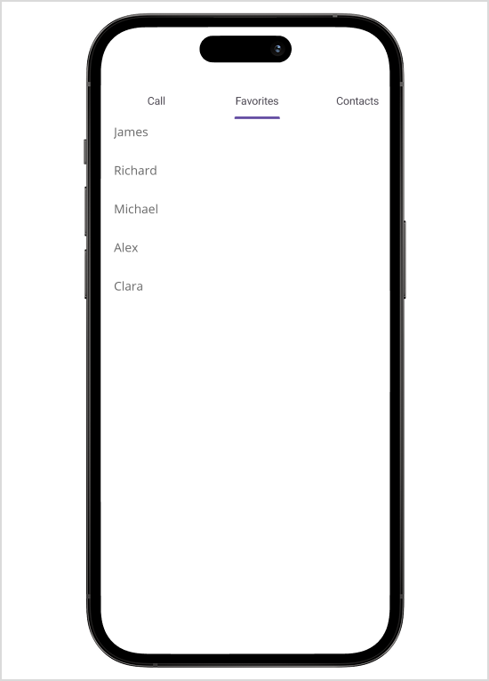

# Getting Started with .NET MAUI Tab View

This section guides you through setting up and configuring a [Tab View](https://help.syncfusion.com/cr/maui/Syncfusion.Maui.TabView.SfTabView.html?tabs=tabid-1) in your .NET MAUI application. Follow the steps below to add a basic Tab View to your project.

To quickly get started with the .NET MAUI Tab View, watch this video.

{% youtube "https://www.youtube.com/watch?v=DYJmZ3eKfsc&ab_channel=Syncfusion%2CInc" %}

## Prerequisites

Before proceeding, ensure the following are set up:

1. Install [.NET 7 SDK](https://dotnet.microsoft.com/en-us/download/dotnet/7.0) or later is installed.
2. Set up a .NET MAUI environment with Visual Studio 2022 (v17.3 or later) or Visual Studio Code. For Visual Studio Code users, ensure that the .NET MAUI workload is installed and configured as described [here.](https://learn.microsoft.com/en-us/dotnet/maui/get-started/installation?view=net-maui-8.0&tabs=visual-studio-code).

## Step 1: Create a New MAUI Project

### Visual Studio

1. Go to **File > New > Project** and choose the **.NET MAUI App** template.
2. Name the project and choose a location. Then, click **Next.**
3. Select the .NET framework version and click **Create.**

### Visual Studio Code

1. Open the command palette by pressing `Ctrl+Shift+P` and type **.NET:New Project** and enter.
2. Choose the **.NET MAUI App** template.
3. Select the project location, type the project name and press **Enter.**
4. Then choose **Create project.**

## Step 2: Install the Syncfusion MAUI TabView NuGet Package

1. In **Solution Explorer,** right-click the project and choose **Manage NuGet Packages.**
2. Search for [Syncfusion.Maui.TabView](https://www.nuget.org/packages/Syncfusion.Maui.TabView/) and install the latest version.
3. Ensure the necessary dependencies are installed correctly, and the project is restored.

## Step 3: Register the handler

[Syncfusion.Maui.Core](https://www.nuget.org/packages/Syncfusion.Maui.Core/) NuGet is a dependent package for all Syncfusion controls of .NET MAUI. In the MauiProgram.cs file, register the handler for Syncfusion core.


using Microsoft.Maui;
using Microsoft.Maui.Hosting;
using Microsoft.Maui.Controls.Compatibility;
using Microsoft.Maui.Controls.Hosting;
using Microsoft.Maui.Controls.Xaml;
using Syncfusion.Maui.Core.Hosting;

namespace TabViewMauiSample
{
    public static class MauiProgram
    {
        public static MauiApp CreateMauiApp()
        {
            var builder = MauiApp.CreateBuilder();
            builder
            .UseMauiApp<App>()
            .ConfigureSyncfusionCore()
            .ConfigureFonts(fonts =>
            {
                fonts.AddFont("OpenSans-Regular.ttf", "OpenSansRegular");
            });

            return builder.Build();
        }
    }
}

 

## Step 4: Add a Basic Tab View

1. To initialize the control, import the TabView namespace into your code.

2. Initialize [SfTabView](https://help.syncfusion.com/cr/maui/Syncfusion.Maui.TabView.SfTabView.html?tabs=tabid-1)





<?xml version="1.0" encoding="utf-8" ?>
<ContentPage 
            ...
            xmlns:tabView="clr-namespace:Syncfusion.Maui.TabView;assembly=Syncfusion.Maui.TabView">
    <ContentPage.Content> 
        <tabView:SfTabView /> 
    </ContentPage.Content>  
</ContentPage>
	




using Syncfusion.Maui.TabView;
namespace TabViewGettingStarted
{
    public partial class MainPage : ContentPage
    {
        public MainPage()
        {
            InitializeComponent();           
            SfTabView tabView = new SfTabView();   
            this.Content = tabView; 
        }
    }   
}





## Populate Tab Items in .NET MAUI Tab View

Tab items can be added to the control using the [Items](https://help.syncfusion.com/cr/maui/Syncfusion.Maui.TabView.SfTabView.html#Syncfusion_Maui_TabView_SfTabView_Items) property of [SfTabView](https://help.syncfusion.com/cr/maui/Syncfusion.Maui.TabView.SfTabView.html).





<?xml version="1.0" encoding="utf-8" ?>
<ContentPage xmlns="http://schemas.microsoft.com/dotnet/2021/maui"
            xmlns:x="http://schemas.microsoft.com/winfx/2009/xaml"
            x:Class="TabViewMauiSample.MainPage"
            xmlns:tabView="clr-namespace:Syncfusion.Maui.TabView;assembly=Syncfusion.Maui.TabView"
            BackgroundColor="{DynamicResource PageBackgroundColor}">
    <ContentPage.Content> 
        <tabView:SfTabView x:Name="tabView">
            <tabView:SfTabView.Items>
                <tabView:SfTabItem Header="Call">
                    <tabView:SfTabItem.Content>
                        <Grid BackgroundColor="Red" />
                    </tabView:SfTabItem.Content>
                </tabView:SfTabItem>

                <tabView:SfTabItem Header="Favorites">
                     <tabView:SfTabItem.Content>
                    <ListView RowHeight="50">
                        <ListView.ItemsSource>
                            <x:Array Type="{x:Type x:String}">
                                <x:String>James</x:String>
                                <x:String>Richard</x:String>
                                <x:String>Michael</x:String>
                                <x:String>Alex</x:String>
                                <x:String>Clara</x:String>
                            </x:Array>
                        </ListView.ItemsSource>
                        <ListView.ItemTemplate>
                            <DataTemplate>
                                <ViewCell>
                                    <Grid Margin="10,5">
                                        <Label
                                            VerticalOptions="Start"
                                            HorizontalOptions="Start"
                                            TextColor="#666666"
                                            FontSize="16"
                                            Text="{Binding}"/>
                                    </Grid>
                                </ViewCell>
                            </DataTemplate>
                        </ListView.ItemTemplate>
                    </ListView>
                </tabView:SfTabItem.Content>
                </tabView:SfTabItem>

                <tabView:SfTabItem Header="Contacts">
                    <tabView:SfTabItem.Content>
                        <Grid BackgroundColor="Blue"/>
                    </tabView:SfTabItem.Content>
                </tabView:SfTabItem>
            </tabView:SfTabView.Items>
        </tabView:SfTabView>
    </ContentPage.Content>  
</ContentPage>





using Syncfusion.Maui.TabView;

namespace TabViewMauiSample
{
	public partial class TabView : ContentPage
	{
        SfTabView tabView;
		public TabView ()
		{
			InitializeComponent ();
            var tabView = new SfTabView();
            Grid allContactsGrid = new Grid { BackgroundColor = Colors.Red };
            var favorites = new ListView
            {
                RowHeight = 50,
                ItemsSource = new string[] { "James", "Richard", "Michael", "Alex", "Clara" },
                ItemTemplate = new DataTemplate(() =>
                {
                    var grid = new Grid
                    {
                        Margin = new Thickness(10, 5)
                    };

                    var label = new Label
                    {
                        VerticalOptions = LayoutOptions.Start,
                        HorizontalOptions = LayoutOptions.Start,
                        TextColor = Color.FromArgb("#666666"),
                        FontSize = 16
                    };
                    label.SetBinding(Label.TextProperty, ".");

                    grid.Children.Add(label);

                    return new ViewCell
                    {
                        View = grid
                    };
                })
            };
            Grid contactsGrid = new Grid { BackgroundColor = Colors.Blue };
            var tabItems = new TabItemCollection
            {
                new SfTabItem()
                {
                    Header = "Call",
                    Content = allContactsGrid
                },
                new SfTabItem()
                {
                    Header = "Favorites",
                    Content = favorites
                },
                new SfTabItem()
                {
                    Header = "Contacts",
                    Content = contactsGrid
                }
            };

            tabView.Items = tabItems;
            this.Content = tabView;
		}
	}
}





N> View [sample](https://github.com/SyncfusionExamples/maui-tabview-samples/tree/main/TabViewGettingStarted) in GitHub

## Populate ItemsSource

Items can be added to the control using the [ItemsSource](https://help.syncfusion.com/cr/maui/Syncfusion.Maui.TabView.SfTabView.html#Syncfusion_Maui_TabView_SfTabView_ItemsSource) property of [SfTabView](https://help.syncfusion.com/cr/maui/Syncfusion.Maui.TabView.SfTabView.html).

Objects of any class can be given as items for `SfTabView` by using `ItemsSource`. The views corresponding to the objects can be set using the [HeaderItemTemplate](https://help.syncfusion.com/cr/maui/Syncfusion.Maui.TabView.SfTabView.html#Syncfusion_Maui_TabView_SfTabView_HeaderItemTemplate) for the header items and [ContentItemTemplate](https://help.syncfusion.com/cr/maui/Syncfusion.Maui.TabView.SfTabView.html#Syncfusion_Maui_TabView_SfTabView_ContentItemTemplate) for the content.

Create a model class using the TabItems collection property that is initialized with the required number of data objects, as shown in the following code example.





public class Model: INotifyPropertyChanged
{

    public event PropertyChangedEventHandler PropertyChanged;

    protected void OnPropertyChanged(string propertyName)
    {
        var handler = PropertyChanged;
        if (handler != null)
            handler(this, new PropertyChangedEventArgs(propertyName));
    }

    private string name;

    public string Name
    {
        get { return name; }
        set
        {
            name = value;
            OnPropertyChanged("Name");
        }
    }
}









public class TabItemsSourceViewModel:INotifyPropertyChanged
{
    public event PropertyChangedEventHandler PropertyChanged;

    protected void OnPropertyChanged(string propertyName)
    {
        var handler = PropertyChanged;
        if (handler != null)
            handler(this, new PropertyChangedEventArgs(propertyName));
    }

    private ObservableCollection<Model> tabItems;
    public ObservableCollection<Model> TabItems
    {
        get { return tabItems; }
        set
        {
            tabItems = value;
            OnPropertyChanged("TabItems");
        }
    }
    public TabItemsSourceViewModel()
    {
        TabItems = new ObservableCollection<Model>();
        TabItems.Add(new Model() { Name = "Alexandar" });
        TabItems.Add(new Model() { Name = "Gabriella" });
        TabItems.Add(new Model() { Name = "Clara"});
        TabItems.Add(new Model() { Name = "Tye" });
        TabItems.Add(new Model() { Name = "Nora" });
        TabItems.Add(new Model() { Name = "Sebastian" });
        
    }

}





The following code example binds the collection to the `ItemsSource` property of `SfTabView`.





    <ContentPage xmlns="http://schemas.microsoft.com/dotnet/2021/maui"
             xmlns:x="http://schemas.microsoft.com/winfx/2009/xaml"
             x:Class="ItemTemplateSample.MainPage"
             xmlns:local="clr-namespace:ItemTemplateSample"
             xmlns:tabView="clr-namespace:Syncfusion.Maui.TabView;assembly=Syncfusion.Maui.TabView"
             BackgroundColor="{DynamicResource SecondaryColor}" >

    <ContentPage.BindingContext>
        <local:TabItemsSourceViewModel />
    </ContentPage.BindingContext>
    <tabView:SfTabView ItemsSource="{Binding TabItems}" >
    </tabView:SfTabView>

    </ContentPage>

  




using Syncfusion.Maui.TabView;

namespace ItemTemplateSample;

public partial class MainPage : ContentPage
{
	TabItemsSourceViewModel model;
    SfTabView tabView;
	public MainPage()
	{
		InitializeComponent();
		model = new TabItemsSourceViewModel();
		this.BindingContext = model;
		tabView = new SfTabView();
        tabView.ItemsSource = model.TabItems;
		this.Content = tabView;
    } 
}





### Header item template

By defining the `HeaderItemTemplate` of the `SfTabView`, a custom user interface(UI) can be achieved to display the tab header data items.





    <tabView:SfTabView ItemsSource="{Binding TabItems}" >
        <tabView:SfTabView.HeaderItemTemplate>
                <DataTemplate >
                    <Label  Padding="5,10,10,10"  Text="{Binding Name}"/>
                 </DataTemplate>
            </tabView:SfTabView.HeaderItemTemplate>
    </tabView:SfTabView>
    




namespace ItemTemplateSample;

public partial class MainPage : ContentPage
{
	
    TabItemsSourceViewModel model;
    SfTabView tabView;
	public MainPage()
	{
		InitializeComponent();
		model = new TabItemsSourceViewModel();
		this.BindingContext = model;
		tabView = new SfTabView();
		tabView.ItemsSource = model.TabItems;
		tabView.HeaderItemTemplate = new DataTemplate(() =>
		{
			var nameLabel = new Label { Padding = new Thickness("5,10,10,10")};
            nameLabel.SetBinding(Label.TextProperty, "Name");
		    
			return nameLabel;
		});
		this.Content = tabView;
    }
}





### Content item template

By defining the `ContentItemTemplate` of the `SfTabView`, a custom user interface(UI) can be achieved to display the tab content data items.





    <tabView:SfTabView ItemsSource="{Binding TabItems}" >
        <tabView:SfTabView.HeaderItemTemplate>
                <DataTemplate >
                    <Label  Padding="5,10,10,10"  Text="{Binding Name}"/>
                 </DataTemplate>
            </tabView:SfTabView.HeaderItemTemplate>
             <tabView:SfTabView.ContentItemTemplate>
                <DataTemplate>
                     <Label TextColor="Black"  Text="{Binding Name}" />
               </DataTemplate>
        </tabView:SfTabView.ContentItemTemplate>
    </tabView:SfTabView>
    




namespace ItemTemplateSample;

public partial class MainPage : ContentPage
{

    TabItemsSourceViewModel model;
    SfTabView tabView;
    public MainPage()
    {
        InitializeComponent();
        model = new TabItemsSourceViewModel();
        this.BindingContext = model;
        tabView = new SfTabView();
        tabView.ItemsSource = model.TabItems;
        tabView.HeaderItemTemplate = new DataTemplate(() =>
        {
            var nameLabel = new Label { Padding = new Thickness("5,10,10,10")};
            nameLabel.SetBinding(Label.TextProperty, "Name");
            
            return nameLabel;
        });
        tabView.ContentItemTemplate = new DataTemplate(() =>
        {
            var nameLabel = new Label { TextColor=Colors.Black };
            nameLabel.SetBinding(Label.TextProperty, "Name");
            return nameLabel;
        });
        this.Content = tabView;
    }
}





N> You can refer to our [.NET MAUI Tab View](https://www.syncfusion.com/maui-controls/maui-tab-view) feature tour page for its groundbreaking feature representations. You can also explore our  [.NET MAUI Tab View Example](https://github.com/syncfusion/maui-demos/tree/master/MAUI/TabView) that shows you how to render the Tab View in .NET MAUI.

