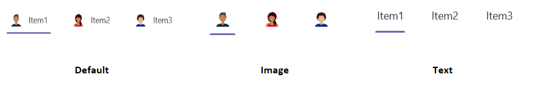

# Header display mode in .NET MAUI Tab View control (SfTabView)

By default, the Tab View control displays the title of each Tab Item. It can be changed to any of the following types:

* Default
* Image
* Text

The Tab View can be changed by setting the `HeaderDisplayMode` property of [`SfTabView`](https://help.syncfusion.com/cr/maui/Syncfusion.Maui.TabView.html).





    <ContentPage xmlns="http://schemas.microsoft.com/dotnet/2021/maui"
                xmlns:x="http://schemas.microsoft.com/winfx/2009/xaml"
                x:Class="TabView.MainPage"
                xmlns:tabView="clr-namespace:Syncfusion.Maui.TabView;assembly=Syncfusion.Maui.TabView">

        <tabView:SfTabView HeaderDisplayMode="Default">
            <tabView:SfTabItem Header="Item1" ImageSource="avatar1.png" />
            <tabView:SfTabItem Header="Item2" ImageSource="avatar2.png" />
            <tabView:SfTabItem Header="Item3" ImageSource="avatar3.png" />
        </tabView:SfTabView>

    </ContentPage>





    using Syncfusion.Maui.TabView;
    namespace UGSample
    {
        public partial class MainPage : ContentPage
        {          
            public MainPage()
            {
                InitializeComponent();
                SfTabView tabView = new SfTabView
                {
                    HeaderDisplayMode = TabBarDisplayMode.Default
                };
                SfTabItem tabItem1 = new SfTabItem
                {
                    Header = "Item1",
                    ImageSource = "avatar1.png"
                };
                SfTabItem tabItem2 = new SfTabItem
                {
                    Header = "Item2",
                    ImageSource = "avatar2.png"
                };
                SfTabItem tabItem3 = new SfTabItem
                {
                    Header = "Item3",
                    ImageSource = "avatar3.png"
                };
                tabView.Items.Add(tabItem1);
                tabView.Items.Add(tabItem2);
                tabView.Items.Add(tabItem3);
                this.Content = tabView;
            }
        }
    }





    N> The `HeaderDisplayMode` will only apply if both a header and an image are provided for the Tab Item. If either the header or imagesource is missing, the Tab Item will automatically apply the Default mode.

