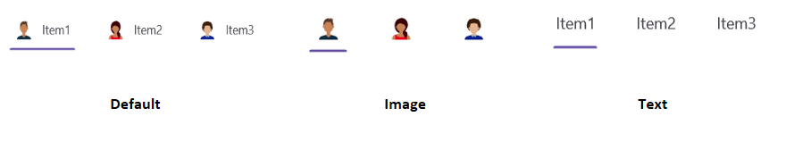

# Header Display Mode in .NET MAUI Tab View (SfTabView)

## Prerequisites

Before using the [SfTabView](https://help.syncfusion.com/cr/maui/Syncfusion.Maui.TabView.SfTabView.html), ensure the following NuGet package is installed in your .NET MAUI project:

- `Syncfusion.Maui.TabView`

For step-by-step setup, refer to the [Getting Started](https://help.syncfusion.com/maui/tabview/getting-started) documentation.

## Overview

By default, the [.NET MAUI Tab View](https://help.syncfusion.com/cr/maui/Syncfusion.Maui.TabView.SfTabView.html) control displays the title of each Tab Item. The header can be customized to display in any of the following modes defined by the [`TabBarDisplayMode`](https://help.syncfusion.com/cr/maui/Syncfusion.Maui.TabView.TabBarDisplayMode.html) enum:

* `Default` - Displays the title of each Tab Item. The tab header is rendered using the standard styling.
* `Image` - Displays the `ImageSource` of each Tab Item instead of the header text.
* `Text` - Displays only the header text of each Tab Item, even if an `ImageSource` is set.

> **Note** The images referenced in the samples (`avatar1.png`, `avatar2.png`, `avatar3.png`) must be added to the `Resources/Images` folder of your MAUI project and registered as `MauiImage` items in the `.csproj` file so they can be resolved by the `ImageSource` property.

You can configure the Tab View by setting the [`HeaderDisplayMode`](https://help.syncfusion.com/cr/maui/Syncfusion.Maui.TabView.SfTabView.html#Syncfusion_Maui_TabView_SfTabView_HeaderDisplayMode) property of type `TabBarDisplayMode` on the `SfTabView` control. The XAML string value (for example, `"Default"`) maps to the corresponding `TabBarDisplayMode` enum member.

## Default

The `Default` mode renders the header title for each Tab Item. If both a `Header` and an `ImageSource` are provided, the default styling is applied.





<tabView:SfTabView HeaderDisplayMode="Default">
    <tabView:SfTabItem Header="Item1" ImageSource="avatar1.png" />
    <tabView:SfTabItem Header="Item2" ImageSource="avatar2.png" />
    <tabView:SfTabItem Header="Item3" ImageSource="avatar3.png" />
</tabView:SfTabView>





SfTabView tabView = new SfTabView()
{
    HeaderDisplayMode = TabBarDisplayMode.Default,
    Items =
    {
        new SfTabItem { Header = "Item1", ImageSource = "avatar1.png" },
        new SfTabItem { Header = "Item2", ImageSource = "avatar2.png" },
        new SfTabItem { Header = "Item3", ImageSource = "avatar3.png" }
    }
};





## Image

The `Image` mode displays the `ImageSource` of each Tab Item. You must set an `ImageSource` on every Tab Item; otherwise the header will not render.





<tabView:SfTabView HeaderDisplayMode="Image">
    <tabView:SfTabItem Header="Item1" ImageSource="avatar1.png" />
    <tabView:SfTabItem Header="Item2" ImageSource="avatar2.png" />
    <tabView:SfTabItem Header="Item3" ImageSource="avatar3.png" />
</tabView:SfTabView>





SfTabView tabView = new SfTabView()
{
    HeaderDisplayMode = TabBarDisplayMode.Image,
    Items =
    {
        new SfTabItem { Header = "Item1", ImageSource = "avatar1.png" },
        new SfTabItem { Header = "Item2", ImageSource = "avatar2.png" },
        new SfTabItem { Header = "Item3", ImageSource = "avatar3.png" }
    }
};





## Text

The `Text` mode displays only the header text of each Tab Item, even if an `ImageSource` is set.





<tabView:SfTabView HeaderDisplayMode="Text">
    <tabView:SfTabItem Header="Item1" ImageSource="avatar1.png" />
    <tabView:SfTabItem Header="Item2" ImageSource="avatar2.png" />
    <tabView:SfTabItem Header="Item3" ImageSource="avatar3.png" />
</tabView:SfTabView>





SfTabView tabView = new SfTabView()
{
    HeaderDisplayMode = TabBarDisplayMode.Text,
    Items =
    {
        new SfTabItem { Header = "Item1", ImageSource = "avatar1.png" },
        new SfTabItem { Header = "Item2", ImageSource = "avatar2.png" },
        new SfTabItem { Header = "Item3", ImageSource = "avatar3.png" }
    }
};





## Behavior notes

> **Note** The `HeaderDisplayMode` will only fully apply its intended visual when both a [`Header`](https://help.syncfusion.com/cr/maui/Syncfusion.Maui.TabView.SfTabItem.html#Syncfusion_Maui_TabView_SfTabItem_Header) and an [`ImageSource`](https://help.syncfusion.com/cr/maui/Syncfusion.Maui.TabView.SfTabItem.html#Syncfusion_Maui_TabView_SfTabItem_ImageSource) are provided for the Tab Item. If only the `Header` is set, the `Text` mode is used; if only the `ImageSource` is set, the `Image` mode is used; if neither is set, the Tab Item will fall back to the `Default` display mode.

## Troubleshooting

* If images do not appear in the header, verify that the image files exist under `Resources/Images` and are registered as `MauiImage` items in the `.csproj` file.
* If the C# sample does not compile, confirm that the `Syncfusion.Maui.TabView` namespace is imported and that `TabBarDisplayMode` is the correct enum name in your installed package version.
* If changing `HeaderDisplayMode` has no visible effect, ensure that both `Header` and `ImageSource` are set on each `SfTabItem`, as described in the behavior notes above.

## See also

* [Getting Started with .NET MAUI Tab View](https://help.syncfusion.com/maui/tabview/getting-started)
* [Selection Indicator Customization in .NET MAUI Tab View](https://help.syncfusion.com/maui/tabview/selection-indicator-customization)
* [Tab Item Customization in .NET MAUI Tab View](Thttps://help.syncfusion.com/maui/tabview/tab-item-customization)
* [Tab bar Customization in .NET MAUI Tab View](https://help.syncfusion.com/maui/tabview/tab-bar-customization)
* [Populating ItemsSource in .NET MAUI Tab View](https://help.syncfusion.com/maui/tabview/populating-itemssource)