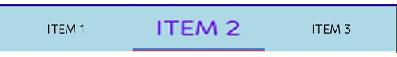

# How to Select a Tab Item Programmatically? 

## Programmatically Select the Tab Item

You can use the [SelectedIndex](https://help.syncfusion.com/cr/maui/Syncfusion.Maui.TabView.SfTabView.html#Syncfusion_Maui_TabView_SfTabView_SelectedIndex) property of SfTabView to programmatically select a tab item. Below is a code snippet demonstrating how to do this:




   <tabView:SfTabView x:Name="tabView" SelectedIndex="2"/>



    tabView.SelectedIndex = 2;



## Get the Selected Tab Item Using IsSelected

The `IsSelected` property indicates whether the tab item is active. This property can be used, as shown in the code snippet below, to check and perform actions on the selected tab item.




    <tabView:SfTabView x:Name="tabView" SelectionChanged="Index_Changed"/>




    tabView.SelectionChanged += Index_Changed;
    private void Index_Changed(object sender, TabSelectionChangedEventArgs e)
    {
        bool itemSelection = tab1.IsSelected;
        if (itemSelection)
        {
            tab1.FontSize = 26;
        }
    }





