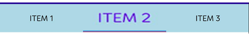

# How to Select a Tab Item Programmatically?

## Prerequisites

Before using the [SfTabView](https://help.syncfusion.com/cr/maui/Syncfusion.Maui.TabView.SfTabView.html), ensure the following NuGet package is installed in your .NET MAUI project:

- `Syncfusion.Maui.TabView`

For step-by-step setup, refer to the [Getting Started](https://help.syncfusion.com/maui/tabview/getting-started) documentation.

## Overview

This section explains how to programmatically select a tab item and how to detect or act on the currently selected tab item in the .NET MAUI Tab View (`SfTabView`) control:

* Use the [`SelectedIndex`](https://help.syncfusion.com/cr/maui/Syncfusion.Maui.TabView.SfTabView.html#Syncfusion_Maui_TabView_SfTabView_SelectedIndex) property to select a tab item programmatically (for example, in response to a button click or app navigation).
* Use the [`IsSelected`](https://help.syncfusion.com/cr/maui/Syncfusion.Maui.TabView.SfTabItem.html#Syncfusion_Maui_TabView_SfTabItem_IsSelected) property on an `SfTabItem`, in combination with the `SelectionChanged` event, to check whether a specific tab item is the currently selected one and to perform actions based on that state.

## Programmatically select the tab item

You can use the [`SelectedIndex`](https://help.syncfusion.com/cr/maui/Syncfusion.Maui.TabView.SfTabView.html#Syncfusion_Maui_TabView_SfTabView_SelectedIndex) property of `SfTabView` to programmatically select a tab item. The value is zero-based and must be less than the number of items in the `Items` collection; setting it to `-1` clears the selection.




<tabView:SfTabView x:Name="tabView" SelectedIndex="2">
    <tabView:SfTabItem Header="Item1" />
    <tabView:SfTabItem Header="Item2" />
    <tabView:SfTabItem Header="Item3" />
</tabView:SfTabView>





SfTabView tabView = new SfTabView()
{
    SelectedIndex = 2,
    Items =
    {
        new SfTabItem { Header = "Item1", ImageSource = "avatar1.png" },
        new SfTabItem { Header = "Item2", ImageSource = "avatar2.png" },
        new SfTabItem { Header = "Item3", ImageSource = "avatar3.png" }
    }
};





## Perform an action when a tab is selected using the IsSelected property

The [`IsSelected`](https://help.syncfusion.com/cr/maui/Syncfusion.Maui.TabView.SfTabItem.html#Syncfusion_Maui_TabView_SfTabItem_IsSelected) property on `SfTabItem` indicates whether the tab item is the currently active one. Use this property inside the `SelectionChanged` event handler to identify the newly selected tab item and perform actions based on that state, as shown in the code snippet below.




<tabView:SfTabView x:Name="tabView" SelectionChanged="Index_Changed">
    <tabView:SfTabItem x:Name="tab1" Header="Item1" />
    <tabView:SfTabItem x:Name="tab2" Header="Item2" />
    <tabView:SfTabItem x:Name="tab3" Header="Item3" />
</tabView:SfTabView>




SfTabView tabView = new SfTabView()
{
    Items =
    {
        new SfTabItem { Header = "Item1", ImageSource = "avatar1.png" },
        new SfTabItem { Header = "Item2", ImageSource = "avatar2.png" },
        new SfTabItem { Header = "Item3", ImageSource = "avatar3.png" }
    }
};
tabView.SelectionChanged += Index_Changed;
private void Index_Changed(object sender, TabSelectionChangedEventArgs e)
{
    // Identify the newly selected tab item using the new index from the event args.
    var selectedItem = e.NewIndex;
}




## See also

* [Selection Indicator Customization in .NET MAUI Tab View](https://help.syncfusion.com/maui/tabview/selection-indicator-customization)
* [Tab Item Customization in .NET MAUI Tab View](Thttps://help.syncfusion.com/maui/tabview/tab-item-customization)
* [Tab bar Customization in .NET MAUI Tab View](https://help.syncfusion.com/maui/tabview/tab-bar-customization)
* [Populating ItemsSource in .NET MAUI Tab View](https://help.syncfusion.com/maui/tabview/populating-itemssource)