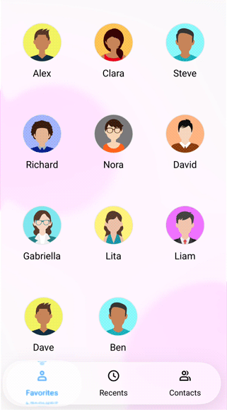

# Liquid Glass Support for .NET MAUI TabView:

The [SfTabView](https://help.syncfusion.com/cr/maui/Syncfusion.Maui.TabView.SfTabView.html?tabs=tabid-1) supports a liquid glass effect (also called acrylic or glass morphism) when you enable `EnableLiquidGlassEffect`. This feature applies a frosted, translucent style that blends seamlessly with the background, giving the Tab View a modern and elegant look. The effect is rendered dynamically during loading and user interaction, creating a subtle, responsive visual without changing the Tab View’s default structure. It works best over vibrant images or colorful layouts, enhancing depth and providing a stylish appearance to your application.

## Availability

1.  Supported on .NET 10 or greater.
2.  Supported on mac or iOS 26 or greater.
3.  On platforms/versions below these requirements, the glass effect is not applied and the Tab View  render with the standard appearance.




    <Grid>
        <!-- Background to make the glass effect visible while pressing the Tab View  -->
        <Image Source="wallpaper.jpg" Aspect="AspectFill" />
        <tabview:SfTabView EnableLiquidGlassEffect="True" />
    </Grid>




SfTabView tabView = new SfTabView
{
    EnableLiquidGlassEffect = true
};




## Behavior and tips

- The glass effect is applied to the Tab View  at render time and during user interaction.
- Place the Tab View  over visually rich content (images, gradients, or color blocks) to better showcase the transient glass effect.
- Visual output and performance may vary by device/platform; keep backgrounds moderately detailed to maintain clarity during interaction.

The following GIF demonstrates the liquid glass effect

