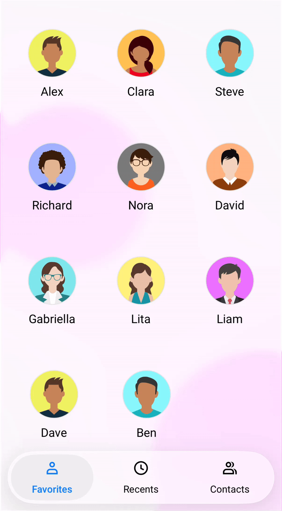

# Liquid Glass Support for .NET MAUI TabView

## Prerequisites

Before using the [SfTabView](https://help.syncfusion.com/cr/maui/Syncfusion.Maui.TabView.SfTabView.html), ensure the following NuGet package is installed in your .NET MAUI project:

- `Syncfusion.Maui.TabView`

For step-by-step setup, refer to the [Getting Started](https://help.syncfusion.com/maui/tabview/getting-started) documentation.

## Overview

The [`SfTabView`](https://help.syncfusion.com/cr/maui/Syncfusion.Maui.TabView.SfTabView.html) supports a liquid glass effect (also called glass morphism) when you enable the [`EnableLiquidGlassEffect`](https://help.syncfusion.com/cr/maui/Syncfusion.Maui.TabView.SfTabView.html#Syncfusion_Maui_TabView_SfTabView_EnableLiquidGlassEffect) property.

## What is the liquid glass effect?

The liquid glass effect is a frosted, translucent style that blends seamlessly with the background, giving the Tab View a modern and elegant look. The effect is rendered dynamically during loading and user interaction, creating a subtle, responsive visual while preserving the Tab View's default structure. It works best over vibrant images or colorful layouts, enhancing depth and providing a stylish appearance to your application.

## Steps to enable the liquid glass effect

1. Install the Syncfusion .NET MAUI Tab View package and register the handler.
2. Declare the `xmlns:tabView` namespace on the page.
3. Set the `EnableLiquidGlassEffect` property to `true` on the `SfTabView`.
4. Place the `SfTabView` over visually rich content (an image, gradient, or color block) so the glass effect is clearly visible.

> **Note** This feature is supported only on `.NET 10` along with `iOS 26` and `macOS 26`. On other platforms (Android, Windows, older iOS/macOS), the property has no effect and the Tab View renders with its default styling.




<Grid>
    <!-- Background to make the glass effect visible while pressing the Tab View. -->
    <Image Source="wallpaper.jpg" Aspect="AspectFill" />
    <tabView:SfTabView EnableLiquidGlassEffect="true">
        <tabView:SfTabItem Header="Item1" />
        <tabView:SfTabItem Header="Item2" />
        <tabView:SfTabItem Header="Item3" />
    </tabView:SfTabView>
</Grid>




SfTabView tabView = new SfTabView
{
    EnableLiquidGlassEffect = true
    Items =
    {
        new SfTabItem { Header = "Item1" },
        new SfTabItem { Header = "Item2" },
        new SfTabItem { Header = "Item3" }
    }
};

tabView.TabItemTapped += TabView_TabItemTapped;



## Behavior

- The `EnableLiquidGlassEffect` property is a `bool` and defaults to `false`. When set to `true`, the glass effect is applied to the Tab View at render time and during user interaction.
- On unsupported platforms, the property has no effect and the Tab View renders with its default styling; no exception is thrown.
- The image referenced in the XAML sample (`wallpaper.jpg`) must be added to the `Resources/Images` folder of your MAUI project and registered as a `MauiImage` item in the `.csproj` file so it can be resolved.

## Design tips

- Place the Tab View over visually rich content (images, gradients, or color blocks) to better showcase the glass effect.
- Use a background with moderate detail and a strong contrast with the foreground content to maintain clarity during interaction.
- Visual output and performance may vary by device and platform; test on each target platform you intend to support.

The following GIF demonstrates the liquid glass effect of the Tab View.

## Troubleshooting

* If the glass effect is not visible, confirm that the project targets `.NET 10` and that you are running on `iOS 26` or `macOS 26`. On other platforms the property has no effect.
* If the XAML sample does not compile, verify that the `xmlns:tabView` namespace is declared on the page and that the Syncfusion MAUI Tab View package is installed.
* If the C# sample does not compile, add `using Syncfusion.Maui.TabView;` at the top of the file.
* If the background image does not appear, ensure the image file is placed under `Resources/Images` and registered as a `MauiImage` item in the `.csproj` file.

## See also

* [Getting Started with .NET MAUI Tab View](https://help.syncfusion.com/maui/tabview/getting-started)
* [Selection Indicator Customization in .NET MAUI Tab View](https://help.syncfusion.com/maui/tabview/selection-indicator-customization)
* [Header Display Mode in .NET MAUI Tab View](https://help.syncfusion.com/maui/tabview/header-display-mode)
* [Tab Item Customization in .NET MAUI Tab View](Thttps://help.syncfusion.com/maui/tabview/tab-item-customization)
* [Tab bar Customization in .NET MAUI Tab View](https://help.syncfusion.com/maui/tabview/tab-bar-customization)
* [Populating ItemsSource in .NET MAUI Tab View](https://help.syncfusion.com/maui/tabview/populating-itemssource)