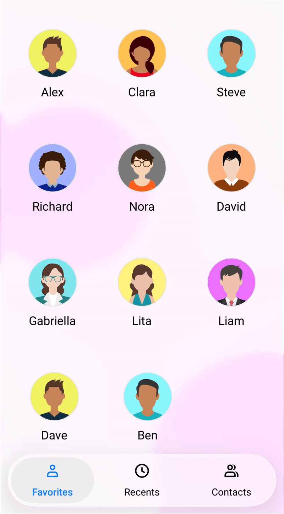

# Liquid Glass Support for .NET MAUI Tab View (SfTabView)

The Liquid Glass Effect introduces a modern, translucent design with adaptive color tinting and light refraction, creating a sleek, glass-like user experience that remains clear and accessible while maintaining readable contrast. This section explains how to enable and customize the effect in the Syncfusion® .NET MAUI TabView (SfTabView) control.

## Prerequisites

Before using the [SfTabView](https://help.syncfusion.com/cr/maui/Syncfusion.Maui.TabView.SfTabView.html), Install the [Syncfusion.Maui.TabView](https://www.nuget.org/packages/Syncfusion.Maui.TabView) and [Syncfusion.Maui.Core](https://www.nuget.org/packages/Syncfusion.Maui.Core) NuGet packages in your .NET MAUI project. The `Syncfusion.Maui.Core` package is required for the [SfGlassEffectView](https://help.syncfusion.com/cr/maui/Syncfusion.Maui.Core.SfGlassEffectView.html) container used to host the Liquid Glass Effect.

For step-by-step setup, refer to the [Getting Started](https://help.syncfusion.com/maui/tabview/getting-started) documentation.

N>
* The Liquid Glass Effect is supported only on **.NET 10** targeting **macOS 26 or higher** and **iOS 26 or higher**.
* It is not supported on Android or Windows.

## Enable the Liquid Glass effect

The [Tab View](https://help.syncfusion.com/cr/maui/Syncfusion.Maui.TabView.SfTabView.html) supports a liquid glass effect (also called glass morphism) when you enable the [EnableLiquidGlassEffect](https://help.syncfusion.com/cr/maui/Syncfusion.Maui.TabView.SfTabView.html#Syncfusion_Maui_TabView_SfTabView_EnableLiquidGlassEffect) property. The following code example illustrates how to enable the liquid glass effect on the `Tab View`. Place the drawer over a visually rich background (image, gradient, or color block) so the translucent effect is visible.




<Grid>
    <!-- Background to make the glass effect visible while pressing the Tab View. -->
    <Image Source="wallpaper.jpg" Aspect="AspectFill" />
    <tabView:SfTabView EnableLiquidGlassEffect="True">
        <tabView:SfTabItem Header="Item1" />
        <tabView:SfTabItem Header="Item2" />
        <tabView:SfTabItem Header="Item3" />
    </tabView:SfTabView>
</Grid>




Grid grid = new Grid
{
    Children =
    {
        new Image
        {
            Source = "wallpaper.jpg",
            Aspect = Aspect.AspectFill
        },
        new SfTabView
        {
            EnableLiquidGlassEffect = true,
            Items = new TabItemCollection
            {
                new SfTabItem { Header = "Item1" },
                new SfTabItem { Header = "Item2" },
                new SfTabItem { Header = "Item3" }
            }
        }
    }
};




## Behavior and tips

- The glass effect is applied to the Tab View  at render time and during user interaction.
- Place the Tab View  over visually rich content (images, gradients, or color blocks) to better showcase the transient glass effect.
- Visual output and performance may vary by device/platform; keep backgrounds moderately detailed to maintain clarity during interaction.

The following GIF demonstrates the liquid glass effect of the Tab View.

## See also

- [Selection Indicator Customization in .NET MAUI Tab View](https://help.syncfusion.com/maui/tabview/selection-indicator-customization)
- [Tab Item Customization in .NET MAUI Tab View](Thttps://help.syncfusion.com/maui/tabview/tab-item-customization)
- [Tab Bar Customization in .NET MAUI Tab View](https://help.syncfusion.com/maui/tabview/tab-bar-customization)
- [Populating ItemsSource in .NET MAUI Tab View](https://help.syncfusion.com/maui/tabview/populating-itemssource)