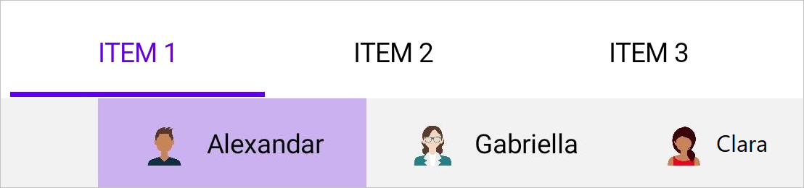

# Nested tab in .NET MAUI Tab View (SfTabView)

Nested tab items can be configured in tab view through the `Items` property of `SfTabView`, which holds the nested collection of `SfTabItem` through `TabItemsCollection`.





<ContentPage xmlns="http://schemas.microsoft.com/dotnet/2021/maui"
             xmlns:x="http://schemas.microsoft.com/winfx/2009/xaml"
             x:Class="TabViewMauiSample.MainPage"
             xmlns:tabView="http://schemas.syncfusion.com/maui"
             BackgroundColor="{DynamicResource SecondaryColor}">
    <ContentPage.Content>
        <Grid>
            <tabView:SfTabView x:Name="tabView"
                                TabBarBackground="#FDF8F6"
                                TabWidthMode="SizeToContent"
                                TabBarPlacement="Top"
                                BackgroundColor="Transparent"
                                IndicatorBackground="#6200EE"
                                IndicatorPlacement="Top" >
                <tabView:SfTabView.Items>
                    <tabView:SfTabItem Header="Photos">
                        <tabView:SfTabItem.Content>
                            <Grid BackgroundColor="Blue">
                                <tabView:SfTabView x:Name="tabView"
                                                    TabBarBackground="#FDF8F6"
                                                    TabWidthMode="Default"
                                                    TabBarPlacement="Bottom"
                                                    BackgroundColor="Transparent"
                                                    IndicatorBackground="#6200EE"
                                                    IndicatorPlacement="Top" >
                                        <tabView:SfTabView.Items>
                                            <tabView:SfTabItem Header="Camera">
                                                <tabView:SfTabItem.Content>
                                                    <Grid BackgroundColor="Blue">
                                                        <Image WidthRequest="35"
                                                                HeightRequest="35"
                                                                VerticalOptions="Center"
                                                                HorizontalOptions="Center"
                                                                Aspect="AspectFit"
                                                                Source="camera"/>    
                                                    </Grid>
                                                </tabView:SfTabItem.Content>
                                            </tabView:SfTabItem>

                                            <tabView:SfTabItem Header="Video">
                                                <tabView:SfTabItem.Content>
                                                    <Grid BackgroundColor="Blue">
                                                        <Image WidthRequest="35"
                                                                HeightRequest="35"
                                                                VerticalOptions="Center"
                                                                HorizontalOptions="Center"
                                                                Aspect="AspectFit"
                                                                Source="video"/>    
                                                    </Grid>
                                                </tabView:SfTabItem.Content>
                                            </tabView:SfTabItem>

                                            <tabView:SfTabItem Header="Screenshots">
                                                <tabView:SfTabItem.Content>
                                                    <Grid BackgroundColor="Blue">
                                                        <Image WidthRequest="35"
                                                                HeightRequest="35"
                                                                VerticalOptions="Center"
                                                                HorizontalOptions="Center"
                                                                Aspect="AspectFit"
                                                                Source="screenshots"/>    
                                                    </Grid>
                                                </tabView:SfTabItem.Content>
                                            </tabView:SfTabItem>

                                            <tabView:SfTabItem Header="Wallpaper">
                                                <tabView:SfTabItem.Content>
                                                    <Grid BackgroundColor="Blue">
                                                        <Image WidthRequest="35"
                                                                HeightRequest="35"
                                                                VerticalOptions="Center"
                                                                HorizontalOptions="Center"
                                                                Aspect="AspectFit"
                                                                Source="wallpaper"/>    
                                                    </Grid>
                                                </tabView:SfTabItem.Content>
                                            </tabView:SfTabItem>
                                        </tabView:SfTabView.Items>
                                    </tabView:SfTabView>
                            </Grid>
                        </tabView:SfTabItem.Content>
                    </tabView:SfTabItem>

                    <tabView:SfTabItem Header="Collections">
                        <tabView:SfTabItem.Content>
                            <Grid BackgroundColor="Red"/>
                        </tabView:SfTabItem.Content>
                    </tabView:SfTabItem>

                    <tabView:SfTabItem Header="Explore">
                        <tabView:SfTabItem.Content>
                            <Grid BackgroundColor="Green"/>
                        </tabView:SfTabItem.Content>
                    </tabView:SfTabItem>
                </tabView:SfTabView.Items>
            </tabView:SfTabView>
        </Grid>
    </ContentPage.Content>
</ContentPage>





