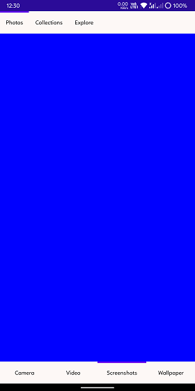

# Nested Tab in .NET MAUI Tab View (SfTabView)

You can configure nested tab items in the Tab View using the [Items](https://help.syncfusion.com/cr/maui/Syncfusion.Maui.TabView.SfTabView.html#Syncfusion_Maui_TabView_SfTabView_Items) property of [SfTabView](https://help.syncfusion.com/cr/maui/Syncfusion.Maui.TabView.SfTabView.html). This property holds the nested collection of [SfTabItem](https://help.syncfusion.com/cr/maui/Syncfusion.Maui.TabView.SfTabItem.html) by [TabItemsCollection](https://help.syncfusion.com/cr/maui/Syncfusion.Maui.TabView.TabItemCollection.html).

To get start quickly with Nested Tab View in .NET MAUI Tab View, you can check on this video:

{% youtube "https://www.youtube.com/watch?v=batfDt1S8Mc&ab_channel=Syncfusion%2CInc" %}





<ContentPage xmlns="http://schemas.microsoft.com/dotnet/2021/maui"
             xmlns:x="http://schemas.microsoft.com/winfx/2009/xaml"
             x:Class="TabViewMauiSample.MainPage"
             xmlns:tabView="clr-namespace:Syncfusion.Maui.TabView;assembly=Syncfusion.Maui.TabView"
             BackgroundColor="{DynamicResource SecondaryColor}">
    <ContentPage.Content>
        <Grid>
            <tabView:SfTabView x:Name="tabView"
                                TabBarBackground="#FDF8F6"
                                TabWidthMode="SizeToContent"
                                TabBarPlacement="Top"
                                BackgroundColor="Transparent"
                                IndicatorBackground="#6200EE"
                                IndicatorPlacement="Top" >
                <tabView:SfTabView.Items>
                    <tabView:SfTabItem Header="Photos">
                        <tabView:SfTabItem.Content>
                            <Grid BackgroundColor="Blue">
                                <tabView:SfTabView x:Name="nestedTabView"
                                                    TabBarBackground="#FDF8F6"
                                                    TabWidthMode="Default"
                                                    TabBarPlacement="Bottom"
                                                    BackgroundColor="Transparent"
                                                    IndicatorBackground="#6200EE"
                                                    IndicatorPlacement="Top" >
                                        <tabView:SfTabView.Items>
                                            <tabView:SfTabItem Header="Camera">
                                                <tabView:SfTabItem.Content>
                                                    <Grid BackgroundColor="Blue">
                                                      ...  
                                                    </Grid>
                                                </tabView:SfTabItem.Content>
                                            </tabView:SfTabItem>

                                            <tabView:SfTabItem Header="Video">
                                                <tabView:SfTabItem.Content>
                                                    <Grid BackgroundColor="Blue">
                                                       ...   
                                                    </Grid>
                                                </tabView:SfTabItem.Content>
                                            </tabView:SfTabItem>

                                            <tabView:SfTabItem Header="Screenshots">
                                                <tabView:SfTabItem.Content>
                                                    <Grid BackgroundColor="Blue">
                                                        ...   
                                                    </Grid>
                                                </tabView:SfTabItem.Content>
                                            </tabView:SfTabItem>

                                            <tabView:SfTabItem Header="Wallpaper">
                                                <tabView:SfTabItem.Content>
                                                    <Grid BackgroundColor="Blue">
                                                       ...   
                                                    </Grid>
                                                </tabView:SfTabItem.Content>
                                            </tabView:SfTabItem>
                                        </tabView:SfTabView.Items>
                                    </tabView:SfTabView>
                            </Grid>
                        </tabView:SfTabItem.Content>
                    </tabView:SfTabItem>

                    <tabView:SfTabItem Header="Collections">
                        <tabView:SfTabItem.Content>
                            <Grid BackgroundColor="Red"/>
                        </tabView:SfTabItem.Content>
                    </tabView:SfTabItem>

                    <tabView:SfTabItem Header="Explore">
                        <tabView:SfTabItem.Content>
                            <Grid BackgroundColor="Green"/>
                        </tabView:SfTabItem.Content>
                    </tabView:SfTabItem>
                </tabView:SfTabView.Items>
            </tabView:SfTabView>
        </Grid>
    </ContentPage.Content>
</ContentPage>




public partial class MainPage : ContentPage
{
    SfTabView tabView;
    SfTabView nestedTabView;
    public MainPage()
    {
        InitializeComponent();
        tabView = new SfTabView();
        nestedTabView = new SfTabView();
        var tabItems = new TabItemCollection
        {
            new SfTabItem()
            {
                Header = "Photos",
                Content = nestedTabView
            },
            new SfTabItem()
            {
                Header = "Collections",
                Content = new ListView()
                {
                    //// code
                },
            },
            new SfTabItem()
            {
                Header = "Explore",
                Content = new ListView()
                {
                    //// code
                },
            }
        };
        var nestedTabItems = new TabItemCollection
        {
            new SfTabItem()
            {
                Header = "Camera",
                Content = new ListView()
                {
                    //// code
                },
            },
            new SfTabItem()
            {
                Header = "Video",
                Content = new ListView()
                {
                    //// code
                },
            },
            new SfTabItem()
            {
                Header = "Screenshots",
                Content = new ListView()
                {
                    //// code
                },
            },
            new SfTabItem()
            {
                Header = "Wallpaper",
                Content = new ListView()
                {
                    //// code
                },
            }
        };

        tabView.Items = tabItems;
        tabView.TabWidthMode = TabWidthMode.SizeToContent;
        tabView.TabBarPlacement = TabBarPlacement.Top;
        tabView.IndicatorPlacement = TabIndicatorPlacement.Top;
        tabView.TabBarBackground = new SolidColorBrush(Color.FromArgb("#FDF8F6"));
        tabView.IndicatorBackground = new SolidColorBrush(Color.FromArgb("#6200EE"));
        nestedTabView.Items = nestedTabItems;
        nestedTabView.TabBarPlacement = TabBarPlacement.Bottom;
        nestedTabView.IndicatorPlacement = TabIndicatorPlacement.Top;
        nestedTabView.TabBarBackground = new SolidColorBrush(Color.FromArgb("#FDF8F6"));
        nestedTabView.IndicatorBackground = new SolidColorBrush(Color.FromArgb("#6200EE"));
        this.Content = tabView;
    }
}




N> View the [sample](https://github.com/SyncfusionExamples/maui-tabview-samples/tree/main/NestedTabViewSample) on GitHub.

## EnableVirtualization

Enabling virtualization improves the initial loading performance of [SfTabView](https://help.syncfusion.com/cr/maui/Syncfusion.Maui.TabView.SfTabView.html). To activate this feature, set the `EnableVirtualization` property to `true`.




<tabView:SfTabView EnableVirtualization="True" />




SfTabView tabView = new SfTabView();
tabView.EnableVirtualization = true;


