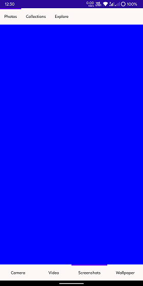

# Nested Tab in .NET MAUI Tab View (SfTabView)

## Prerequisites

Before using the [SfTabView](https://help.syncfusion.com/cr/maui/Syncfusion.Maui.TabView.SfTabView.html), ensure the following NuGet package is installed in your .NET MAUI project:

- `Syncfusion.Maui.TabView`

For step-by-step setup, refer to the [Getting Started](https://help.syncfusion.com/maui/tabview/getting-started) documentation.

## Overview

A nested tab is a tab item whose `Content` is itself another `SfTabView`. Use this pattern when you need to group related sub-categories under a parent tab—for example, a "Photos" tab that contains a nested tab view with "Camera", "Video", "Screenshots", and "Wallpaper" sub-tabs.

You can configure nested tab items in the Tab View using the [`Items`](https://help.syncfusion.com/cr/maui/Syncfusion.Maui.TabView.SfTabView.html#Syncfusion_Maui_TabView_SfTabView_Items) property of [`SfTabView`](https://help.syncfusion.com/cr/maui/Syncfusion.Maui.TabView.SfTabView.html). This property holds a collection of [`SfTabItem`](https://help.syncfusion.com/cr/maui/Syncfusion.Maui.TabView.SfTabItem.html) instances of type [`TabItemCollection`](https://help.syncfusion.com/cr/maui/Syncfusion.Maui.TabView.TabItemCollection.html).

> **Note** The minimum Syncfusion MAUI package version that supports nested tabs is 21.2.XX or later. Verify the version in your project before applying the samples below.

## Walkthrough video

To get started quickly with nested tabs in the .NET MAUI Tab View, watch this video walkthrough:

{% youtube "https://www.youtube.com/watch?v=batfDt1S8Mc&ab_channel=Syncfusion%2CInc" "Walkthrough: nested tabs in the .NET MAUI Tab View" %}




<Grid>
    <tabView:SfTabView x:Name="tabView"
                        TabBarBackground="#FDF8F6"
                        TabWidthMode="SizeToContent"
                        TabBarPlacement="Top"
                        BackgroundColor="Transparent"
                        IndicatorBackground="#6200EE"
                        IndicatorPlacement="Top">
        <tabView:SfTabView.Items>
            <tabView:SfTabItem Header="Photos">
                <tabView:SfTabItem.Content>
                    <Grid BackgroundColor="Blue">
                        <tabView:SfTabView x:Name="nestedTabView"
                                            TabBarBackground="#FDF8F6"
                                            TabWidthMode="Default"
                                            TabBarPlacement="Bottom"
                                            BackgroundColor="Transparent"
                                            IndicatorBackground="#6200EE"
                                            IndicatorPlacement="Top">
                            <tabView:SfTabView.Items>
                                <tabView:SfTabItem Header="Camera">
                                    <tabView:SfTabItem.Content>
                                        <Grid BackgroundColor="Blue">
                                            <!-- Camera content goes here. -->
                                        </Grid>
                                    </tabView:SfTabItem.Content>
                                </tabView:SfTabItem>
                                <tabView:SfTabItem Header="Video">
                                    <tabView:SfTabItem.Content>
                                        <Grid BackgroundColor="Blue">
                                            <!-- Video content goes here. -->
                                        </Grid>
                                    </tabView:SfTabItem.Content>
                                </tabView:SfTabItem>
                                <tabView:SfTabItem Header="Screenshots">
                                    <tabView:SfTabItem.Content>
                                        <Grid BackgroundColor="Blue">
                                            <!-- Screenshots content goes here. -->
                                        </Grid>
                                    </tabView:SfTabItem.Content>
                                </tabView:SfTabItem>
                                <tabView:SfTabItem Header="Wallpaper">
                                    <tabView:SfTabItem.Content>
                                        <Grid BackgroundColor="Blue">
                                            <!-- Wallpaper content goes here. -->
                                        </Grid>
                                    </tabView:SfTabItem.Content>
                                </tabView:SfTabItem>
                            </tabView:SfTabView.Items>
                        </tabView:SfTabView>
                    </Grid>
                </tabView:SfTabItem.Content>
            </tabView:SfTabItem>
            <tabView:SfTabItem Header="Collections">
                <tabView:SfTabItem.Content>
                    <Grid BackgroundColor="Red"/>
                </tabView:SfTabItem.Content>
            </tabView:SfTabItem>
            <tabView:SfTabItem Header="Explore">
                <tabView:SfTabItem.Content>
                    <Grid BackgroundColor="Green"/>
                </tabView:SfTabItem.Content>
            </tabView:SfTabItem>
        </tabView:SfTabView.Items>
    </tabView:SfTabView>
</Grid>




SfTabView tabView = new SfTabView
{
    Items = new TabItemCollection
    {
        new SfTabItem()
        {
            Header = "Photos",
            Content = new SfTabView
            {
                Items = new TabItemCollection
                {
                    new SfTabItem()
                    {
                        Header = "Camera",
                        Content = new ListView()
                        {
                            // Add Camera content here.
                        }
                    },
                    new SfTabItem()
                    {
                        Header = "Video",
                        Content = new ListView()
                        {
                            // Add Video content here.
                        }
                    },
                    new SfTabItem()
                    {
                        Header = "Screenshots",
                        Content = new ListView()
                        {
                            // Add Screenshots content here.
                        }
                    },
                    new SfTabItem()
                    {
                        Header = "Wallpaper",
                        Content = new ListView()
                        {
                            // Add Wallpaper content here.
                        }
                    }
                },
                TabBarPlacement = TabBarPlacement.Bottom,
                IndicatorPlacement = TabIndicatorPlacement.Top,
                TabBarBackground = new SolidColorBrush(Color.FromArgb("#FDF8F6")),
                IndicatorBackground = new SolidColorBrush(Color.FromArgb("#6200EE"))
            }
        },
        new SfTabItem()
        {
            Header = "Collections",
            Content = new ListView()
            {
                // Add Collections content here.
            }
        },
        new SfTabItem()
        {
            Header = "Explore",
            Content = new ListView()
            {
                // Add Explore content here.
            }
        }
    },
    TabWidthMode = TabWidthMode.SizeToContent,
    TabBarPlacement = TabBarPlacement.Top,
    IndicatorPlacement = TabIndicatorPlacement.Top,
    TabBarBackground = new SolidColorBrush(Color.FromArgb("#FDF8F6")),
    IndicatorBackground = new SolidColorBrush(Color.FromArgb("#6200EE"))
};




N> View the [sample](https://github.com/SyncfusionExamples/maui-tabview-samples/tree/main/NestedTabViewSample) on GitHub.

## Enable Virtualization

The [`EnableVirtualization`](https://help.syncfusion.com/cr/maui/Syncfusion.Maui.TabView.SfTabView.html#Syncfusion_Maui_TabView_SfTabView_EnableVirtualization) property is a `bool` that defaults to `false`. Set it to `true` to improve the initial loading performance of the `SfTabView` by only creating the tab content when the corresponding tab is selected. This is especially useful when the Tab View contains many heavy or nested tab items.




<tabView:SfTabView x:Name="tabView" EnableVirtualization="true">
    <tabView:SfTabItem Header="Item1" />
    <tabView:SfTabItem Header="Item2" />
    <tabView:SfTabItem Header="Item3" />
</tabView:SfTabView>




SfTabView tabView = new SfTabView
{
    EnableVirtualization = true,
    Items =
    {
        new SfTabItem { Header = "Item1" },
        new SfTabItem { Header = "Item2" },
        new SfTabItem { Header = "Item3" }
    }
};




## See also

* [Selection Indicator Customization in .NET MAUI Tab View](https://help.syncfusion.com/maui/tabview/selection-indicator-customization)
* [Tab Item Customization in .NET MAUI Tab View](Thttps://help.syncfusion.com/maui/tabview/tab-item-customization)
* [Tab bar Customization in .NET MAUI Tab View](https://help.syncfusion.com/maui/tabview/tab-bar-customization)