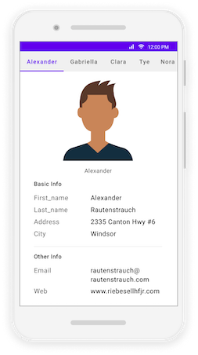

# MAUI TabView (SfTabView) Overview

The advanced .NET  Multi-platform App UI (MAUI) Tab View is a simple and intuitive interface for tab navigation in mobile and desktop applications, where users can explore and switch between different tabs.

## Key features

* .NET MAUI TabView can be used to optimize screen space usage when the application requires complex and huge layouts.
* A .NET MAUI TabView contains set of .NET MAUI TabItem place accordingly to share the same space.
* At a time only one .NET MAUI Tab Item will be visible and accessible from the user. The user has to tap the Tab of hidden Tab Item to make it visible on the screen.

