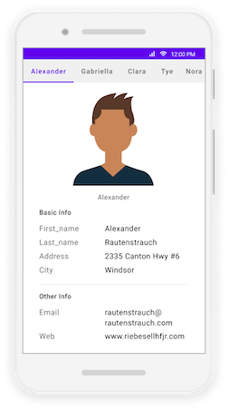

# Overview of .NET MAUI Tab View (SfTabView)

The advanced .NET Multi-platform App UI (MAUI) Tab View provides a simple and intuitive interface for tab navigation in both mobile and desktop applications. This allows users to explore and switch between different tabs efficiently.

## Key features

* Nested tab support with different header placements.

* Fixed and scrollable tab headers.

* Image and text support for headers.

## Usage

* The .NET MAUI Tab View can be used to optimize screen space usage when the application requires complex and extensive layouts.

* The .NET MAUI Tab View contains a set of tab items that share the same space.

* At any given time, only one .NET MAUI tab item will be visible and accessible to users. Users must tap the tab of the hidden tab item to make it visible on the screen.

