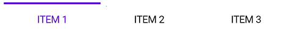
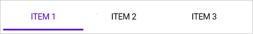
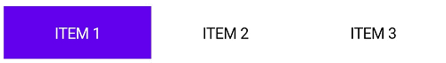
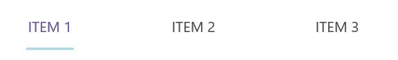
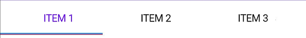
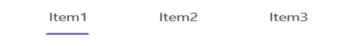
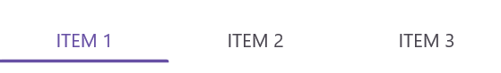
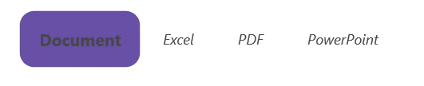

# Customize the Selection Indicator in .NET MAUI Tab View (SfTabView)

## Placement options

The .NET MAUI Tab View provides three options for determining how selection indicator aligns relative to the tab header item. The options are top, bottom, and fill. This can be done by setting the [IndicatorPlacement](https://help.syncfusion.com/cr/maui/Syncfusion.Maui.TabView.SfTabView.html#Syncfusion_Maui_TabView_SfTabView_IndicatorPlacement) property of SfTabView.

### Top

The indicator will be placed at the top of the selected tab.




    <tabView:SfTabView IndicatorPlacement="Top">



     tabView.IndicatorPlacement = IndicatorPlacement.Top;




 

### Bottom

The indicator will be placed at the bottom of the selected tab.




    <tabView:SfTabView IndicatorPlacement="Bottom">



     tabView.IndicatorPlacement = IndicatorPlacement.Bottom;




 

### Fill

The indicator will fill the selected tab.




    <tabView:SfTabView IndicatorPlacement="Fill">



     tabView.IndicatorPlacement = IndicatorPlacement.Fill;




 

## Background Customization

The background of the indicator can be customized using the [IndicatorBackground](https://help.syncfusion.com/cr/maui/Syncfusion.Maui.TabView.SfTabView.html#Syncfusion_Maui_TabView_SfTabView_IndicatorBackground) property of SfTabView.

### Solid Color 

The SolidColorBrush class defines the color property of [IndicatorBackground](https://help.syncfusion.com/cr/maui/Syncfusion.Maui.TabView.SfTabView.html#Syncfusion_Maui_TabView_SfTabView_IndicatorBackground), which represents the color of the selection indicator background.




    <tabView:SfTabView IndicatorBackground="LightBlue">



     tabView.TabBarBackground = Color.LightBlue;




 

### Gradient Color 

The background can be customized with a linear gradient and radial gradient as like below example.



    <tabView:SfTabView>
        <tabView:SfTabView.IndicatorBackground>
            <LinearGradientBrush EndPoint="0,1">
                <GradientStop Color="#009FFF" Offset="0.1" />
                <GradientStop Color="#ec2F4B Offset="1.0" />
            </LinearGradientBrush>
        </tabView:SfTabView.IndicatorBackground>
    </tabView:SfTabView>


Microsoft.Maui.Controls.GradientStop gra1 = new Microsoft.Maui.Controls.GradientStop()
{
    Color = Color.FromArgb("#009FFF"),
    Offset = (float)0.1,
};

Microsoft.Maui.Controls.GradientStop gra2 = new Microsoft.Maui.Controls.GradientStop()
{
    Color = Color.FromArgb("#ec2F4B"),
    Offset = (float)1.0,
};

LinearGradientBrush graBrush = new LinearGradientBrush()
{
    EndPoint = new Point(0, 1),
    GradientStops = new GradientStopCollection() { gra1, gra2 }
};

SfTabView tabView = new SfTabView();
tabView.IndicatorBackground = graBrush;




 

N> View [sample](https://github.com/SyncfusionExamples/maui-tabview-samples/tree/main/TabBarCustomization) in GitHub

## Indicator Width Mode

The [IndicatorWidthMode](https://help.syncfusion.com/cr/maui/Syncfusion.Maui.TabView.SfTabView.html#Syncfusion_Maui_TabView_SfTabView_IndicatorWidthMode) property allows customization of the width of the indicator. By default, the `IndicatorWidthMode` property is set to [Fit](https://help.syncfusion.com/cr/maui/Syncfusion.Maui.TabView.IndicatorWidthMode.html#Syncfusion_Maui_TabView_IndicatorWidthMode_Fit), which adjusts the indicator width to fit the content of the header item. You can change the width size based on the header item by setting the `IndicatorWidthMode` property to [Stretch](https://help.syncfusion.com/cr/maui/Syncfusion.Maui.TabView.IndicatorWidthMode.html#Syncfusion_Maui_TabView_IndicatorWidthMode_Stretch).




    <tabView:SfTabView IndicatorWidthMode="Fit">



     tabView.IndicatorWidthMode = IndicatorWidthMode.Fit;




 




    <tabView:SfTabView IndicatorWidthMode="Stretch">



     tabView.IndicatorWidthMode = IndicatorWidthMode.Stretch;




 

## Indicator's corner radius
You can customize the corner radius of the selection indicator using the [IndicatorCornerRadius](https://help.syncfusion.com/cr/maui/Syncfusion.Maui.TabView.SfTabView.html#Syncfusion_Maui_TabView_SfTabView_IndicatorCornerRadius) property in the Tab View.




    <tabView:SfTabView IndicatorCornerRadius ="5">



     tabView.IndicatorCornerRadius  = 5;


 

 

## Indicator's Stroke Thickness
You can customize the stroke thickness of the selection indicator using the [IndicatorStrokeThickness](https://help.syncfusion.com/cr/maui/Syncfusion.Maui.TabView.SfTabView.html#Syncfusion_Maui_TabView_SfTabView_IndicatorStrokeThickness) property in the Tab View.




    <tabView:SfTabView IndicatorStrokeThickness ="7">
    </tabView:SfTabView>



     tabView.IndicatorStrokeThickness  = 7;


 

 