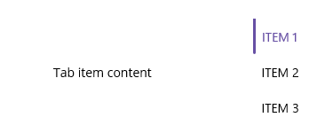
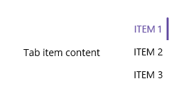
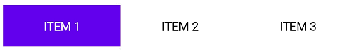
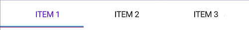
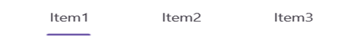
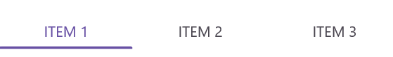
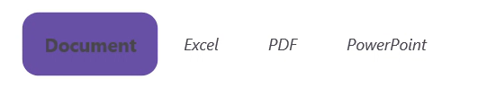
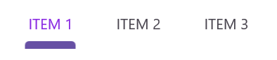

# Customize the Selection Indicator in .NET MAUI Tab View (SfTabView)

## Prerequisites

Before using the [SfTabView](https://help.syncfusion.com/cr/maui/Syncfusion.Maui.TabView.SfTabView.html), ensure the following NuGet package is installed in your .NET MAUI project:

- `Syncfusion.Maui.TabView`

For step-by-step setup, refer to the [Getting Started](https://help.syncfusion.com/maui/tabview/getting-started) documentation.

## Placement options

The selection indicator in the `SfTabView` highlights the currently selected tab header. You can customize its placement, background, width, corner radius, and stroke thickness using the properties documented on this page.

The .NET MAUI Tab View provides five options for determining how the selection indicator aligns relative to the tab header item. These options are `Top`, `Bottom`, `Left`, `Right`, and `Fill`. This can be configured by setting the [`IndicatorPlacement`](https://help.syncfusion.com/cr/maui/Syncfusion.Maui.TabView.SfTabView.html#Syncfusion_Maui_TabView_SfTabView_IndicatorPlacement) property of `SfTabView`. The indicator's available placements are constrained by the [`TabBarPlacement`](https://help.syncfusion.com/cr/maui/Syncfusion.Maui.TabView.SfTabView.html#Syncfusion_Maui_TabView_SfTabView_TabBarPlacement) of the tab bar; see the [Limitations](#limitations) section below.

### Top

The indicator will be placed at the top of the selected tab. Use this with `TabBarPlacement="Top"`.




<tabView:SfTabView TabBarPlacement="Top"
                   IndicatorPlacement="Top"
                   TabBarSize="60"
                   IndicatorWidthMode="Stretch">
    <tabView:SfTabView.Items>
        <tabView:SfTabItem Header="ITEM 1">
            <tabView:SfTabItem.Content>
                <Label Text="Tab item content"
                       HorizontalOptions="Center"
                       VerticalOptions="Center" />
            </tabView:SfTabItem.Content>
        </tabView:SfTabItem>
        <tabView:SfTabItem Header="ITEM 2">
            <tabView:SfTabItem.Content>
                <Label Text="Tab item content"
                       HorizontalOptions="Center"
                       VerticalOptions="Center" />
            </tabView:SfTabItem.Content>
        </tabView:SfTabItem>
        <tabView:SfTabItem Header="ITEM 3">
            <tabView:SfTabItem.Content>
                <Label Text="Tab item content"
                       HorizontalOptions="Center"
                       VerticalOptions="Center" />
            </tabView:SfTabItem.Content>
        </tabView:SfTabItem>
    </tabView:SfTabView.Items>
</tabView:SfTabView>




SfTabView tabView = new SfTabView
{
    TabBarPlacement = TabBarPlacement.Top,
    IndicatorPlacement = TabIndicatorPlacement.Top,
    TabBarSize = 60,
    IndicatorWidthMode = IndicatorWidthMode.Stretch,
    Items = new TabItemCollection
    {
        new SfTabItem()
        {
            Header = "ITEM 1",
            Content = new Label
            {
                Text = "Tab item content",
                HorizontalOptions = LayoutOptions.Center,
                VerticalOptions = LayoutOptions.Center
            }
        },
        new SfTabItem()
        {
            Header = "ITEM 2",
            Content = new Label
            {
                Text = "Tab item content",
                HorizontalOptions = LayoutOptions.Center,
                VerticalOptions = LayoutOptions.Center
            }
        },
        new SfTabItem()
        {
            Header = "ITEM 3",
            Content = new Label
            {
                Text = "Tab item content",
                HorizontalOptions = LayoutOptions.Center,
                VerticalOptions = LayoutOptions.Center
            }
        }
    }
};




### Bottom

The indicator will be placed at the bottom of the selected tab. Use this with `TabBarPlacement="Top"` or `TabBarPlacement="Bottom"`. The XAML and C# samples are identical to the [Top](#top) example, except that `IndicatorPlacement` is set to `Bottom`.




<tabView:SfTabView TabBarPlacement="Top"
                   IndicatorPlacement="Bottom"
                   TabBarSize="60"
                   IndicatorWidthMode="Stretch">
    <tabView:SfTabView.Items>
        <tabView:SfTabItem Header="ITEM 1">
            <tabView:SfTabItem.Content>
                <Label Text="Tab item content"
                       HorizontalOptions="Center"
                       VerticalOptions="Center" />
            </tabView:SfTabItem.Content>
        </tabView:SfTabItem>
        <tabView:SfTabItem Header="ITEM 2">
            <tabView:SfTabItem.Content>
                <Label Text="Tab item content"
                       HorizontalOptions="Center"
                       VerticalOptions="Center" />
            </tabView:SfTabItem.Content>
        </tabView:SfTabItem>
        <tabView:SfTabItem Header="ITEM 3">
            <tabView:SfTabItem.Content>
                <Label Text="Tab item content"
                       HorizontalOptions="Center"
                       VerticalOptions="Center" />
            </tabView:SfTabItem.Content>
        </tabView:SfTabItem>
    </tabView:SfTabView.Items>
</tabView:SfTabView>




SfTabView tabView = new SfTabView
{
    TabBarPlacement = TabBarPlacement.Top,
    IndicatorPlacement = TabIndicatorPlacement.Bottom,
    TabBarSize = 60,
    IndicatorWidthMode = IndicatorWidthMode.Stretch,
    Items = new TabItemCollection
    {
        new SfTabItem()
        {
            Header = "ITEM 1",
            Content = new Label
            {
                Text = "Tab item content",
                HorizontalOptions = LayoutOptions.Center,
                VerticalOptions = LayoutOptions.Center
            }
        },
        new SfTabItem()
        {
            Header = "ITEM 2",
            Content = new Label
            {
                Text = "Tab item content",
                HorizontalOptions = LayoutOptions.Center,
                VerticalOptions = LayoutOptions.Center
            }
        },
        new SfTabItem()
        {
            Header = "ITEM 3",
            Content = new Label
            {
                Text = "Tab item content",
                HorizontalOptions = LayoutOptions.Center,
                VerticalOptions = LayoutOptions.Center
            }
        }
    }
};




### Left

The indicator will be placed at the left of the selected tab. Use this with `TabBarPlacement="Right"`. The XAML and C# samples are identical to the [Top](#top) example, except that `TabBarPlacement` is set to `Right` and `IndicatorPlacement` is set to `Left`.




<tabView:SfTabView TabBarPlacement="Right"
                   IndicatorPlacement="Left"
                   TabBarSize="60"
                   IndicatorWidthMode="Stretch">
    <tabView:SfTabView.Items>
        <tabView:SfTabItem Header="ITEM 1">
            <tabView:SfTabItem.Content>
                <Label Text="Tab item content"
                       HorizontalOptions="Center"
                       VerticalOptions="Center" />
            </tabView:SfTabItem.Content>
        </tabView:SfTabItem>
        <tabView:SfTabItem Header="ITEM 2">
            <tabView:SfTabItem.Content>
                <Label Text="Tab item content"
                       HorizontalOptions="Center"
                       VerticalOptions="Center" />
            </tabView:SfTabItem.Content>
        </tabView:SfTabItem>
        <tabView:SfTabItem Header="ITEM 3">
            <tabView:SfTabItem.Content>
                <Label Text="Tab item content"
                       HorizontalOptions="Center"
                       VerticalOptions="Center" />
            </tabView:SfTabItem.Content>
        </tabView:SfTabItem>
    </tabView:SfTabView.Items>
</tabView:SfTabView>





SfTabView tabView = new SfTabView
{
    TabBarPlacement = TabBarPlacement.Right,
    IndicatorPlacement = TabIndicatorPlacement.Left,
    TabBarSize = 60,
    IndicatorWidthMode = IndicatorWidthMode.Stretch,
    Items = new TabItemCollection
    {
        new SfTabItem()
        {
            Header = "ITEM 1",
            Content = new Label
            {
                Text = "Tab item content",
                HorizontalOptions = LayoutOptions.Center,
                VerticalOptions = LayoutOptions.Center
            }
        },
        new SfTabItem()
        {
            Header = "ITEM 2",
            Content = new Label
            {
                Text = "Tab item content",
                HorizontalOptions = LayoutOptions.Center,
                VerticalOptions = LayoutOptions.Center
            }
        },
        new SfTabItem()
        {
            Header = "ITEM 3",
            Content = new Label
            {
                Text = "Tab item content",
                HorizontalOptions = LayoutOptions.Center,
                VerticalOptions = LayoutOptions.Center
            }
        }
    }
};




### Right

The indicator will be placed at the right of the selected tab. Use this with `TabBarPlacement="Right"`. The XAML and C# samples are identical to the [Top](#top) example, except that `TabBarPlacement` is set to `Right` and `IndicatorPlacement` is set to `Right`.




<tabView:SfTabView TabBarPlacement="Right"
                   IndicatorPlacement="Right"
                   TabBarSize="60"
                   IndicatorWidthMode="Stretch">
    <tabView:SfTabView.Items>
        <tabView:SfTabItem Header="ITEM 1">
            <tabView:SfTabItem.Content>
                <Label Text="Tab item content"
                       HorizontalOptions="Center"
                       VerticalOptions="Center" />
            </tabView:SfTabItem.Content>
        </tabView:SfTabItem>
        <tabView:SfTabItem Header="ITEM 2">
            <tabView:SfTabItem.Content>
                <Label Text="Tab item content"
                       HorizontalOptions="Center"
                       VerticalOptions="Center" />
            </tabView:SfTabItem.Content>
        </tabView:SfTabItem>
        <tabView:SfTabItem Header="ITEM 3">
            <tabView:SfTabItem.Content>
                <Label Text="Tab item content"
                       HorizontalOptions="Center"
                       VerticalOptions="Center" />
            </tabView:SfTabItem.Content>
        </tabView:SfTabItem>
    </tabView:SfTabView.Items>
</tabView:SfTabView>





SfTabView tabView = new SfTabView
{
    TabBarPlacement = TabBarPlacement.Right,
    IndicatorPlacement = TabIndicatorPlacement.Right,
    TabBarSize = 60,
    IndicatorWidthMode = IndicatorWidthMode.Stretch,
    Items = new TabItemCollection
    {
        new SfTabItem()
        {
            Header = "ITEM 1",
            Content = new Label
            {
                Text = "Tab item content",
                HorizontalOptions = LayoutOptions.Center,
                VerticalOptions = LayoutOptions.Center
            }
        },
        new SfTabItem()
        {
            Header = "ITEM 2",
            Content = new Label
            {
                Text = "Tab item content",
                HorizontalOptions = LayoutOptions.Center,
                VerticalOptions = LayoutOptions.Center
            }
        },
        new SfTabItem()
        {
            Header = "ITEM 3",
            Content = new Label
            {
                Text = "Tab item content",
                HorizontalOptions = LayoutOptions.Center,
                VerticalOptions = LayoutOptions.Center
            }
        }
    }
};




### Fill

The indicator will fill the selected tab. Use this with `IndicatorPlacement="Fill"`.





<tabView:SfTabView IndicatorPlacement="Fill">
    <tabView:SfTabView.Items>
        <tabView:SfTabItem Header="ITEM 1">
            <tabView:SfTabItem.Content>
                <Label Text="Tab item content"
                       HorizontalOptions="Center"
                       VerticalOptions="Center" />
            </tabView:SfTabItem.Content>
        </tabView:SfTabItem>
        <tabView:SfTabItem Header="ITEM 2">
            <tabView:SfTabItem.Content>
                <Label Text="Tab item content"
                       HorizontalOptions="Center"
                       VerticalOptions="Center" />
            </tabView:SfTabItem.Content>
        </tabView:SfTabItem>
        <tabView:SfTabItem Header="ITEM 3">
            <tabView:SfTabItem.Content>
                <Label Text="Tab item content"
                       HorizontalOptions="Center"
                       VerticalOptions="Center" />
            </tabView:SfTabItem.Content>
        </tabView:SfTabItem>
    </tabView:SfTabView.Items>
</tabView:SfTabView>





SfTabView tabView = new SfTabView
{
    IndicatorPlacement = TabIndicatorPlacement.Fill,
    Items = new TabItemCollection
    {
        new SfTabItem()
        {
            Header = "ITEM 1",
            Content = new Label
            {
                Text = "Tab item content",
                HorizontalOptions = LayoutOptions.Center,
                VerticalOptions = LayoutOptions.Center
            }
        },
        new SfTabItem()
        {
            Header = "ITEM 2",
            Content = new Label
            {
                Text = "Tab item content",
                HorizontalOptions = LayoutOptions.Center,
                VerticalOptions = LayoutOptions.Center
            }
        },
        new SfTabItem()
        {
            Header = "ITEM 3",
            Content = new Label
            {
                Text = "Tab item content",
                HorizontalOptions = LayoutOptions.Center,
                VerticalOptions = LayoutOptions.Center
            }
        }
    }
};




#### Limitations

* **TabIndicatorPlacement behavior with VerticalTabBarPlacement:** When using VerticalTabBarPlacement (i.e., the tab bar is positioned on the left or right side of the Tab View), the TabIndicatorPlacement property only supports Left and Right indicator placements. Setting the indicator placement to Top or Bottom will have no effect when the tab bar is placed vertically. Similarly, when using the default horizontal tab bar placement (i.e., the tab bar is positioned on the top or bottom), the TabIndicatorPlacement property only supports Top and Bottom indicator placements. Setting the indicator placement to Left or Right will have no effect when the tab bar is placed horizontally. Mixing incompatible indicator placements with tab bar placements may result in the indicator not being rendered or behaving unexpectedly.

## Background customization

The background of the indicator can be customized using the [`IndicatorBackground`](https://help.syncfusion.com/cr/maui/Syncfusion.Maui.TabView.SfTabView.html#Syncfusion_Maui_TabView_SfTabView_IndicatorBackground) property of `SfTabView`. This property accepts a `Color` or `Brush` value (for example, `SolidColorBrush` or `LinearGradientBrush`).

### Solid color

Use a `Color` or `SolidColorBrush` to set the selection indicator's color.




<tabView:SfTabView IndicatorBackground="LightBlue">
    <tabView:SfTabView.Items>
        <tabView:SfTabItem Header="ITEM 1">
            <tabView:SfTabItem.Content>
                <Label Text="Tab item content"
                       HorizontalOptions="Center"
                       VerticalOptions="Center" />
            </tabView:SfTabItem.Content>
        </tabView:SfTabItem>
        <tabView:SfTabItem Header="ITEM 2">
            <tabView:SfTabItem.Content>
                <Label Text="Tab item content"
                       HorizontalOptions="Center"
                       VerticalOptions="Center" />
            </tabView:SfTabItem.Content>
        </tabView:SfTabItem>
        <tabView:SfTabItem Header="ITEM 3">
            <tabView:SfTabItem.Content>
                <Label Text="Tab item content"
                       HorizontalOptions="Center"
                       VerticalOptions="Center" />
            </tabView:SfTabItem.Content>
        </tabView:SfTabItem>
    </tabView:SfTabView.Items>
</tabView:SfTabView>




SfTabView tabView = new SfTabView
{
    IndicatorBackground = Colors.LightBlue,
    Items = new TabItemCollection
    {
        new SfTabItem()
        {
            Header = "ITEM 1",
            Content = new Label
            {
                Text = "Tab item content",
                HorizontalOptions = LayoutOptions.Center,
                VerticalOptions = LayoutOptions.Center
            }
        },
        new SfTabItem()
        {
            Header = "ITEM 2",
            Content = new Label
            {
                Text = "Tab item content",
                HorizontalOptions = LayoutOptions.Center,
                VerticalOptions = LayoutOptions.Center
            }
        },
        new SfTabItem()
        {
            Header = "ITEM 3",
            Content = new Label
            {
                Text = "Tab item content",
                HorizontalOptions = LayoutOptions.Center,
                VerticalOptions = LayoutOptions.Center
            }
        }
    }
};




### Gradient color

The indicator background can be customized with a linear gradient, as shown in the example below.




<tabView:SfTabView>
    <tabView:SfTabView.IndicatorBackground>
        <LinearGradientBrush EndPoint="0,1">
            <GradientStop Color="#009FFF" Offset="0.1" />
            <GradientStop Color="#ec2F4B" Offset="1.0" />
        </LinearGradientBrush>
    </tabView:SfTabView.IndicatorBackground>
</tabView:SfTabView>





SfTabView tabView = new SfTabView
{
    IndicatorBackground = new LinearGradientBrush
    {
        EndPoint = new Point(0, 1),
        GradientStops = new GradientStopCollection
        {
            new GradientStop
            {
                Color = Color.FromArgb("#009FFF"),
                Offset = 0.1f
            },
            new GradientStop
            {
                Color = Color.FromArgb("#ec2F4B"),
                Offset = 1.0f
            }
        }
    }
};




N> View the complete [sample](https://github.com/SyncfusionExamples/maui-tabview-samples/tree/main/TabBarCustomization) on GitHub.

## IndicatorWidthMode

The [`IndicatorWidthMode`](https://help.syncfusion.com/cr/maui/Syncfusion.Maui.TabView.SfTabView.html#Syncfusion_Maui_TabView_SfTabView_IndicatorWidthMode) property allows customization of the width of the indicator. By default, `IndicatorWidthMode` is [`Fit`](https://help.syncfusion.com/cr/maui/Syncfusion.Maui.TabView.IndicatorWidthMode.html#Syncfusion_Maui_TabView_IndicatorWidthMode_Fit), which sizes the indicator to match the width of the header item's content. You can stretch the indicator to fill the tab header by setting `IndicatorWidthMode` to [`Stretch`](https://help.syncfusion.com/cr/maui/Syncfusion.Maui.TabView.IndicatorWidthMode.html#Syncfusion_Maui_TabView_IndicatorWidthMode_Stretch).




<tabView:SfTabView IndicatorWidthMode="Fit">
    <tabView:SfTabItem Header="Item1" />
    <tabView:SfTabItem Header="Item2" />
    <tabView:SfTabItem Header="Item3" />
</tabView:SfTabView>




SfTabView tabView = new SfTabView
{
    IndicatorWidthMode = IndicatorWidthMode.Fit,
    Items =
    {
        new SfTabItem { Header = "Item1" },
        new SfTabItem { Header = "Item2" },
        new SfTabItem { Header = "Item3" }
    }
};







<tabView:SfTabView IndicatorWidthMode="Stretch">
    <tabView:SfTabItem Header="Item1" />
    <tabView:SfTabItem Header="Item2" />
    <tabView:SfTabItem Header="Item3" />
</tabView:SfTabView>




SfTabView tabView = new SfTabView
{
    IndicatorWidthMode = IndicatorWidthMode.Stretch,
    Items =
    {
        new SfTabItem { Header = "Item1" },
        new SfTabItem { Header = "Item2" },
        new SfTabItem { Header = "Item3" }
    }
};




## IndicatorCornerRadius

You can customize the corner radius of the selection indicator using the [`IndicatorCornerRadius`](https://help.syncfusion.com/cr/maui/Syncfusion.Maui.TabView.SfTabView.html#Syncfusion_Maui_TabView_SfTabView_IndicatorCornerRadius) property in the Tab View. The property is of type `double` and represents the radius in device-independent units. The default value is `0`.




<tabView:SfTabView IndicatorCornerRadius="5">
    <tabView:SfTabItem Header="Item1" />
    <tabView:SfTabItem Header="Item2" />
    <tabView:SfTabItem Header="Item3" />
</tabView:SfTabView>




SfTabView tabView = new SfTabView
{
    IndicatorCornerRadius = 5,
    Items =
    {
        new SfTabItem { Header = "Item1" },
        new SfTabItem { Header = "Item2" },
        new SfTabItem { Header = "Item3" }
    }
};




## IndicatorStrokeThickness

You can customize the stroke thickness of the selection indicator using the [`IndicatorStrokeThickness`](https://help.syncfusion.com/cr/maui/Syncfusion.Maui.TabView.SfTabView.html#Syncfusion_Maui_TabView_SfTabView_IndicatorStrokeThickness) property in the Tab View. The property is of type `double` and represents the stroke thickness in device-independent units. The default value is `0`.




<tabView:SfTabView IndicatorStrokeThickness="7">
    <tabView:SfTabItem Header="Item1" />
    <tabView:SfTabItem Header="Item2" />
    <tabView:SfTabItem Header="Item3" />
</tabView:SfTabView>




SfTabView tabView = new SfTabView
{
    IndicatorStrokeThickness = 7,
    Items =
    {
        new SfTabItem { Header = "Item1" },
        new SfTabItem { Header = "Item2" },
        new SfTabItem { Header = "Item3" }
    }
};




## See also

- [Header Display Mode in .NET MAUI Tab View](https://help.syncfusion.com/maui/tabview/header-display-mode)
- [Tab Item Customization in .NET MAUI Tab View](Thttps://help.syncfusion.com/maui/tabview/tab-item-customization)
- [Tab bar Customization in .NET MAUI Tab View](https://help.syncfusion.com/maui/tabview/tab-bar-customization)