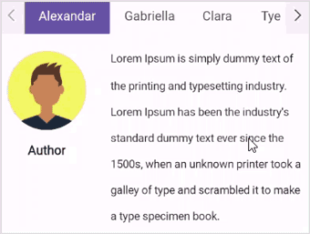

# Swiping in .NET MAUI Tab View (SfTabView)

The `EnableSwiping` property of `SfTabView` is used to navigate between tab contents using swiping. The default value of `EnableSwiping` is `true.`




    <tabView:SfTabView EnableSwiping="True">



     tabView.EnableSwiping = true;




