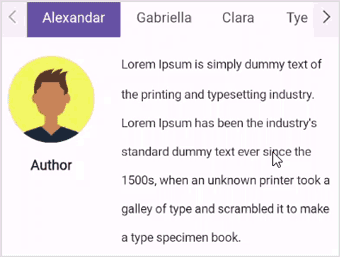

# Swiping in .NET MAUI Tab View (SfTabView)

## Prerequisites

Before using the [SfTabView](https://help.syncfusion.com/cr/maui/Syncfusion.Maui.TabView.SfTabView.html), ensure the following NuGet package is installed in your .NET MAUI project:

- `Syncfusion.Maui.TabView`

For step-by-step setup, refer to the [Getting Started](https://help.syncfusion.com/maui/tabview/getting-started) documentation.

## Overview

Set the [`EnableSwiping`](https://help.syncfusion.com/cr/maui/Syncfusion.Maui.TabView.SfTabView.html#Syncfusion_Maui_TabView_SfTabView_EnableSwiping) property of `SfTabView` to allow users to switch between tab contents by swiping horizontally. The property is of type `bool` and defaults to `false`. When enabled, swiping left or right on the tab content moves to the adjacent tab; tapping a tab header or programmatically setting `SelectedIndex` also continues to work.

> **Note** The minimum Syncfusion MAUI package version that supports `EnableSwiping` is 19.3.XX or later.

## Enable swiping





<tabView:SfTabView EnableSwiping="true">
    <tabView:SfTabItem Header="ITEM 1">
        <tabView:SfTabItem.Content>
            <Label Text="Tab item content"
                   HorizontalOptions="Center"
                   VerticalOptions="Center" />
        </tabView:SfTabItem.Content>
    </tabView:SfTabItem>
    <tabView:SfTabItem Header="ITEM 2">
        <tabView:SfTabItem.Content>
            <Label Text="Tab item content"
                   HorizontalOptions="Center"
                   VerticalOptions="Center" />
        </tabView:SfTabItem.Content>
    </tabView:SfTabItem>
    <tabView:SfTabItem Header="ITEM 3">
        <tabView:SfTabItem.Content>
            <Label Text="Tab item content"
                   HorizontalOptions="Center"
                   VerticalOptions="Center" />
        </tabView:SfTabItem.Content>
    </tabView:SfTabItem>
</tabView:SfTabView>





SfTabView tabView = new SfTabView
{
    EnableSwiping = true,
    Items = new TabItemCollection
    {
        new SfTabItem()
        {
            Header = "ITEM 1",
            Content = new Label
            {
                Text = "Tab item content",
                HorizontalOptions = LayoutOptions.Center,
                VerticalOptions = LayoutOptions.Center
            }
        },
        new SfTabItem()
        {
            Header = "ITEM 2",
            Content = new Label
            {
                Text = "Tab item content",
                HorizontalOptions = LayoutOptions.Center,
                VerticalOptions = LayoutOptions.Center
            }
        },
        new SfTabItem()
        {
            Header = "ITEM 3",
            Content = new Label
            {
                Text = "Tab item content",
                HorizontalOptions = LayoutOptions.Center,
                VerticalOptions = LayoutOptions.Center
            }
        }
    }
};





## Limitations

* **Interference between child controls and Tab View swiping:** When a child control within a Tab View supports horizontal swiping (for example, a horizontal `ScrollView`, `CollectionView`, or `CarouselView`), it can intercept the gesture and prevent the Tab View from receiving it.
* **Workaround:** If you need both a horizontally scrolling child control and Tab View swiping, set `EnableSwiping` to `false` and provide tab navigation through tab-header taps, programmatic `SelectedIndex` changes, or custom gesture handling on the child control.
* **Vertical tab bar placement:** When `TabBarPlacement` is `Left` or `Right`, swiping is disabled because the gesture direction conflicts with the vertical tab bar layout. Use tab-header taps or `SelectedIndex` to navigate in those layouts.
* **RTL layouts:** In right-to-left layouts, the swipe direction is reversed (swipe right moves to the previous tab, swipe left moves to the next tab).

## Troubleshooting

* If swiping does not switch tabs, confirm that `EnableSwiping` is set to `true` and that no child control (such as a horizontal `ScrollView`) is intercepting the gesture.
* If the swipe direction feels reversed, verify that your app is not in a right-to-left layout. In RTL layouts, swipe right moves to the previous tab.
* If `EnableSwiping` has no effect, confirm that your installed Syncfusion MAUI package version supports the property (19.3.XX or later).

## See also

* [Getting Started with .NET MAUI Tab View](https://help.syncfusion.com/maui/tabview/getting-started)
* [Events in .NET MAUI Tab View](https://help.syncfusion.com/maui/tabview/events)
* [Header Display Mode in .NET MAUI Tab View](https://help.syncfusion.com/maui/tabview/header-display-mode)
* [Tab Item Customization in .NET MAUI Tab View](Thttps://help.syncfusion.com/maui/tabview/tab-item-customization)
* [Nested Tabs in .NET MAUI Tab View](https://help.syncfusion.com/maui/tabview/nested-tabs)
* [Populating ItemsSource in .NET MAUI Tab View](https://help.syncfusion.com/maui/tabview/populating-itemssource)
