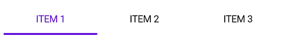
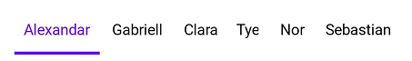
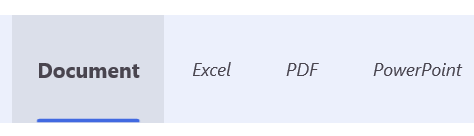
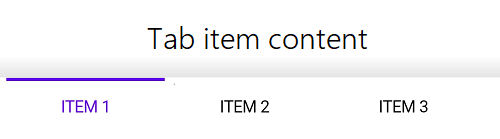
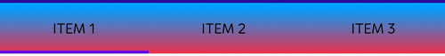
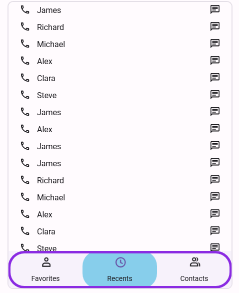

# Customize the Tab Bar in .NET MAUI Tab View (SfTabView)

## Tab width options

The .NET MAUI Tab View provides two modes that determines how the width of the tab is calculated on the tab bar while it gets populated. The options are [Default](https://help.syncfusion.com/cr/maui/Syncfusion.Maui.TabView.TabWidthMode.html#Syncfusion_Maui_TabView_TabWidthMode_Default) and [SizeToContent](https://help.syncfusion.com/cr/maui/Syncfusion.Maui.TabView.TabWidthMode.html#Syncfusion_Maui_TabView_TabWidthMode_SizeToContent). These can be achieved using the [TabWidthMode](https://help.syncfusion.com/cr/maui/Syncfusion.Maui.TabView.TabWidthMode.html) property.

### Fixed bar

The width of the tab is divided equally based on the available control width. This enables a fixed tab bar that will not allow tab scrolling, regardless of the number of tabs. This can be achieved by setting the `TabWidthMode` as `Default`.

N> This mode is recommended when the tab count is not more than four. More tabs in this mode may appear with the text being trimmed.




    <tabView:SfTabView TabWidthMode="Default">



     tabView.TabWidthMode = TabWidthMode.Default;




### Based on the text size

The width of a tab is set to fit the text or image that it contains by setting the `TabWidthMode` as `SizeToContent`. Scroll is enabled in this mode to access the items outside the visible area.




    <tabView:SfTabView TabWidthMode="SizeToContent">



     tabView.TabWidthMode = TabWidthMode.SizeToContent;




 

## Customize the TabBarHeight

The height of the tab bar can be customized by setting the [TabBarHeight](https://help.syncfusion.com/cr/maui/Syncfusion.Maui.TabView.SfTabView.html#Syncfusion_Maui_TabView_SfTabView_TabBarHeight) property. The default height is 48.

N> It is recommended to set the `TabBarHeight` to 72 while displaying both the image and text with `ImagePosition` as either top or bottom.




    <tabView:SfTabView TabBarHeight="100">



     tabView.TabBarHeight = 100;




## Customize the tab header text alignment

The horizontal text alignment of the tab header can be customized by setting the [HeaderHorizontalTextAlignment](https://help.syncfusion.com/cr/maui/Syncfusion.Maui.TabView.SfTabView.html#Syncfusion_Maui_TabView_SfTabView_HeaderHorizontalTextAlignment) property. The default value is `Center`. This property accepts the following values:

*   **Start** - The text will be placed at the starting position in the header tab.
*   **Center** - The text will be placed at the center of the header tab.
*   **End** - The text will be placed at the end of the header tab.



 
<tabView:SfTabView HeaderHorizontalTextAlignment="Center"> 


 
tabView.HeaderHorizontalTextAlignment = TextAlignment.Center; 



 

## TabBarPlacement options

The .NET MAUI Tab View provides two options for determining how the tab bar aligns relative to the tab content. The options are top and bottom. This can be achieved using the [TabBarPlacement](https://help.syncfusion.com/cr/maui/Syncfusion.Maui.TabView.SfTabView.html#Syncfusion_Maui_TabView_SfTabView_TabBarPlacement) property.

### Top

The tab bar will be placed above the content region of the Tab View control.




    <tabView:SfTabView TabBarPlacement="Top">



     tabView.TabBarPlacement = TabBarPlacement.Top;




 

### Bottom

The tab bar will be placed below the content region of the Tab View control. 




    <tabView:SfTabView TabBarPlacement="Bottom">



     tabView.TabBarPlacement = TabBarPlacement.Bottom;




 

## TabBarBackground customization

The tab bar background can be customized using the [TabBarBackground](https://help.syncfusion.com/cr/maui/Syncfusion.Maui.TabView.SfTabView.html#Syncfusion_Maui_TabView_SfTabView_TabBarBackground) property, which is of type `Brush`.

### Solid color 

A solid color can be achieved by assigning the `SolidColorBrush` to the [TabBarBackground](https://help.syncfusion.com/cr/maui/Syncfusion.Maui.TabView.SfTabView.html#Syncfusion_Maui_TabView_SfTabView_TabBarBackground), which represents the color of the tab bar background.




    <tabView:SfTabView TabBarBackground="LightBlue">



     tabView.TabBarBackground = Colors.LightBlue;




 

### Gradient color 

The background can be customized with a linear gradient and radial gradient as like below example.



    <tabView:SfTabView>
        <tabView:SfTabView.TabBarBackground>
            <LinearGradientBrush EndPoint="0,1">
                <GradientStop Color="#009FFF" Offset="0.1" />
                <GradientStop Color="#ec2F4B Offset="1.0" />
            </LinearGradientBrush>
        </tabView:SfTabView.TabBarBackground>
    </tabView:SfTabView>



Microsoft.Maui.Controls.GradientStop gra1 = new Microsoft.Maui.Controls.GradientStop()
{
    Color = Color.FromArgb("#009FFF"),
    Offset = (float)0.1,
};

Microsoft.Maui.Controls.GradientStop gra2 = new Microsoft.Maui.Controls.GradientStop()
{
    Color = Color.FromArgb("#ec2F4B"),
    Offset = (float)1.0,
};

LinearGradientBrush graBrush = new LinearGradientBrush()
{
    EndPoint = new Point(0, 1),
    GradientStops = new GradientStopCollection() { gra1, gra2 }
};

SfTabView tabView = new SfTabView();
tabView.TabBarBackground = graBrush;



 

N> View [sample](https://github.com/SyncfusionExamples/maui-tabview-samples/tree/main/TabBarCustomization) in GitHub.

## Tab bar border customization

You can customize the border of the tab header area in .NET MAUI Tab View using the following properties:

- TabBarBorderColor: Sets the border color.
- TabBarBorderThickness: Sets the border thickness.
- TabBarCornerRadius: Sets the corner radius of the tab bar's border.




<tabView:SfTabView
    x:Name="tabView"
    TabBarPlacement="Bottom"
    TabBarBorderColor="#7C3AED"
    TabBarBorderThickness="2"
    TabBarCornerRadius="24">
</tabView:SfTabView>



 tabView.TabBarPlacement = TabBarPlacement.Bottom;
 tabView.TabBarBorderColor = Color.FromArgb("#7C3AED");
 tabView.TabBarBorderThickness = 2;
 tabView.TabBarCornerRadius = new CornerRadius(24);




