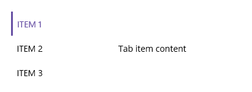
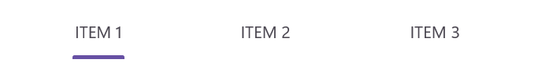

# Customize the Tab Bar in .NET MAUI Tab View (SfTabView)

## Prerequisites

Before using the [SfTabView](https://help.syncfusion.com/cr/maui/Syncfusion.Maui.TabView.SfTabView.html), ensure the following NuGet package is installed in your .NET MAUI project:

- `Syncfusion.Maui.TabView`

For step-by-step setup, refer to the [Getting Started](https://help.syncfusion.com/maui/tabview/getting-started) documentation.

## Overview

The tab bar is the strip that displays the headers of each tab item in the `SfTabView` control. You can customize its placement, size, background, text alignment, spacing, animation, and border using the properties documented on this page.

## TabBarPlacement options

The .NET MAUI Tab View provides four options for determining how the tab bar aligns relative to the tab content. The options are `Top`, `Bottom`, `Left`, and `Right`. This can be achieved using the [`TabBarPlacement`](https://help.syncfusion.com/cr/maui/Syncfusion.Maui.TabView.SfTabView.html#Syncfusion_Maui_TabView_SfTabView_TabBarPlacement) property.

### Top

The tab bar will be placed above the content region of the Tab View control.




<tabView:SfTabView TabBarPlacement="Top"
                   TabBarSize="60"
                   IndicatorWidthMode="Stretch">
    <tabView:SfTabView.Items>
        <tabView:SfTabItem Header="ITEM 1">
            <tabView:SfTabItem.Content>
                <Label Text="Tab item content"
                       HorizontalOptions="Center"
                       VerticalOptions="Center" />
            </tabView:SfTabItem.Content>
        </tabView:SfTabItem>
        <tabView:SfTabItem Header="ITEM 2">
            <tabView:SfTabItem.Content>
                <Label Text="Tab item content"
                       HorizontalOptions="Center"
                       VerticalOptions="Center" />
            </tabView:SfTabItem.Content>
        </tabView:SfTabItem>
        <tabView:SfTabItem Header="ITEM 3">
            <tabView:SfTabItem.Content>
                <Label Text="Tab item content"
                       HorizontalOptions="Center"
                       VerticalOptions="Center" />
            </tabView:SfTabItem.Content>
        </tabView:SfTabItem>
    </tabView:SfTabView.Items>
</tabView:SfTabView>





SfTabView tabView = new SfTabView
{
    TabBarPlacement = TabBarPlacement.Top,
    TabBarSize = 60,
    IndicatorWidthMode = IndicatorWidthMode.Stretch,
    Items = new TabItemCollection
    {
        new SfTabItem()
        {
            Header = "ITEM 1",
            Content = new Label
            {
                Text = "Tab item content",
                HorizontalOptions = LayoutOptions.Center,
                VerticalOptions = LayoutOptions.Center
            }
        },
        new SfTabItem()
        {
            Header = "ITEM 2",
            Content = new Label
            {
                Text = "Tab item content",
                HorizontalOptions = LayoutOptions.Center,
                VerticalOptions = LayoutOptions.Center
            }
        },
        new SfTabItem()
        {
            Header = "ITEM 3",
            Content = new Label
            {
                Text = "Tab item content",
                HorizontalOptions = LayoutOptions.Center,
                VerticalOptions = LayoutOptions.Center
            }
        }
    }
};





### Bottom

The tab bar will be placed below the content region of the Tab View control. The XAML and C# samples are identical to the [Top](#top) example, except that `TabBarPlacement` is set to `Bottom`.

### Left

The tab bar will be placed to the left of the content region of the Tab View control. The XAML and C# samples are identical to the [Top](#top) example, except that `TabBarPlacement` is set to `Left`.

### Right

The tab bar will be placed to the right of the content region of the Tab View control. The XAML and C# samples are identical to the [Top](#top) example, except that `TabBarPlacement` is set to `Right`.

## Tab width options

The .NET MAUI Tab View provides two modes that determine how the width of the tab is calculated on the tab bar while it gets populated. The options are [`Default`](https://help.syncfusion.com/cr/maui/Syncfusion.Maui.TabView.TabWidthMode.html#Syncfusion_Maui_TabView_TabWidthMode_Default) and [`SizeToContent`](https://help.syncfusion.com/cr/maui/Syncfusion.Maui.TabView.TabWidthMode.html#Syncfusion_Maui_TabView_TabWidthMode_SizeToContent). These can be achieved using the [`TabWidthMode`](https://help.syncfusion.com/cr/maui/Syncfusion.Maui.TabView.TabWidthMode.html) property.

### Fixed bar

The width of the tab is divided equally based on the available control width. This enables a fixed tab bar that will not allow tab scrolling, regardless of the number of tabs. Set `TabWidthMode` to `Default` to enable this behavior.

> **Note** This mode is recommended when the tab count is four or fewer. More tabs in this mode may appear with the text being trimmed.




<tabView:SfTabView TabWidthMode="Default">
    <tabView:SfTabItem Header="Item1" />
    <tabView:SfTabItem Header="Item2" />
    <tabView:SfTabItem Header="Item3" />
</tabView:SfTabView>




SfTabView tabView = new SfTabView
{
    TabWidthMode = TabWidthMode.Default,
    Items =
    {
        new SfTabItem { Header = "Item1" },
        new SfTabItem { Header = "Item2" },
        new SfTabItem { Header = "Item3" }
    }
};





### Based on the text size

The width of a tab is set to fit the text or image that it contains when `TabWidthMode` is `SizeToContent`. Scroll is enabled in this mode to access the items outside the visible area.




<tabView:SfTabView TabWidthMode="SizeToContent">
    <tabView:SfTabItem Header="Item1" />
    <tabView:SfTabItem Header="Item2" />
    <tabView:SfTabItem Header="Item3" />
</tabView:SfTabView>




SfTabView tabView = new SfTabView
{
    TabWidthMode = TabWidthMode.SizeToContent,
    Items =
    {
        new SfTabItem { Header = "Item1" },
        new SfTabItem { Header = "Item2" },
        new SfTabItem { Header = "Item3" }
    }
};





## Customize the TabBarSize

The size of the tab bar can be customized by setting the [`TabBarSize`](https://help.syncfusion.com/cr/maui/Syncfusion.Maui.TabView.SfTabView.html#Syncfusion_Maui_TabView_SfTabView_TabBarSize) property. The property is of type `double` and the default size is `48`. The `TabBarSize` property controls the tab bar's height when `TabBarPlacement` is `Top` or `Bottom`, and its width when `TabBarPlacement` is `Left` or `Right`.




<tabView:SfTabView TabBarSize="100" TabBarPlacement="Left">
    <tabView:SfTabItem Header="Item1" />
    <tabView:SfTabItem Header="Item2" />
    <tabView:SfTabItem Header="Item3" />
</tabView:SfTabView>




SfTabView tabView = new SfTabView
{
    TabBarSize = 100,
    TabBarPlacement = TabBarPlacement.Left,
    Items =
    {
        new SfTabItem { Header = "Item1" },
        new SfTabItem { Header = "Item2" },
        new SfTabItem { Header = "Item3" }
    }
};





> **Note** The earlier `TabBarHeight` and `TabBarWidth` properties are obsolete as of Syncfusion MAUI 27.1.XX and have been replaced by `TabBarSize`. The newer property adapts to the tab bar's orientation automatically.

## Customize the tab header text alignment

The horizontal text alignment of the tab header can be customized by setting the [`HeaderHorizontalTextAlignment`](https://help.syncfusion.com/cr/maui/Syncfusion.Maui.TabView.SfTabView.html#Syncfusion_Maui_TabView_SfTabView_HeaderHorizontalTextAlignment) property. The property is of type `TextAlignment` and the default value is `Center`. This property accepts the following values:

* `Start` - Places the text at the starting position in the header tab.
* `Center` - Places the text at the center of the header tab.
* `End` - Places the text at the end of the header tab.




<tabView:SfTabView HeaderHorizontalTextAlignment="Center">
    <tabView:SfTabItem Header="Item1" />
    <tabView:SfTabItem Header="Item2" />
    <tabView:SfTabItem Header="Item3" />
</tabView:SfTabView>




SfTabView tabView = new SfTabView
{
    HeaderHorizontalTextAlignment = TextAlignment.Center,
    Items =
    {
        new SfTabItem { Header = "Item1" },
        new SfTabItem { Header = "Item2" },
        new SfTabItem { Header = "Item3" }
    }
};





## Customize the HeaderItemSpacing

Use the [`HeaderItemSpacing`](https://help.syncfusion.com/cr/maui/Syncfusion.Maui.TabView.SfTabView.html#Syncfusion_Maui_TabView_SfTabView_HeaderItemSpacing) property to set the spacing between tab items. The property is of type `double` and the default spacing is `36`.

> **Note** `HeaderItemSpacing` is effective only when `TabWidthMode` is set to `SizeToContent`.




<tabView:SfTabView HeaderItemSpacing="100" TabWidthMode="SizeToContent">
    <tabView:SfTabItem Header="Item1" />
    <tabView:SfTabItem Header="Item2" />
    <tabView:SfTabItem Header="Item3" />
</tabView:SfTabView>




SfTabView tabView = new SfTabView
{
    HeaderItemSpacing = 100,
    TabWidthMode = TabWidthMode.SizeToContent,
    Items =
    {
        new SfTabItem { Header = "Item1" },
        new SfTabItem { Header = "Item2" },
        new SfTabItem { Header = "Item3" }
    }
};





## AnimationEasing

The animation of the tab item content and selection indicator can be customized by setting the [`AnimationEasing`](https://help.syncfusion.com/cr/maui/Syncfusion.Maui.TabView.SfTabView.html#Syncfusion_Maui_TabView_SfTabView_AnimationEasing) property. The property is of type `Easing` and the default value is `Easing.Linear`. Common values include `Easing.Linear`, `Easing.CubicInOut`, `Easing.SpringOut`, and `Easing.BounceIn`.




<tabView:SfTabView AnimationEasing="SpringOut">
    <tabView:SfTabItem Header="Item1" />
    <tabView:SfTabItem Header="Item2" />
    <tabView:SfTabItem Header="Item3" />
</tabView:SfTabView>




SfTabView tabView = new SfTabView
{
    AnimationEasing = Easing.SpringOut,
    Items =
    {
        new SfTabItem { Header = "Item1" },
        new SfTabItem { Header = "Item2" },
        new SfTabItem { Header = "Item3" }
    }
};





## TabBarBackground customization

The tab bar background can be customized using the [`TabBarBackground`](https://help.syncfusion.com/cr/maui/Syncfusion.Maui.TabView.SfTabView.html#Syncfusion_Maui_TabView_SfTabView_TabBarBackground) property, which is of type `Brush`. The XAML parser accepts a color name as a string, while the C# API requires an explicit `Color` or `Brush` value.

### Solid color

Use a `Color` or `SolidColorBrush` to set the tab bar's background color.




<tabView:SfTabView TabBarBackground="LightBlue">
    <tabView:SfTabItem Header="Item1" />
    <tabView:SfTabItem Header="Item2" />
    <tabView:SfTabItem Header="Item3" />
</tabView:SfTabView>




SfTabView tabView = new SfTabView
{
    TabBarBackground = new SolidColorBrush(Colors.LightBlue),
    Items =
    {
        new SfTabItem { Header = "Item1" },
        new SfTabItem { Header = "Item2" },
        new SfTabItem { Header = "Item3" }
    }
};





### Gradient color

The tab bar background can be customized with a linear gradient, as shown in the example below.




<tabView:SfTabView>
    <tabView:SfTabView.TabBarBackground>
        <LinearGradientBrush EndPoint="0,1">
            <GradientStop Color="#009FFF" Offset="0.1" />
            <GradientStop Color="#ec2F4B" Offset="1.0" />
        </LinearGradientBrush>
    </tabView:SfTabView.TabBarBackground>
</tabView:SfTabView>




SfTabView tabView = new SfTabView
{
    TabBarBackground = new LinearGradientBrush
    {
        EndPoint = new Point(0, 1),
        GradientStops = new GradientStopCollection
        {
            new GradientStop
            {
                Color = Color.FromArgb("#009FFF"),
                Offset = 0.1f
            },
            new GradientStop
            {
                Color = Color.FromArgb("#ec2F4B"),
                Offset = 1.0f
            }
        }
    }
};





> **Note** View the [TabBarCustomization sample](https://github.com/SyncfusionExamples/maui-tabview-samples/tree/main/TabBarCustomization) on GitHub.

## Tab bar border customization

You can customize the border of the tab header area in .NET MAUI Tab View using the following properties:

- [`TabBarBorderColor`](https://help.syncfusion.com/cr/maui/Syncfusion.Maui.TabView.SfTabView.html#Syncfusion_Maui_TabView_SfTabView_TabBarBorderColor) - Sets the border color. Type: `Color`.
- [`TabBarBorderThickness`](https://help.syncfusion.com/cr/maui/Syncfusion.Maui.TabView.SfTabView.html#Syncfusion_Maui_TabView_SfTabView_TabBarBorderThickness) - Sets the border thickness. Type: `double`.
- [`TabBarCornerRadius`](https://help.syncfusion.com/cr/maui/Syncfusion.Maui.TabView.SfTabView.html#Syncfusion_Maui_TabView_SfTabView_TabBarCornerRadius) - Sets the corner radius of the tab bar's border. Type: `CornerRadius`.




<tabView:SfTabView TabBarPlacement="Bottom"
                   TabBarBorderColor="#7C3AED"
                   TabBarBorderThickness="2"
                   TabBarCornerRadius="24">
    <tabView:SfTabItem Header="Item1" />
    <tabView:SfTabItem Header="Item2" />
    <tabView:SfTabItem Header="Item3" />
</tabView:SfTabView>




SfTabView tabView = new SfTabView
{
    TabBarPlacement = TabBarPlacement.Bottom,
    TabBarBorderColor = Color.FromArgb("#7C3AED"),
    TabBarBorderThickness = 2,
    TabBarCornerRadius = new CornerRadius(24),
    Items =
    {
        new SfTabItem { Header = "Item1" },
        new SfTabItem { Header = "Item2" },
        new SfTabItem { Header = "Item3" }
    }
};





## Troubleshooting

* If the tab bar appears at the wrong size, confirm that you are using `TabBarSize` (not the obsolete `TabBarHeight`/`TabBarWidth`).
* If a gradient does not render, confirm that the `LinearGradientBrush` is assigned to `TabBarBackground` and that each `GradientStop` has both a `Color` and an `Offset` set.
* If `HeaderItemSpacing` has no effect, confirm that `TabWidthMode` is set to `SizeToContent`.
* If `tabView.TabBarBackground = Colors.LightBlue;` fails to compile, wrap the color in a `SolidColorBrush`: `tabView.TabBarBackground = new SolidColorBrush(Colors.LightBlue);`.

## See also

* [Getting Started with .NET MAUI Tab View](https://help.syncfusion.com/maui/tabview/getting-started)
* [Selection Indicator Customization in .NET MAUI Tab View](https://help.syncfusion.com/maui/tabview/selection-indicator-customization)
* [Header Display Mode in .NET MAUI Tab View](https://help.syncfusion.com/maui/tabview/header-display-mode)
* [Tab Item Customization in .NET MAUI Tab View](Thttps://help.syncfusion.com/maui/tabview/tab-item-customization)
* [Tab bar Customization in .NET MAUI Tab View](https://help.syncfusion.com/maui/tabview/tab-bar-customization)
* [Populating ItemsSource in .NET MAUI Tab View](https://help.syncfusion.com/maui/tabview/populating-itemssource)