# Configure the Appearance of Tab Item in .NET MAUI Tab View (SfTabView)

A tab item consists of various elements that can be customized in the .NET MAUI Tab View.

## Adding image in tab item

### Header

The header holds the text of the tab item displayed in the tab bar.




<tabView:SfTabView>
    <tabView:SfTabItem Header="ITEM 1"/>
</tabView:SfTabView>



var tabView = new SfTabView();
var tabItems = new TabItemCollection
{
    new SfTabItem()
    {
        Header = "ITEM 1",
    }
}




 

### ImageSource 

The image to be displayed in the tab bar representing the tab item.




<tabView:SfTabView>
    <tabView:SfTabItem Header="ITEM 1" ImageSource="alexandar"/>
</tabView:SfTabView>



var tabView = new SfTabView();
var tabItems = new TabItemCollection
{
    new SfTabItem()
    {
        Header = "ITEM 1",
        ImageSource = "alexandar",
    }
}





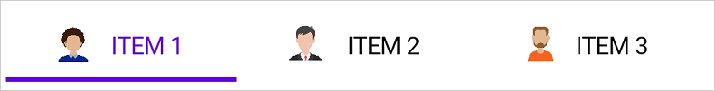 

### Content 

The assigned view will get displayed in the main area of the Tab View.




<tabView:SfTabView>
    <tabView:SfTabItem Header="ITEM 2">
        <tabView:SfTabItem.Content>
            <ListView>
                ...
            </ListView>
        </tabView:SfTabItem.Content>
        </tabView:SfTabItem>
</tabView>



    var tabView = new SfTabView();
    var tabItems = new TabItemCollection
    {
        new SfTabItem()
        {
            Header = "ITEM 2",
            Content = new ListView()
            {
                /// code
            }
        }
    }




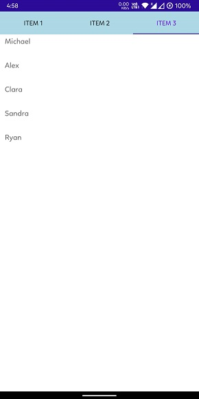 

## ImagePosition options 

The .NET MAUI Tab View provides four options determining how the image of the tab aligns relative to the text. The options are left, top, right and bottom. These can be achieved using the [ImagePosition](https://help.syncfusion.com/cr/maui/Syncfusion.Maui.TabView.SfTabItem.html#Syncfusion_Maui_TabView_SfTabItem_ImagePosition) property of [SfTabItem](https://help.syncfusion.com/cr/maui/Syncfusion.Maui.TabView.SfTabItem.html).

N> Each tab item can have different image positions. The Visual State Manager can be used to apply the same value to all tabs.

### Top

The image will be placed above the text vertically.




 <tabView:SfTabView>
     <tabView:SfTabItem ImagePosition="Top"/>
 </tabView:SfTabView>



var tabView = new SfTabView();
var tabItems = new TabItemCollection
{
    new SfTabItem()
    {
        ImagePosition = TabImagePosition.Top,
    }
}




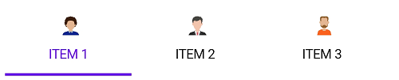 

### Bottom

The image will be placed below the text vertically.




<tabView:SfTabView>
    <tabView:SfTabItem ImagePosition="Bottom"/>
</tabView:SfTabView>



var tabView = new SfTabView();
var tabItems = new TabItemCollection
{
    new SfTabItem()
    {
        ImagePosition = TabImagePosition.Bottom,
    }
}




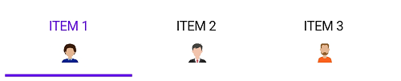 

### Left

The image will be placed before the text, horizontally.




<tabView:SfTabView>
    <tabView:SfTabItem ImagePosition="Left">
</tabView:SfTabView>



var tabView = new SfTabView();
var tabItems = new TabItemCollection
{
    new SfTabItem()
    {
        ImagePosition = TabImagePosition.Left,
    }
}




 

### Right

The image will be placed to the right side of the text, horizontally.




<tabView:SfTabView>
    <tabView:SfTabItem ImagePosition="Right">
</tabView:SfTabView>



var tabView = new SfTabView();
var tabItems = new TabItemCollection
{
    new SfTabItem()
    {
        ImagePosition = TabImagePosition.Right,
    }
}




 

## ImageTextSpacing

The [ImageTextSpacing](https://help.syncfusion.com/cr/maui/Syncfusion.Maui.TabView.SfTabItem.html#Syncfusion_Maui_TabView_SfTabItem_ImageTextSpacing) property in SfTabItem allows spacing between the image and the text of the tab item.




<tabView:SfTabView>
    <tabView:SfTabItem ImageTextSpacing="20"/>
</tabView:SfTabView>



var tabView = new SfTabView();
var tabItems = new TabItemCollection
{
    new SfTabItem()
    {
        ImageTextSpacing = "20",
    }
}




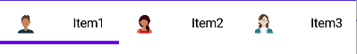

## TextColor customization 

The text color of the tab item displayed in the tab bar.




<tabView:SfTabView>
    <tabView:SfTabItem TextColor="Blue"/>
</tabView:SfTabView>



var tabView = new SfTabView();
var tabItems = new TabItemCollection
{
    new SfTabItem()
    {
        TextColor = Color.Blue,
    }
}




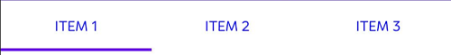 

## Font customization 

This type of customization involves changes to some font elements.

### FontFamily

Font family of the tab item text displayed in the tab bar.




<tabView:SfTabView>
    <tabView:SfTabItem FontFamily="OpenSansRegular"/>
</tabView:SfTabView>



var tabView = new SfTabView();
var tabItems = new TabItemCollection
{
    new SfTabItem()
    {
        FontFamily = "OpenSansRegular",
    }
}




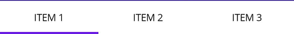 

### FontAttribute

The font style of the text of each tab item in the tab bar.




<tabView:SfTabView>
    <tabView:SfTabItem FontAttributes="Bold"/>
</tabView:SfTabView>



var tabView = new SfTabView();
var tabItems = new TabItemCollection
{
    new SfTabItem()
    {
        FontAttributes = FontAttributes.Bold,
    }
}




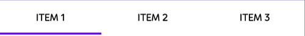 

### FontSize

The size of the text of each tab item in the tab bar.




<tabView:SfTabView>
    <tabView:SfTabItem FontSize="32"/>
</tabView:SfTabView>



var tabView = new SfTabView();
var tabItems = new TabItemCollection
{
    new SfTabItem()
    {
        FontSize = 32,
    }
}




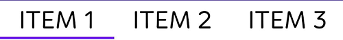

## Badge support

In SfTabItem, badges notify users of new or unread messages, notifications, or the status of something.

### BadgeText

By using the [BadgeText](https://help.syncfusion.com/cr/maui/Syncfusion.Maui.TabView.SfTabItem.html#Syncfusion_Maui_TabView_SfTabItem_BadgeText) property in the SfTabItem, you can add text to badge view.




<tabView:SfTabView>
    <tabView:SfTabItem BadgeText="20"/>
</tabView:SfTabView>



var tabView = new SfTabView();
var tabItems = new TabItemCollection
{
    new SfTabItem()
    {
        BadgeText = "20",
    }
}




### BadgeSettings

The [BadgeSettings](https://help.syncfusion.com/cr/maui/Syncfusion.Maui.TabView.SfTabItem.html#Syncfusion_Maui_TabView_SfTabItem_BadgeSettings) property helps customize the basic look and feel of the badge view in the SfTabItem. 

It contains the sub-elements such as badge types, positions, and colors. You can customize the background color, text color, border color, width, offset, and font attributes.

N> To customize the badge beyond predefined styles, set [Type](https://help.syncfusion.com/cr/maui/Syncfusion.Maui.Core.BadgeSettings.html#Syncfusion_Maui_Core_BadgeSettings_Type) property to [None](https://help.syncfusion.com/cr/maui/Syncfusion.Maui.Core.BadgeType.html#Syncfusion_Maui_Core_BadgeType_None) in the [BadgeSettings](https://help.syncfusion.com/cr/maui/Syncfusion.Maui.Core.BadgeSettings.html#properties).




<ContentPage
    . . .  
    xmlns:tabView="clr-namespace:Syncfusion.Maui.TabView;assembly=Syncfusion.Maui.TabView  
    xmlns:core="clr-namespace:Syncfusion.Maui.Core;assembly=Syncfusion.Maui.Core">
    <tabView:SfTabView>
        <tabView:SfTabItem Header="RECENTS" BadgeText="20">
            <tabView:SfTabItem.BadgeSettings >
                <core:BadgeSettings FontSize="15" 
                                    FontAttributes="Bold" 
                                    FontFamily="serif"/>
            </tabView:SfTabItem.BadgeSettings>
        </tabView:SfTabItem>
    </tabView:SfTabView>    
</ContentPage>




using Syncfusion.Maui.Core;
using Syncfusion.Maui.TabView;
...

var tabView = new SfTabView();
BadgeSettings badgeSetting = new BadgeSettings();
badgeSetting.FontAttributes = FontAttributes.Bold;
badgeSetting.FontSize = 15;
badgeSetting.FontFamily = "serif";

var tabItems = new TabItemCollection()
{
    new SfTabItem()
    {
        Header="TabItem",
        BadgeText = "Inbox",
        BadgeSettings = badgeSetting,
    }
};

tabView.Items = tabItems;
            




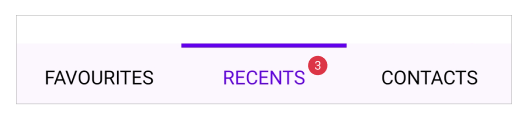 

N> View [sample](https://github.com/SyncfusionExamples/maui-tabview-samples/tree/main/TabViewCustomizationSample) in GitHub.

## TabHeaderPadding

The [TabHeaderPadding](https://help.syncfusion.com/cr/maui/Syncfusion.Maui.TabView.SfTabView.html#Syncfusion_Maui_TabView_SfTabView_TabHeaderPadding) property in [SfTabView](https://help.syncfusion.com/cr/maui/Syncfusion.Maui.TabView.SfTabView.html?tabs=tabid-1) allows for adding padding to the tab header.

N> The `TabHeaderPadding` property is only applicable when [TabWidthMode](https://help.syncfusion.com/cr/maui/Syncfusion.Maui.TabView.SfTabView.html#Syncfusion_Maui_TabView_SfTabView_TabWidthMode) is set to [SizeToContent](https://help.syncfusion.com/cr/maui/Syncfusion.Maui.TabView.TabWidthMode.html#Syncfusion_Maui_TabView_TabWidthMode_SizeToContent).




<tabView:SfTabView TabWidthMode="SizeToContent" TabHeaderPadding="5,10,5,10">
    <tabView:SfTabItem/>
</tabView:SfTabView>



var tabView = new SfTabView();
tabView.TabWidthMode = TabWidthMode.SizeToContent;
tabView.TabHeaderPadding = new Thickness(5, 10, 5, 10);




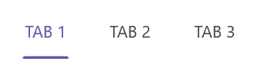

## Scroll buttons on header

Scroll buttons are used to navigate through the items in the header of the Tab View by adjusting the [IsScrollButtonEnabled](https://help.syncfusion.com/cr/maui/Syncfusion.Maui.TabView.SfTabView.html#Syncfusion_Maui_TabView_SfTabView_IsScrollButtonEnabled) property of [SfTabView](https://help.syncfusion.com/cr/maui/Syncfusion.Maui.TabView.SfTabView.html?tabs=tabid-1). This additionally indicates the presence of tabs beyond the currently visible area.




<tabView:SfTabView  IsScrollButtonEnabled="True">
    <tabView:SfTabItem/>
</tabView:SfTabView>



var tabView = new SfTabView();
tabView.IsScrollButtonEnabled = true;




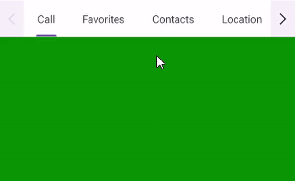 

### Scroll button customization

The [ScrollButtonBackground](https://help.syncfusion.com/cr/maui/Syncfusion.Maui.TabView.SfTabView.html#Syncfusion_Maui_TabView_SfTabView_ScrollButtonBackground) and [ScrollButtonColor](https://help.syncfusion.com/cr/maui/Syncfusion.Maui.TabView.SfTabView.html#Syncfusion_Maui_TabView_SfTabView_ScrollButtonColor) property of [SfTabView](https://help.syncfusion.com/cr/maui/Syncfusion.Maui.TabView.SfTabView.html?tabs=tabid-1) allows customization of the background and foreground color of the scroll button.




<tabView:SfTabView ScrollButtonBackground="Violet" ScrollButtonColor="Red">
</tabView:SfTabView>



StackLayout stackLayout = new StackLayout();
var tabView = new SfTabView();
tabView.ScrollButtonBackground = SolidColorBrush.Violet;
tabView.ScrollButtonColor = Colors.Red;
stackLayout.Children.Add(tabView);
this.Content = stackLayout;




## FontAutoScalingEnabled

The [FontAutoScalingEnabled](https://help.syncfusion.com/cr/maui/Syncfusion.Maui.TabView.SfTabItem.html#Syncfusion_Maui_TabView_SfTabItem_FontAutoScalingEnabled) property automatically scales the tab header's font size based on the operating system's text size. The default value is `false`.




<tabView:SfTabView FontAutoScalingEnabled="True">
...
</tabView:SfTabView>



var tabView = new SfTabView();
tabView.FontAutoScalingEnabled = true;




## ContentTransitionDuration

You can customize the animation duration when changing the [SelectedIndex](https://help.syncfusion.com/cr/maui/Syncfusion.Maui.TabView.SfTabView.html#Syncfusion_Maui_TabView_SfTabView_SelectedIndex) of the Tab View by setting the [ContentTransitionDuration](https://help.syncfusion.com/cr/maui/Syncfusion.Maui.TabView.SfTabView.html#Syncfusion_Maui_TabView_SfTabView_ContentTransitionDuration) property.




<tabView:SfTabView  ContentTransitionDuration ="1000">
    <tabView:SfTabItem/>
</tabView:SfTabView>



var tabView = new SfTabView();
tabView.ContentTransitionDuration = 1000;




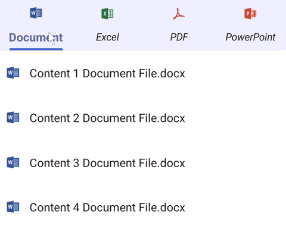

## ImageSize

You can customize the image size in the .NET MAUI Tab View control by setting the [ImageSize](https://help.syncfusion.com/cr/maui/Syncfusion.Maui.TabView.SfTabItem.html#Syncfusion_Maui_TabView_SfTabItem_ImageSize) property.




<tabView:SfTabView>
    <tabView:SfTabItem ImageSize="50"/>
</tabView:SfTabView>



StackLayout stackLayout = new StackLayout();
var tabView = new SfTabView();
var tabItems = new TabItemCollection
{
    new SfTabItem()
    {
        ImageSize = 50,
    }
};
tabView.Items = tabItems;
stackLayout.Children.Add(tabView);
this.Content = stackLayout;




## Disable ripple effect on item click

<<<<<<< HEAD
The `EnableRippleAnimation` property of the [SfTabView](https://help.syncfusion.com/cr/maui/Syncfusion.Maui.TabView.SfTabView.html) allows you to enable or disable the ripple animation for tab headers. This animation provides visual feedback when a tab header is tapped. The default value of the `EnableRippleAnimation` property is `true`.
=======
The [EnableRippleAnimation](https://help.syncfusion.com/cr/maui/Syncfusion.Maui.TabView.SfTabView.html#Syncfusion_Maui_TabView_SfTabView_EnableRippleAnimation) property of the [SfTabView](https://help.syncfusion.com/cr/maui/Syncfusion.Maui.TabView.SfTabView.html) allows you to enable or disable the ripple animation for tab headers. This animation provides visual feedback when a tab header is tapped. The default value of the `EnableRippleAnimation` property is `true`.
>>>>>>> master




<!-- Define the SfTabView control with the ripple animation disabled -->
<tabView:SfTabView EnableRippleAnimation="False">
    <!-- Define tab items -->
</tabView:SfTabView>



// Create an instance of the SfTabView control
SfTabView tabView = new SfTabView();

// Disable the ripple animation
tabView.EnableRippleAnimation = false;





## How to

### Disable hover effect on tab item

To disable the hover effect when the mouse pointer is over a [TabItem](https://help.syncfusion.com/cr/maui/Syncfusion.Maui.TabView.SfTabItem.html) header, set color value `Transparent` to the built-in key `SfTabViewHoverBackground`.





<ContentPage xmlns="http://schemas.microsoft.com/dotnet/2021/maui"
			 xmlns:x="http://schemas.microsoft.com/winfx/2009/xaml"
			 ... >
	<ContentPage.Resources>
		<Color x:Key="SfTabViewHoverBackground">Transparent</Color>
	</ContentPage.Resources>
	<ContentPage.Content>
		<tabView:SfTabView x:Name="tabView" EnableRippleAnimation="False">
			<!-- Define tab items -->
		</tabView:SfTabView>
	</ContentPage.Content>
</ContentPage>



