# Configure the Appearance of a Tab Item in .NET MAUI Tab View

## Prerequisites

Before using the [SfTabView](https://help.syncfusion.com/cr/maui/Syncfusion.Maui.TabView.SfTabView.html), ensure the following NuGet package is installed in your .NET MAUI project:

- `Syncfusion.Maui.TabView`

For step-by-step setup, refer to the [Getting Started](https://help.syncfusion.com/maui/tabview/getting-started) documentation.

## Tab item elements

A tab item in the `SfTabView` control consists of three core elements (header text, image, and content area) and supports a wide range of appearance customizations including text color, font properties, image positioning, badges, scroll buttons, and animation duration. This page documents each customization property with a runnable example.

### Header

The [`Header`](https://help.syncfusion.com/cr/maui/Syncfusion.Maui.TabView.SfTabItem.html#Syncfusion_Maui_TabView_SfTabItem_Header) property holds the text of the tab item displayed in the tab bar. The property is of type `string`.




<tabView:SfTabView>
    <tabView:SfTabItem Header="ITEM 1" />
    <tabView:SfTabItem Header="ITEM 2" />
    <tabView:SfTabItem Header="ITEM 3" />
</tabView:SfTabView>




SfTabView tabView = new SfTabView
{
    Items = 
    { 
        new SfTabItem { Header = "ITEM 1" },
        new SfTabItem { Header = "ITEM 2" },
        new SfTabItem { Header = "ITEM 3" }
    }
};




### ImageSource

The [`ImageSource`](https://help.syncfusion.com/cr/maui/Syncfusion.Maui.TabView.SfTabItem.html#Syncfusion_Maui_TabView_SfTabItem_ImageSource) property holds the image displayed in the tab bar representing the tab item. The image file must be added to the `Resources/Images` folder of your MAUI project and registered as a `MauiImage` item in the `.csproj` file.




<tabView:SfTabView>
    <tabView:SfTabItem Header="ITEM 1" ImageSource="image1.png" />
    <tabView:SfTabItem Header="ITEM 2" ImageSource="image2.png" />
    <tabView:SfTabItem Header="ITEM 3" ImageSource="image3.png" />
</tabView:SfTabView>




SfTabView tabView = new SfTabView
{
    Items = 
    { 
        new SfTabItem { Header = "ITEM 1", ImageSource = "image1.png"  },
        new SfTabItem { Header = "ITEM 2", ImageSource = "image2.png"  },
        new SfTabItem { Header = "ITEM 3", ImageSource = "image3.png"  }
    }
};




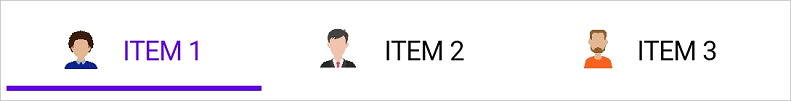

### Content

The [`Content`](https://help.syncfusion.com/cr/maui/Syncfusion.Maui.TabView.SfTabItem.html#Syncfusion_Maui_TabView_SfTabItem_Content) property holds the view displayed in the main area of the Tab View when the tab is selected. The property is of type `View`.




<tabView:SfTabView>
    <tabView:SfTabItem Header="ITEM 2">
        <tabView:SfTabItem.Content>
            <ListView>
                <!-- ListView content here -->
            </ListView>
        </tabView:SfTabItem.Content>
    </tabView:SfTabItem>
</tabView:SfTabView>




SfTabView tabView = new SfTabView
{
    Items = new TabItemCollection
    {
        new SfTabItem()
        {
            Header = "ITEM 2",
            Content = new ListView()
            {
                // ListView content here
            }
        }
    }
};




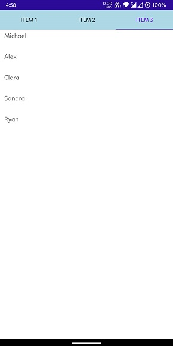

## ImagePosition options

The .NET MAUI Tab View provides four options for determining how the image of the tab aligns relative to the text. The options are `Left`, `Top`, `Right`, and `Bottom`. These can be achieved using the [`ImagePosition`](https://help.syncfusion.com/cr/maui/Syncfusion.Maui.TabView.SfTabItem.html#Syncfusion_Maui_TabView_SfTabItem_ImagePosition) property of [`SfTabItem`](https://help.syncfusion.com/cr/maui/Syncfusion.Maui.TabView.SfTabItem.html). The property is of type `TabImagePosition` and the default value is `Left`.

> **Note** Each tab item can have a different image position. Use the Visual State Manager to apply the same value to all tabs.

### Top

Places the image above the text vertically.




<tabView:SfTabView>
    <tabView:SfTabItem Header="ITEM 1" ImageSource="image1.png" ImagePosition="Top" />
    <tabView:SfTabItem Header="ITEM 2" ImageSource="image2.png" ImagePosition="Top" />
    <tabView:SfTabItem Header="ITEM 3" ImageSource="image3.png" ImagePosition="Top" />
</tabView:SfTabView>




SfTabView tabView = new SfTabView
{
    Items = 
    { 
        new SfTabItem { Header = "ITEM 1", ImageSource = "image1.png", ImagePosition = TabImagePosition.Top  },
        new SfTabItem { Header = "ITEM 2", ImageSource = "image2.png", ImagePosition = TabImagePosition.Top  },
        new SfTabItem { Header = "ITEM 3", ImageSource = "image3.png", ImagePosition = TabImagePosition.Top  }
    }
};




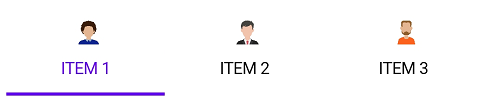

### Bottom

Places the image below the text vertically.




<tabView:SfTabView>
    <tabView:SfTabItem Header="ITEM 1" ImageSource="image1.png" ImagePosition="Bottom" />
    <tabView:SfTabItem Header="ITEM 2" ImageSource="image2.png" ImagePosition="Bottom" />
    <tabView:SfTabItem Header="ITEM 3" ImageSource="image3.png" ImagePosition="Bottom" />
</tabView:SfTabView>




SfTabView tabView = new SfTabView
{
    Items = 
    { 
        new SfTabItem { Header = "ITEM 1", ImageSource = "image1.png", ImagePosition = TabImagePosition.Bottom },
        new SfTabItem { Header = "ITEM 2", ImageSource = "image2.png", ImagePosition = TabImagePosition.Bottom },
        new SfTabItem { Header = "ITEM 3", ImageSource = "image3.png", ImagePosition = TabImagePosition.Bottom }
    }
};




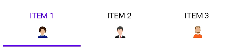

### Left

Places the image before the text, horizontally.




<tabView:SfTabView>
    <tabView:SfTabItem Header="ITEM 1" ImageSource="image1.png" ImagePosition="Left" />
    <tabView:SfTabItem Header="ITEM 2" ImageSource="image2.png" ImagePosition="Left" />
    <tabView:SfTabItem Header="ITEM 3" ImageSource="image3.png" ImagePosition="Left" />
</tabView:SfTabView>




SfTabView tabView = new SfTabView
{
     Items = 
    { 
        new SfTabItem { Header = "ITEM 1", ImageSource = "image1.png", ImagePosition = TabImagePosition.Left },
        new SfTabItem { Header = "ITEM 2", ImageSource = "image2.png", ImagePosition = TabImagePosition.Left },
        new SfTabItem { Header = "ITEM 3", ImageSource = "image3.png", ImagePosition = TabImagePosition.Left }
    }
};




### Right

Places the image to the right of the text, horizontally.




<tabView:SfTabView>
    <tabView:SfTabItem ImagePosition="Right" />
    <tabView:SfTabItem Header="ITEM 1" ImageSource="image1.png" ImagePosition="Right" />
    <tabView:SfTabItem Header="ITEM 2" ImageSource="image2.png" ImagePosition="Right" />
    <tabView:SfTabItem Header="ITEM 3" ImageSource="image3.png" ImagePosition="Right" />
</tabView:SfTabView>




SfTabView tabView = new SfTabView
{
    Items = 
    { 
        new SfTabItem { Header = "ITEM 1", ImageSource = "image1.png", ImagePosition = TabImagePosition.Right },
        new SfTabItem { Header = "ITEM 2", ImageSource = "image2.png", ImagePosition = TabImagePosition.Right },
        new SfTabItem { Header = "ITEM 3", ImageSource = "image3.png", ImagePosition = TabImagePosition.Right }
    }
};




## ImageTextSpacing

The [`ImageTextSpacing`](https://help.syncfusion.com/cr/maui/Syncfusion.Maui.TabView.SfTabItem.html#Syncfusion_Maui_TabView_SfTabItem_ImageTextSpacing) property in `SfTabItem` sets the spacing between the image and the text of the tab item. The property is of type `double`.




<tabView:SfTabView>
    <tabView:SfTabItem  />
    <tabView:SfTabItem Header="ITEM 1" ImageSource="image1.png" ImageTextSpacing="20"/>
    <tabView:SfTabItem Header="ITEM 2" ImageSource="image2.png" ImageTextSpacing="20"/>
    <tabView:SfTabItem Header="ITEM 3" ImageSource="image3.png" ImageTextSpacing="20"/>
</tabView:SfTabView>




SfTabView tabView = new SfTabView
{
    Items = 
    { 
        new SfTabItem { Header = "ITEM 1", ImageSource = "image1.png", ImagePosition = ImageTextSpacing=20 },
        new SfTabItem { Header = "ITEM 2", ImageSource = "image2.png", ImagePosition = ImageTextSpacing=20 },
        new SfTabItem { Header = "ITEM 3", ImageSource = "image3.png", ImagePosition = ImageTextSpacing=20 }
    }
};



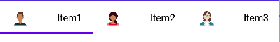

## TextColor customization

The [`TextColor`](https://help.syncfusion.com/cr/maui/Syncfusion.Maui.TabView.SfTabItem.html#Syncfusion_Maui_TabView_SfTabItem_TextColor) property sets the text color of the tab item displayed in the tab bar. The property is of type `Color`.




<tabView:SfTabView>
    <tabView:SfTabItem Header="ITEM 1" TextColor="Blue" />
    <tabView:SfTabItem Header="ITEM 2" TextColor="Blue" />
    <tabView:SfTabItem Header="ITEM 3" TextColor="Blue" />
</tabView:SfTabView>




SfTabView tabView = new SfTabView
{
    Items = 
    { 
        new SfTabItem { Header = "ITEM 1", TextColor = Colors.Blue },
        new SfTabItem { Header = "ITEM 2", TextColor = Colors.Blue },
        new SfTabItem { Header = "ITEM 3", TextColor = Colors.Blue }
    }
};




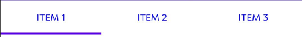

## Font customization

This type of customization involves changes to font elements such as family, attributes, and size.

### FontFamily

The [`FontFamily`](https://help.syncfusion.com/cr/maui/Syncfusion.Maui.TabView.SfTabItem.html#Syncfusion_Maui_TabView_SfTabItem_FontFamily) property sets the font family of the tab item text. To use a custom font, register it in `MauiProgram.cs` using `.ConfigureFonts(fonts => fonts.AddFont("OpenSansRegular.ttf", "OpenSansRegular"))` and include the font file in the `Resources/Fonts` folder of your project.




<tabView:SfTabView>
    <tabView:SfTabItem Header="ITEM 1" FontFamily="OpenSansRegular" />
    <tabView:SfTabItem Header="ITEM 2" FontFamily="OpenSansRegular" />
    <tabView:SfTabItem Header="ITEM 3" FontFamily="OpenSansRegular" />
</tabView:SfTabView>




SfTabView tabView = new SfTabView
{
    Items = 
    { 
        new SfTabItem { Header = "ITEM 1", FontFamily = "OpenSansRegular" },
        new SfTabItem { Header = "ITEM 2", FontFamily = "OpenSansRegular" },
        new SfTabItem { Header = "ITEM 3", FontFamily = "OpenSansRegular" }
    }
};




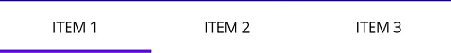

### FontAttributes

The [`FontAttributes`](https://help.syncfusion.com/cr/maui/Syncfusion.Maui.TabView.SfTabItem.html#Syncfusion_Maui_TabView_SfTabItem_FontAttributes) property sets the font style of the text of each tab item. Valid values are `None`, `Bold`, and `Italic`.




<tabView:SfTabView>
    <tabView:SfTabItem Header="ITEM 1" FontAttributes="Bold" />
    <tabView:SfTabItem Header="ITEM 2" FontAttributes="Bold" />
    <tabView:SfTabItem Header="ITEM 3" FontAttributes="Bold" />
</tabView:SfTabView>




SfTabView tabView = new SfTabView
{
    Items = 
    { 
        new SfTabItem { Header = "ITEM 1", FontAttributes = FontAttributes.Bold },
        new SfTabItem { Header = "ITEM 2", FontAttributes = FontAttributes.Bold },
        new SfTabItem { Header = "ITEM 3", FontAttributes = FontAttributes.Bold }
    }
};




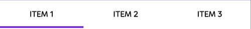

### FontSize

The [`FontSize`](https://help.syncfusion.com/cr/maui/Syncfusion.Maui.TabView.SfTabItem.html#Syncfusion_Maui_TabView_SfTabItem_FontSize) property sets the size of the text of each tab item. The property is of type `double`.




<tabView:SfTabView>
    <tabView:SfTabItem Header="ITEM 1" FontSize="32" />
    <tabView:SfTabItem Header="ITEM 2" FontSize="32" />
    <tabView:SfTabItem Header="ITEM 3" FontSize="32" />
</tabView:SfTabView>




SfTabView tabView = new SfTabView
{
    Items = 
    { 
        new SfTabItem { Header = "ITEM 1", FontSize="32" },
        new SfTabItem { Header = "ITEM 2", FontSize="32" },
        new SfTabItem { Header = "ITEM 3", FontSize="32" }
    }
};



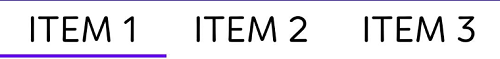

## LineBreakMode

The [`LineBreakMode`](https://help.syncfusion.com/cr/maui/Syncfusion.Maui.TabView.SfTabItem.html#Syncfusion_Maui_TabView_SfTabItem_LineBreakMode) property sets the line break mode of the tab item text. The property is of type `LineBreakMode`. Valid values are `NoWrap`, `WordWrap`, `CharacterWrap`, `HeadTruncation`, `TailTruncation`, and `MiddleTruncation`.




<tabView:SfTabView>
    <tabView:SfTabItem Header="Terms and Conditions and Privacy Policy" LineBreakMode="WordWrap" />
    <tabView:SfTabItem Header="Account Settings and Preferences" LineBreakMode="WordWrap" />
    <tabView:SfTabItem Header="Licenses and Copyrights Agreements" LineBreakMode="WordWrap" />
</tabView:SfTabView>




SfTabView tabView = new SfTabView
{
    Items = new TabItemCollection
    {
        new SfTabItem()
        {
            Header = "Terms and Conditions and Privacy Policy",
            LineBreakMode = LineBreakMode.WordWrap
        },
        new SfTabItem()
        {
            Header = "Account Settings and Preferences",
            LineBreakMode = LineBreakMode.WordWrap
        },
        new SfTabItem()
        {
            Header = "Licenses and Copyrights Agreements",
            LineBreakMode = LineBreakMode.WordWrap
        }
    }
};




## Badge support

In `SfTabItem`, badges notify users of new or unread messages, notifications, or the status of something.

### BadgeText

The [`BadgeText`](https://help.syncfusion.com/cr/maui/Syncfusion.Maui.TabView.SfTabItem.html#Syncfusion_Maui_TabView_SfTabItem_BadgeText) property sets the text shown inside the badge view.




<tabView:SfTabView>
    <tabView:SfTabItem  />
    <tabView:SfTabItem Header="ITEM 1" BadgeText="20" />
    <tabView:SfTabItem Header="ITEM 2" BadgeText="10" />
    <tabView:SfTabItem Header="ITEM 3" BadgeText="25" />
</tabView:SfTabView>




SfTabView tabView = new SfTabView
{
    Items = 
    { 
        new SfTabItem { Header = "ITEM 1", BadgeText = 20 },
        new SfTabItem { Header = "ITEM 2", BadgeText = 10 },
        new SfTabItem { Header = "ITEM 3", BadgeText = 25 }
    }
};




### BadgeSettings

The [`BadgeSettings`](https://help.syncfusion.com/cr/maui/Syncfusion.Maui.TabView.SfTabItem.html#Syncfusion_Maui_TabView_SfTabItem_BadgeSettings) property customizes the appearance of the badge view. It exposes sub-properties such as badge type, position, background color, text color, border color, border thickness, offset, and font attributes.

> **Note** To customize the badge beyond predefined styles, set the [`Type`](https://help.syncfusion.com/cr/maui/Syncfusion.Maui.Core.BadgeSettings.html#Syncfusion_Maui_Core_BadgeSettings_Type) property to [`None`](https://help.syncfusion.com/cr/maui/Syncfusion.Maui.Core.BadgeType.html#Syncfusion_Maui_Core_BadgeType_None) in the `BadgeSettings`.




<tabView:SfTabView>
    <tabView:SfTabItem Header="RECENTS" BadgeText="20">
        <tabView:SfTabItem.BadgeSettings>
            <core:BadgeSettings FontSize="15"
                                FontAttributes="Bold"
                                FontFamily="serif" />
        </tabView:SfTabItem.BadgeSettings>
    </tabView:SfTabItem>
    <tabView:SfTabItem Header="FAVOURITS"/>
    <tabView:SfTabItem Header="CONTACTS"/>
</tabView:SfTabView>




SfTabView tabView = new SfTabView
{
    Items = new TabItemCollection
    {
        new SfTabItem()
        {
            Header = "RECENTS",
            BadgeText = "20",
            BadgeSettings = new BadgeSettings()
            {
                FontSize = 15,
                FontAttributes = FontAttributes.Bold,
                FontFamily = "serif"
            }
        }
        new SfTabItem { Header = "FAVOURITS" },
        new SfTabItem { Header = "CONTACTS" }
    }
};




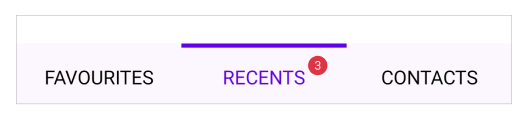

> **Note** View the [TabViewCustomizationSample](https://github.com/SyncfusionExamples/maui-tabview-samples/tree/main/TabViewCustomizationSample) on GitHub.

## TabHeaderPadding

The [`TabHeaderPadding`](https://help.syncfusion.com/cr/maui/Syncfusion.Maui.TabView.SfTabView.html#Syncfusion_Maui_TabView_SfTabView_TabHeaderPadding) property on `SfTabView` adds padding around the tab header. The property is of type `Thickness`.

> **Note** `TabHeaderPadding` is only applicable when [`TabWidthMode`](https://help.syncfusion.com/cr/maui/Syncfusion.Maui.TabView.SfTabView.html#Syncfusion_Maui_TabView_SfTabView_TabWidthMode) is set to [`SizeToContent`](https://help.syncfusion.com/cr/maui/Syncfusion.Maui.TabView.TabWidthMode.html#Syncfusion_Maui_TabView_TabWidthMode_SizeToContent).




<tabView:SfTabView TabWidthMode="SizeToContent" TabHeaderPadding="5,10,5,10">
    <tabView:SfTabItem Header="ITEM 1"/>
    <tabView:SfTabItem Header="ITEM 2"/>
    <tabView:SfTabItem Header="ITEM 3"/>
</tabView:SfTabView>




SfTabView tabView = new SfTabView
{
    TabWidthMode = TabWidthMode.SizeToContent,
    TabHeaderPadding = new Thickness(5, 10, 5, 10)
    Items = 
    { 
        new SfTabItem { Header = "ITEM 1" },
        new SfTabItem { Header = "ITEM 2" },
        new SfTabItem { Header = "ITEM 3" }
    }
};




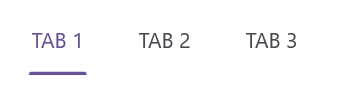

## Scroll buttons

Scroll buttons are used to navigate through the items in the header of the Tab View by setting the [`IsScrollButtonEnabled`](https://help.syncfusion.com/cr/maui/Syncfusion.Maui.TabView.SfTabView.html#Syncfusion_Maui_TabView_SfTabView_IsScrollButtonEnabled) property of `SfTabView`. The property is of type `bool` and defaults to `false`. When enabled, scroll buttons are shown to indicate the presence of tabs beyond the currently visible area.




<tabView:SfTabView IsScrollButtonEnabled="true">
    <tabView:SfTabItem />
</tabView:SfTabView>




SfTabView tabView = new SfTabView
{
    IsScrollButtonEnabled = true
};




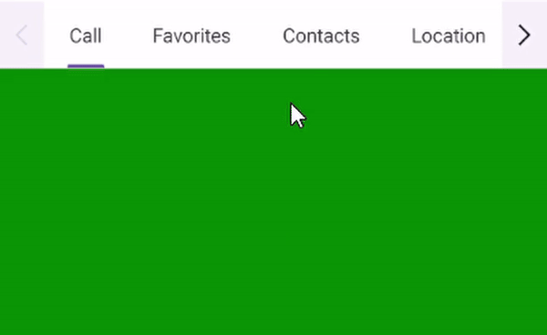

### Scroll button customization

The [`ScrollButtonBackground`](https://help.syncfusion.com/cr/maui/Syncfusion.Maui.TabView.SfTabView.html#Syncfusion_Maui_TabView_SfTabView_ScrollButtonBackground) and [`ScrollButtonColor`](https://help.syncfusion.com/cr/maui/Syncfusion.Maui.TabView.SfTabView.html#Syncfusion_Maui_TabView_SfTabView_ScrollButtonColor) properties of `SfTabView` customize the background and foreground color of the scroll button.




<tabView:SfTabView ScrollButtonBackground="Violet" ScrollButtonColor="Red">
    <tabView:SfTabItem />
</tabView:SfTabView>




SfTabView tabView = new SfTabView
{
    ScrollButtonBackground = new SolidColorBrush(Colors.Violet),
    ScrollButtonColor = Colors.Red
};




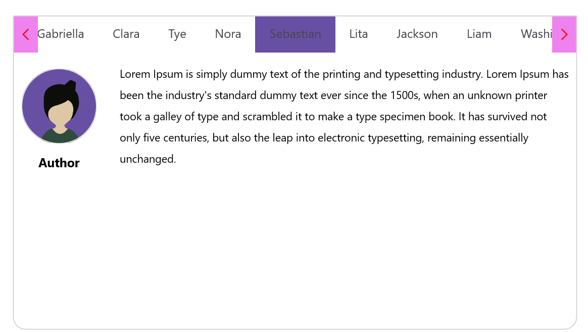

## FontAutoScalingEnabled

The [`FontAutoScalingEnabled`](https://help.syncfusion.com/cr/maui/Syncfusion.Maui.TabView.SfTabItem.html#Syncfusion_Maui_TabView_SfTabItem_FontAutoScalingEnabled) property automatically scales the tab header's font size based on the operating system's text size. The property is of type `bool` and the default value is `false`.




<tabView:SfTabView FontAutoScalingEnabled="true">
    <tabView:SfTabItem />
</tabView:SfTabView>




var tabView = new SfTabView
{
    FontAutoScalingEnabled = true
};




## ContentTransitionDuration

The [`ContentTransitionDuration`](https://help.syncfusion.com/cr/maui/Syncfusion.Maui.TabView.SfTabView.html#Syncfusion_Maui_TabView_SfTabView_ContentTransitionDuration) property customizes the animation duration (in milliseconds) when changing the [`SelectedIndex`](https://help.syncfusion.com/cr/maui/Syncfusion.Maui.TabView.SfTabView.html#Syncfusion_Maui_TabView_SfTabView_SelectedIndex) of the Tab View. The property is of type `int`.




<tabView:SfTabView ContentTransitionDuration="1000">
    <tabView:SfTabItem />
</tabView:SfTabView>




var tabView = new SfTabView
{
    ContentTransitionDuration = 1000
};




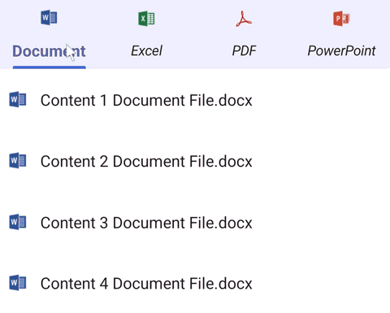

## ImageSize

You can customize the image size in the .NET MAUI Tab View control by setting the [ImageSize](https://help.syncfusion.com/cr/maui/Syncfusion.Maui.TabView.SfTabItem.html#Syncfusion_Maui_TabView_SfTabItem_ImageSize) property.



<tabView:SfTabView>
    <tabView:SfTabItem ImageSize="50"/>
</tabView:SfTabView>



StackLayout stackLayout = new StackLayout();
var tabView = new SfTabView();
var tabItems = new TabItemCollection
{
    new SfTabItem()
    {
        ImageSize = 50,
    }
};
tabView.Items = tabItems;
stackLayout.Children.Add(tabView);
this.Content = stackLayout;




## Disable ripple effect on item click

The [EnableRippleAnimation](https://help.syncfusion.com/cr/maui/Syncfusion.Maui.TabView.SfTabView.html#Syncfusion_Maui_TabView_SfTabView_EnableRippleAnimation) property of the [SfTabView](https://help.syncfusion.com/cr/maui/Syncfusion.Maui.TabView.SfTabView.html) allows you to enable or disable the ripple animation for tab headers. This animation provides visual feedback when a tab header is tapped. The default value of the `EnableRippleAnimation` property is `true`.



<!-- Define the SfTabView control with the ripple animation disabled -->
<tabView:SfTabView EnableRippleAnimation="False">
    <tabView:SfTabItem Header="Item1" />
    <tabView:SfTabItem Header="Item2" />
    <tabView:SfTabItem Header="Item3" />
</tabView:SfTabView>



// Create an instance of the SfTabView control
SfTabView tabView = new SfTabView();

// Disable the ripple animation
tabView.EnableRippleAnimation = false;





## How to

### Disable hover effect on tab item

To disable the hover effect when the mouse pointer is over a [TabItem](https://help.syncfusion.com/cr/maui/Syncfusion.Maui.TabView.SfTabItem.html) header, set color value `Transparent` to the built-in key `SfTabViewHoverBackground`.




<ContentPage.Resources>
    <Color x:Key="SfTabViewHoverBackground">Transparent</Color>
</ContentPage.Resources>
<ContentPage.Content>
    <tabView:SfTabView x:Name="tabView" EnableRippleAnimation="False">
        <tabView:SfTabItem Header="Item1" />
    <tabView:SfTabItem Header="Item2" />
    <tabView:SfTabItem Header="Item3" />
    </tabView:SfTabView>
</ContentPage.Content>





### Select tab items programmatically

To select the tab items programmatically, you can use the [SelectedIndex](https://help.syncfusion.com/cr/maui/Syncfusion.Maui.TabView.SfTabView.html#Syncfusion_Maui_TabView_SfTabView_SelectedIndex) property in SfTabView.



<tabView:SfTabView SelectedIndex="1">
     <tabView:SfTabItem />
     <tabView:SfTabItem />
     <tabView:SfTabItem />
</tabView:SfTabView>



SfTabView tabView = new SfTabView();
tabView.SelectedIndex = 1;





## See also

- [Selection Indicator Customization in .NET MAUI Tab View](https://help.syncfusion.com/maui/tabview/selection-indicator-customization)
- [Header Display Mode in .NET MAUI Tab View](https://help.syncfusion.com/maui/tabview/header-display-mode)
- [Tab bar Customization in .NET MAUI Tab View](https://help.syncfusion.com/maui/tabview/tab-bar-customization)
- [Populating ItemsSource in .NET MAUI Tab View](https://help.syncfusion.com/maui/tabview/populating-itemssource)