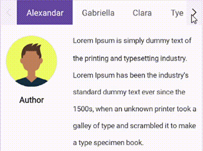

# Configure the appearance of Tab Item in .NET MAUI Tab View (SfTabView)

A tab item consists of the following elements that can be customized.

## Adding image in tab item

### Header

Holds the text of the tab item that is displayed in the tab bar.




    <tabView:SfTabView>
        <tabView:SfTabItem Header="ITEM 1">
    </tabView:SfTabView>



    var tabView = new SfTabView();
    var tabItems = new TabItemCollection
    {
        new SfTabItem()
        {
            Header = "ITEM 1",
        }
    }




 

### ImageSource 

The image to be displayed in the tab bar representing the tab item.




    <tabView:SfTabView>
        <tabView:SfTabItem Header="ITEM 1" ImageSource="alexandar">
    </tabView:SfTabView>



    var tabView = new SfTabView();
    var tabItems = new TabItemCollection
    {
        new SfTabItem()
        {
            Header = "ITEM 1",
            ImageSource = "alexandar",
        }
    }





 

### Content 

The assigned view will get displayed in the main area of the tab view.




    <tabView:SfTabView>
        <tabView:SfTabItem Header="ITEM 2">
            <tabView:SfTabItem.Content>
                <ListView>
                    ...
                </ListView>
            </tabView:SfTabItem.Content>
         </tabView:SfTabItem>
    </tabView>



    var tabView = new SfTabView();
    var tabItems = new TabItemCollection
    {
        new SfTabItem()
        {
            Header="ITEM 2",
            Content = new ListView()
            {
                /// code
            }
        }
    }




 

## Image position options 

The .NET MAUI Tab View provides four options that determine how the image of the tab aligns relative to the text. The options are left, top, right and bottom. It can be achieved using the [TabImagePosition](https://help.syncfusion.com/cr/maui/Syncfusion.Maui.TabView.TabImagePosition.html) property of [SfTabItem](https://help.syncfusion.com/cr/maui/Syncfusion.Maui.TabView.SfTabItem.html) of type [TabImagePosition](https://help.syncfusion.com/cr/maui/Syncfusion.Maui.TabView.TabImagePosition.html).

N> Each tab item can be set with different image positions. Visual State Manager can be used to apply same value to all tabs.

### Top

The image will be placed above the text vertically.




    <tabView:SfTabView>
        <tabView:SfTabItem TabImagePosition="Top">
    </tabView:SfTabView>



    var tabView = new SfTabView();
    var tabItems = new TabItemCollection
    {
        new SfTabItem()
        {
            TabImagePosition = TabImagePosition.Top,
        }
    }




 

### Bottom

The image will be placed below the text vertically.




    <tabView:SfTabView>
        <tabView:SfTabItem TabImagePosition="Bottom">
    </tabView:SfTabView>



    var tabView = new SfTabView();
    var tabItems = new TabItemCollection
    {
        new SfTabItem()
        {
            TabImagePosition = TabImagePosition.Bottom,
        }
    }




 

### Left

The image will be placed before the text horizontally.




    <tabView:SfTabView>
        <tabView:SfTabItem TabImagePosition="Left">
    </tabView:SfTabView>



    var tabView = new SfTabView();
    var tabItems = new TabItemCollection
    {
        new SfTabItem()
        {
            TabImagePosition = TabImagePosition.Left,
        }
    }




 

### Right

The image will be placed to the right side of the text horizontally.




    <tabView:SfTabView>
        <tabView:SfTabItem TabImagePosition="Right">
    </tabView:SfTabView>



    var tabView = new SfTabView();
    var tabItems = new TabItemCollection
    {
        new SfTabItem()
        {
            TabImagePosition = TabImagePosition.Right,
        }
    }




 

## Image Text Spacing

The [ImageTextSpacing](https://help.syncfusion.com/cr/maui/Syncfusion.Maui.TabView.SfTabItem.html#Syncfusion_Maui_TabView_SfTabItem_ImageTextSpacing) property in SfTabItem allows for the provision of spacing between the image and the text of the tab item.




<tabView:SfTabView>
    <tabView:SfTabItem ImageTextSpacing="20">
</tabView:SfTabView>



var tabView = new SfTabView();
var tabItems = new TabItemCollection
{
    new SfTabItem()
    {
        ImageTextSpacing = "20",
    }
}




## Text Color Customization 

The text color of the tab item displayed in the tab bar.




    <tabView:SfTabView>
        <tabView:SfTabItem TextColor="Blue"/>
    </tabView:SfTabView>



    var tabView = new SfTabView();
    var tabItems = new TabItemCollection
    {
        new SfTabItem()
        {
            TextColor = Color.Blue,
        }
    }




 

## Font Customization 

This type of customization involves making changes to the looks of some font elements.

### FontFamily

Font family of the tab item text displayed in the tab bar.




    <tabView:SfTabView>
        <tabView:SfTabItem FontFamily="OpenSansRegular"/>
    </tabView:SfTabView>



    var tabView = new SfTabView();
    var tabItems = new TabItemCollection
    {
        new SfTabItem()
        {
            FontFamily = "OpenSansRegular",
        }
    }




 

### FontAttribute

The font style of the text of each tab item in the tab bar.




    <tabView:SfTabView>
        <tabView:SfTabItem FontAttributes="Bold"/>
    </tabView:SfTabView>



    var tabView = new SfTabView();
    var tabItems = new TabItemCollection
    {
        new SfTabItem()
        {
            FontAttributes = FontAttributes.Bold,
        }
    }




 

### FontSize

The size of the text of each tab item in the tab bar.




    <tabView:SfTabView>
        <tabView:SfTabItem FontSize="32"/>
    </tabView:SfTabView>



    var tabView = new SfTabView();
    var tabItems = new TabItemCollection
    {
        new SfTabItem()
        {
            FontSize = 32,
        }
    }




## Badge Support

In SfTabItem, the badges are used to notify users of new or unread messages, notifications, or the status of something.

### Badge text
By using the [BadgeText](https://help.syncfusion.com/cr/maui/Syncfusion.Maui.TabView.SfTabItem.html#Syncfusion_Maui_TabView_SfTabItem_BadgeText) property in the SfTabItem, you can add text to badge view.




    <tabView:SfTabView>
        <tabView:SfTabItem BadgeText="Inbox"/>
    </tabView:SfTabView>



    var tabView = new SfTabView();
    var tabItems = new TabItemCollection
    {
        new SfTabItem()
        {
            BadgeText = "Inbox",
        }
    }




### Badge settings

The [BadgeSettings](https://help.syncfusion.com/cr/maui/Syncfusion.Maui.TabView.SfTabItem.html#Syncfusion_Maui_TabView_SfTabItem_BadgeSettings) property helps you to customize the basic look and feel of the badge view in the SfTabItem. 

[BadgeSettings](https://help.syncfusion.com/cr/maui/Syncfusion.Maui.TabView.SfTabItem.html#Syncfusion_Maui_TabView_SfTabItem_BadgeSettings) contains the sub-elements such as badge types, positions, and colors. You can customize the background color, text color, border color, width, offset, and font attributes.




    <tabView:SfTabView>
        <tabView:SfTabItem Header="RECENTS" BadgeText="20">
            <tabView:SfTabItem.BadgeSettings >
                <core:BadgeSettings FontSize="15" 
                                    FontAttributes="Bold" 
                                    FontFamily="serif"/>
            </tabView:SfTabItem.BadgeSettings>
        </tabView:SfTabItem>
    </tabView:SfTabView>




    var tabView = new SfTabView();
    BadgeSettings badgeSetting = new BadgeSettings();
    badgeSetting.FontAttributes = FontAttributes.Bold;
    badgeSetting.FontSize = 15;
    badgeSetting.FontFamily = "serif";

    var tabItems = new TabItemCollection()
    {
        new SfTabItem()
        {
            Header="TabItem",
            BadgeText = "Inbox",
            BadgeSettings = badgeSetting,
        }
    };

    tabView.Items = tabItems;
            




 

N> View [sample](https://github.com/SyncfusionExamples/maui-tabview-samples/tree/main/TabViewCustomizationSample) in GitHub.

## Tab Header Padding

The [TabHeaderPadding](https://help.syncfusion.com/cr/maui/Syncfusion.Maui.TabView.SfTabView.html#Syncfusion_Maui_TabView_SfTabView_TabHeaderPadding) property in [SfTabView](https://help.syncfusion.com/cr/maui/Syncfusion.Maui.TabView.SfTabView.html?tabs=tabid-1) allows for adding padding to the tab header.

N> The `TabHeaderPadding` property is only applicable when [TabWidthMode](https://help.syncfusion.com/cr/maui/Syncfusion.Maui.TabView.SfTabView.html#Syncfusion_Maui_TabView_SfTabView_TabWidthMode) is set to [SizeToContent](https://help.syncfusion.com/cr/maui/Syncfusion.Maui.TabView.TabWidthMode.html#Syncfusion_Maui_TabView_TabWidthMode_SizeToContent).




<tabView:SfTabView TabWidthMode="SizeToContent" TabHeaderPadding="5,10,5,10">
    <tabView:SfTabItem/>
</tabView:SfTabView>



var tabView = new SfTabView();
tabView.TabWidthMode = TabWidthMode.SizeToContent;
tabView.TabHeaderPadding = new Thickness(5, 10, 5, 10);




## Scroll buttons on Header

Scroll buttons are used to navigate through the items in the header of the tab view by adjusting the [IsScrollButtonEnabled](https://help.syncfusion.com/cr/maui/Syncfusion.Maui.TabView.SfTabView.html#Syncfusion_Maui_TabView_SfTabView_IsScrollButtonEnabled) property of [SfTabView](https://help.syncfusion.com/cr/maui/Syncfusion.Maui.TabView.SfTabView.html?tabs=tabid-1). This functionality additionally indicates the presence of tabs beyond the currently visible area.




<tabView:SfTabView  IsScrollButtonEnabled="True">
    <tabView:SfTabItem/>
</tabView:SfTabView>



var tabView = new SfTabView();
tabView.IsScrollButtonEnabled = true;




 