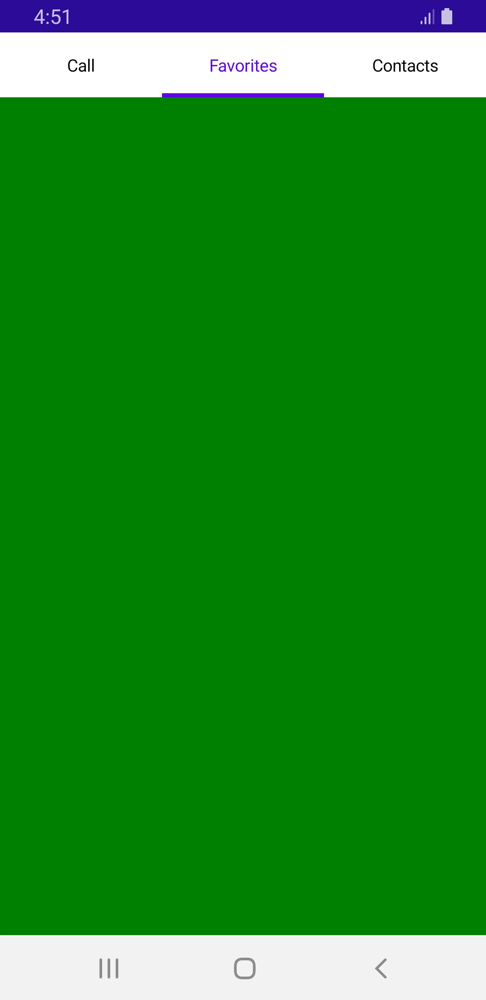

# Visual State Manager in MAUI TabView (SfTabView)

Use the visual state manager to make changes to the .NET MAUI tab properties based on the visual states set from code. The applicable visual states are selected, normal, enable and disable.



<ContentPage xmlns="http://schemas.microsoft.com/dotnet/2021/maui"
             xmlns:x="http://schemas.microsoft.com/winfx/2009/xaml"
             x:Class="TabViewMauiSample.MainPage"
             xmlns:tabView="http://schemas.syncfusion.com/maui"
             BackgroundColor="{DynamicResource SecondaryColor}">
    <ContentPage.Content>
        <Grid>
            <Grid.Resources>
                
                
            </Grid.Resources>
            <tabView:SfTabView>
                    <tabView:SfTabItem Header="Call">
                        <tabView:SfTabItem.Content>
                            <Grid BackgroundColor="Red" x:Name="AllContactsGrid" />
                        </tabView:SfTabItem.Content>
                    </tabView:SfTabItem>
                    <tabView:SfTabItem Header="Favorites">
                        <tabView:SfTabItem.Content>
                            <Grid BackgroundColor="Green" x:Name="FavoritesGrid" />
                        </tabView:SfTabItem.Content>
                    </tabView:SfTabItem>
                    <tabView:SfTabItem Header="Contacts">
                        <tabView:SfTabItem.Content>
                            <Grid BackgroundColor="Blue" x:Name="ContactsGrid" />
                        </tabView:SfTabItem.Content>
                    </tabView:SfTabItem>
            </tabView:SfTabView>
        </Grid>
    </ContentPage.Content>
</ContentPage>



 