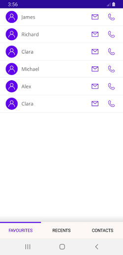

# Visual State Manager in .NET MAUI Tab View (SfTabView)

Use the visual state manager to change the .NET MAUI tab properties based on the visual states set from code. The applicable visual states are selected, normal, and disable.





<ContentPage xmlns="http://schemas.microsoft.com/dotnet/2021/maui"
             xmlns:x="http://schemas.microsoft.com/winfx/2009/xaml"
             x:Class="TabViewMauiSample.MainPage"
             xmlns:tabView="clr-namespace:Syncfusion.Maui.TabView;assembly=Syncfusion.Maui.TabView"
             BackgroundColor="{DynamicResource SecondaryColor}">
    <ContentPage.Content>
        <Grid>
            <Grid.Resources>
                
                
            </Grid.Resources>
            <tabView:SfTabView>
                <tabView:SfTabItem Header="FAVOURITES">
                    <tabView:SfTabItem.Content>
                        <Grid>
                            <Grid GridLayout.Row="1" VerticalOptions="End" HeightRequest="20">
                                <Grid.Background>
                                    <LinearGradientBrush EndPoint="0,1">
                                        <GradientStop Color="Transparent" Offset="0.1" />
                                        <GradientStop Color="#EAEAEA" Offset="0.8" />
                                        <GradientStop Color="#E5E5E5" Offset="1.0" />
                                    </LinearGradientBrush>
                                </Grid.Background>
                        </Grid>
                        <ListView RowHeight="50">
                            <ListView.ItemsSource>
                                <x:Array Type="{x:Type x:String}">
                                    <x:String>James</x:String>
                                    <x:String>Richard</x:String>
                                    <x:String>Clara</x:String>
                                    <x:String>Michael</x:String>
                                    <x:String>Alex</x:String>
                                    <x:String>Clara</x:String>
                                </x:Array>
                            </ListView.ItemsSource>
                            <ListView.ItemTemplate>
                            <DataTemplate>
                                <ViewCell>
                                    <Grid ColumnDefinitions="48,*,48,48" Margin="10,5">
                                        <Image GridLayout.Column="0"
                                                WidthRequest="35"
                                                HeightRequest="35"
                                                VerticalOptions="Center"
                                                HorizontalOptions="Center"
                                                Aspect="AspectFit"
                                                Source="contact_image"/>
                                        <Label GridLayout.Column="1"
                                                VerticalOptions="Center"
                                                HorizontalOptions="Start"
                                                Margin="5,0"
                                                TextColor="#666666"
                                                FontSize="16"
                                                Text="{Binding}"/>
                                        <Image GridLayout.Column="2"
                                                WidthRequest="35"
                                                HeightRequest="35"
                                                VerticalOptions="Center"
                                                HorizontalOptions="Center"
                                                Aspect="AspectFit"
                                                Source="mail"/>
                                        <Image GridLayout.Column="3"
                                                WidthRequest="35"
                                                HeightRequest="35"
                                                VerticalOptions="Center"
                                                HorizontalOptions="Center"
                                                Aspect="AspectFit"
                                                Source="call1"/>
                                        </Grid>
                                    </ViewCell>
                                </DataTemplate>
                            </ListView.ItemTemplate>
                        </ListView>
                    </Grid>
                </tabView:SfTabItem.Content>
            </tabView:SfTabItem>
            <tabView:SfTabItem Header="RECENTS">
                <tabView:SfTabItem.Content>
                    <Grid BackgroundColor="Green" x:Name="FavoritesGrid" />
                </tabView:SfTabItem.Content>
            </tabView:SfTabItem>
            <tabView:SfTabItem Header="CONTACTS">
                <tabView:SfTabItem.Content>
                    <Grid BackgroundColor="Blue" x:Name="ContactsGrid" />
                </tabView:SfTabItem.Content>
            </tabView:SfTabItem>
        </tabView:SfTabView>
    </Grid>
 </ContentPage.Content>
 </ContentPage>





    public partial class MainPage : ContentPage
    {
        public MainPage()
        {
            InitializeComponent();

            SfTabView tabView = new SfTabView();

            ListView listView = new ListView
            {
                RowHeight = 50,
                ItemsSource = new string[] { "James", "Richard", "Clara", "Michael", "Alex", "Clara" },
                ItemTemplate = new DataTemplate(() =>
                {
                    var grid = new Grid
                    {
                        ColumnDefinitions =
                        {
                            new ColumnDefinition { Width = new GridLength(48) },
                            new ColumnDefinition { Width = new GridLength(1, GridUnitType.Star) },
                            new ColumnDefinition { Width = new GridLength(48) },
                            new ColumnDefinition { Width = new GridLength(48) }
                        },
                        Margin = new Thickness(10, 5)
                    };

                    var image1 = new Image
                    {
                        WidthRequest = 35,
                        HeightRequest = 35,
                        VerticalOptions = LayoutOptions.Center,
                        HorizontalOptions = LayoutOptions.Center,
                        Aspect = Aspect.AspectFit,
                        Source = "contact_image"
                    };
                    var label = new Label
                    {
                        VerticalOptions = LayoutOptions.Center,
                        HorizontalOptions = LayoutOptions.Start,
                        Margin = new Thickness(5, 0),
                        TextColor = Color.FromHex("#666666"),
                        FontSize = 16
                    };
                    label.SetBinding(Label.TextProperty, ".");
                    var image2 = new Image
                    {
                        WidthRequest = 35,
                        HeightRequest = 35,
                        VerticalOptions = LayoutOptions.Center,
                        HorizontalOptions = LayoutOptions.Center,
                        Aspect = Aspect.AspectFit,
                        Source = "mail"
                    };
                    var image3 = new Image
                    {
                        WidthRequest = 35,
                        HeightRequest = 35,
                        VerticalOptions = LayoutOptions.Center,
                        HorizontalOptions = LayoutOptions.Center,
                        Aspect = Aspect.AspectFit,
                        Source = "call1"
                    };

                    Grid.SetColumn(image1, 0);
                    Grid.SetColumn(label, 1);
                    Grid.SetColumn(image2, 2);
                    Grid.SetColumn(image3, 3);

                    grid.Children.Add(image1);
                    grid.Children.Add(label);
                    grid.Children.Add(image2);
                    grid.Children.Add(image3);

                    return new ViewCell { View = grid };
                })
            };

            Grid favoritesGrid = new Grid { };
            favoritesGrid.Children.Add(listView);
            Grid recentsGrid = new Grid { BackgroundColor = Colors.Green };
            Grid contactsGrid = new Grid { BackgroundColor = Colors.Blue };
            var tabItems = new TabItemCollection
            {
                new CustomTabItem()
                {
                    Header = "FAVOURITES",
                    Content = favoritesGrid
                },
                new CustomTabItem()
                {
                    Header = "RECENTS",
                    Content = recentsGrid
                },
                new CustomTabItem()
                {
                    Header = "CONTACTS",
                    Content = contactsGrid
                }
            };

            tabView.Items = tabItems;
            this.Content = tabView;

        }
    }

    //Custom SfTabItem

    public class CustomTabItem : SfTabItem
    {
        public CustomTabItem()
        {
            VisualStateGroupList visualStateGroupList = new VisualStateGroupList();
            VisualStateGroup commonStateGroup = new VisualStateGroup();

            VisualState normalState = new VisualState
            {
                Name = "Normal"
            };

            normalState.Setters.Add(new Setter { Property = SfTabItem.TextColorProperty, Value = Colors.Black });

            VisualState selectedState = new VisualState
            {
                Name = "Selected"
            };
            selectedState.Setters.Add(new Setter { Property = SfTabItem.TextColorProperty, Value = Color.FromHex("#6750A4") });

            commonStateGroup.States.Add(normalState);
            commonStateGroup.States.Add(selectedState);

            visualStateGroupList.Add(commonStateGroup);

            VisualStateManager.SetVisualStateGroups(this, visualStateGroupList);
        }
    }




 

N> View [sample](https://github.com/SyncfusionExamples/maui-tabview-samples/tree/main/VisualStateManagerTabView) in GitHub.

## See also 

[How to customize the text color of the header in .NET MAUI TabView?](https://support.syncfusion.com/kb/article/16788/how-to-customize-the-text-color-of-the-header-in-net-maui-tabview)