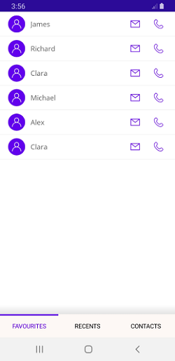

# Visual State Manager in .NET MAUI Tab View (SfTabView)

## Prerequisites

Before using the [SfTabView](https://help.syncfusion.com/cr/maui/Syncfusion.Maui.TabView.SfTabView.html), ensure the following NuGet package is installed in your .NET MAUI project:

- `Syncfusion.Maui.TabView`

For step-by-step setup, refer to the [Getting Started](https://help.syncfusion.com/maui/tabview/getting-started) documentation.

## Overview

Use the `Visual State Manager (VSM)` to change `SfTabItem` properties declaratively in XAML or programmatically in code-behind, based on the tab's visual state. The applicable visual states are `Selected`, `Normal`, and `Disabled`.

Use VSM when you need to apply different appearance values to the same tab depending on its current state—for example, a different `TextColor` when the tab is selected vs. when it is not. For simple, single-state appearance changes, set the properties directly on the `SfTabItem` (see [Tab Item Customization](Tab-Item-Customization.md)).

> **Note** The minimum Syncfusion MAUI package version that supports the Visual State Manager features documented here is 19.3.XX or later.

## Minimal VSM example (XAML)

The following example defines a `Normal` and a `Selected` visual state for `SfTabItem` using an implicit style. The style applies to every `SfTabItem` declared inside the same `ContentPage.Resources` scope.




<ContentPage.Resources>
    <ResourceDictionary>
        
    </ResourceDictionary>
</ContentPage.Resources>
<tabView:SfTabView>
    <tabView:SfTabItem Header="ITEM 1" />
    <tabView:SfTabItem Header="ITEM 2" />
    <tabView:SfTabItem Header="ITEM 3" />
</tabView:SfTabView>





> **Note** To use the `Roboto` font in this example, register it in `MauiProgram.cs` using `.ConfigureFonts(fonts => fonts.AddFont("Roboto-Regular.ttf", "Roboto"))` and include the font file in the `Resources/Fonts` folder of your project. To activate the `Disabled` state, set `IsEnabled="False"` on the `SfTabItem` and add a corresponding `VisualState` with `x:Name="Disabled"`.





<ContentPage.Resources>
    <ResourceDictionary>
        
    </ResourceDictionary>
</ContentPage.Resources>
<tabView:SfTabView>
    <tabView:SfTabItem Header="FAVOURITES">
        <tabView:SfTabItem.Content>
            <ListView RowHeight="50">
                <ListView.ItemsSource>
                    <x:Array Type="{x:Type x:String}">
                        <x:String>James</x:String>
                        <x:String>Richard</x:String>
                        <x:String>Clara</x:String>
                        <x:String>Michael</x:String>
                        <x:String>Alex</x:String>
                    </x:Array>
                </ListView.ItemsSource>
                <ListView.ItemTemplate>
                    <DataTemplate>
                        <ViewCell>
                            <Grid ColumnDefinitions="48,*,48,48" Margin="10,5">
                                <Image Grid.Column="0"
                                        WidthRequest="35"
                                        HeightRequest="35"
                                        VerticalOptions="Center"
                                        HorizontalOptions="Center"
                                        Aspect="AspectFit"
                                        Source="contact_image.png" />
                                <Label Grid.Column="1"
                                        VerticalOptions="Center"
                                        HorizontalOptions="Start"
                                        Margin="5,0"
                                        TextColor="#666666"
                                        FontSize="16"
                                        Text="{Binding}" />
                                <Image Grid.Column="2"
                                        WidthRequest="35"
                                        HeightRequest="35"
                                        VerticalOptions="Center"
                                        HorizontalOptions="Center"
                                        Aspect="AspectFit"
                                        Source="mail.png" />
                                <Image Grid.Column="3"
                                        WidthRequest="35"
                                        HeightRequest="35"
                                        VerticalOptions="Center"
                                        HorizontalOptions="Center"
                                        Aspect="AspectFit"
                                        Source="call1.png" />
                            </Grid>
                        </ViewCell>
                    </DataTemplate>
                </ListView.ItemTemplate>
            </ListView>
        </tabView:SfTabItem.Content>
    </tabView:SfTabItem>
    <tabView:SfTabItem Header="RECENTS">
        <tabView:SfTabItem.Content>
            <Grid BackgroundColor="Green" />
        </tabView:SfTabItem.Content>
    </tabView:SfTabItem>
    <tabView:SfTabItem Header="CONTACTS">
        <tabView:SfTabItem.Content>
            <Grid BackgroundColor="Blue" />
        </tabView:SfTabItem.Content>
    </tabView:SfTabItem>
</tabView:SfTabView>





SfTabView tabView = new SfTabView();
ListView listView = new ListView
{
    RowHeight = 50,
    ItemsSource = new string[] { "James", "Richard", "Clara", "Michael", "Alex", "Clara" },
    ItemTemplate = new DataTemplate(() =>
    {
        var grid = new Grid
        {
            ColumnDefinitions =
            {
                new ColumnDefinition { Width = new GridLength(48) },
                new ColumnDefinition { Width = new GridLength(1, GridUnitType.Star) },
                new ColumnDefinition { Width = new GridLength(48) },
                new ColumnDefinition { Width = new GridLength(48) }
            },
            Margin = new Thickness(10, 5)
        };

        var image1 = new Image
        {
            WidthRequest = 35,
            HeightRequest = 35,
            VerticalOptions = LayoutOptions.Center,
            HorizontalOptions = LayoutOptions.Center,
            Aspect = Aspect.AspectFit,
            Source = "contact_image"
        };
        var label = new Label
        {
            VerticalOptions = LayoutOptions.Center,
            HorizontalOptions = LayoutOptions.Start,
            Margin = new Thickness(5, 0),
            TextColor = Color.FromHex("#666666"),
            FontSize = 16
        };
        label.SetBinding(Label.TextProperty, ".");
        var image2 = new Image
        {
            WidthRequest = 35,
            HeightRequest = 35,
            VerticalOptions = LayoutOptions.Center,
            HorizontalOptions = LayoutOptions.Center,
            Aspect = Aspect.AspectFit,
            Source = "mail"
        };
        var image3 = new Image
        {
            WidthRequest = 35,
            HeightRequest = 35,
            VerticalOptions = LayoutOptions.Center,
            HorizontalOptions = LayoutOptions.Center,
            Aspect = Aspect.AspectFit,
            Source = "call1"
        };

        Grid.SetColumn(image1, 0);
        Grid.SetColumn(label, 1);
        Grid.SetColumn(image2, 2);
        Grid.SetColumn(image3, 3);

        grid.Children.Add(image1);
        grid.Children.Add(label);
        grid.Children.Add(image2);
        grid.Children.Add(image3);

        return new ViewCell { View = grid };
    })
};

Grid favoritesGrid = new Grid { };
favoritesGrid.Children.Add(listView);
Grid recentsGrid = new Grid { BackgroundColor = Colors.Green };
Grid contactsGrid = new Grid { BackgroundColor = Colors.Blue };
var tabItems = new TabItemCollection
{
    new CustomTabItem()
    {
        Header = "FAVOURITES",
        Content = favoritesGrid
    },
    new CustomTabItem()
    {
        Header = "RECENTS",
        Content = recentsGrid
    },
    new CustomTabItem()
    {
        Header = "CONTACTS",
        Content = contactsGrid
    }
};

tabView.Items = tabItems;

//Custom SfTabItem
public class CustomTabItem : SfTabItem
{
    public CustomTabItem()
    {
        VisualStateGroupList visualStateGroupList = new VisualStateGroupList();
        VisualStateGroup commonStateGroup = new VisualStateGroup();

        VisualState normalState = new VisualState
        {
            Name = "Normal"
        };

        normalState.Setters.Add(new Setter { Property = SfTabItem.TextColorProperty, Value = Colors.Black });

        VisualState selectedState = new VisualState
        {
            Name = "Selected"
        };
        selectedState.Setters.Add(new Setter { Property = SfTabItem.TextColorProperty, Value = Color.FromHex("#6750A4") });

        commonStateGroup.States.Add(normalState);
        commonStateGroup.States.Add(selectedState);

        visualStateGroupList.Add(commonStateGroup);

        VisualStateManager.SetVisualStateGroups(this, visualStateGroupList);
    }
}




> **Note** View the [VisualStateManagerTabView sample](https://github.com/SyncfusionExamples/maui-tabview-samples/tree/main/VisualStateManagerTabView) on GitHub.

## Troubleshooting

* If the visual states do not apply, confirm that the `Style` targets `tabView:SfTabItem` and that the `Style` is declared in a scope that applies to the `SfTabView` (for example, `ContentPage.Resources`).
* If a custom font is not applied, confirm that the font is registered in `MauiProgram.cs` using `.ConfigureFonts(...)` and that the font file is included in `Resources/Fonts`.
* If images in the tab content do not render, verify that the image files are placed under `Resources/Images` and registered as `MauiImage` items in the `.csproj` file.
* If the C# sample does not compile, add the required `using` directives at the top of the file: `using Microsoft.Maui.Controls;`, `using Microsoft.Maui.Graphics;`, and `using Syncfusion.Maui.TabView;`.

## See also

* [Getting Started with .NET MAUI Tab View](https://help.syncfusion.com/maui/tabview/getting-started)
* [Selection Indicator Customization in .NET MAUI Tab View](https://help.syncfusion.com/maui/tabview/selection-indicator-customization)
* [Header Display Mode in .NET MAUI Tab View](https://help.syncfusion.com/maui/tabview/header-display-mode)
* [Tab Item Customization in .NET MAUI Tab View](Thttps://help.syncfusion.com/maui/tabview/tab-item-customization)
* [Tab bar Customization in .NET MAUI Tab View](https://help.syncfusion.com/maui/tabview/tab-bar-customization)
* [Populating ItemsSource in .NET MAUI Tab View](https://help.syncfusion.com/maui/tabview/populating-itemssource)
* [How to customize the text color of the header in .NET MAUI Tab View?](https://support.syncfusion.com/kb/article/16788/how-to-customize-the-text-color-of-the-header-in-net-maui-tabview)