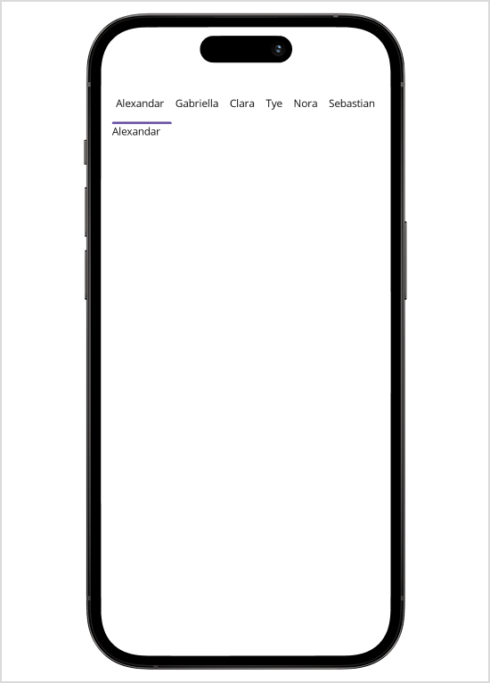
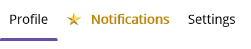

# Populating ItemsSource

Items can be added to the control using the [ItemsSource](https://help.syncfusion.com/cr/maui/Syncfusion.Maui.TabView.SfTabView.html#Syncfusion_Maui_TabView_SfTabView_ItemsSource) property of [SfTabView](https://help.syncfusion.com/cr/maui/Syncfusion.Maui.TabView.SfTabView.html).

Objects of any class can be provided as items for `SfTabView` using `ItemsSource`. The views corresponding to the objects can be set using the [HeaderItemTemplate](https://help.syncfusion.com/cr/maui/Syncfusion.Maui.TabView.SfTabView.html#Syncfusion_Maui_TabView_SfTabView_HeaderItemTemplate) for the header items and [ContentItemTemplate](https://help.syncfusion.com/cr/maui/Syncfusion.Maui.TabView.SfTabView.html#Syncfusion_Maui_TabView_SfTabView_ContentItemTemplate) for the content.

Create a **Model** class using the TabItems collection property, initialized with the required number of data objects, as shown in the following code examples.





public class Model: INotifyPropertyChanged
{

    public event PropertyChangedEventHandler PropertyChanged;

    protected void OnPropertyChanged(string propertyName)
    {
        var handler = PropertyChanged;
        if (handler != null)
            handler(this, new PropertyChangedEventArgs(propertyName));
    }

    private string name;

    public string Name
    {
        get { return name; }
        set
        {
            name = value;
            OnPropertyChanged("Name");
        }
    }
}









public class TabItemsSourceViewModel:INotifyPropertyChanged
{
    public event PropertyChangedEventHandler PropertyChanged;

    protected void OnPropertyChanged(string propertyName)
    {
        var handler = PropertyChanged;
        if (handler != null)
            handler(this, new PropertyChangedEventArgs(propertyName));
    }

    private ObservableCollection<Model> tabItems;
    public ObservableCollection<Model> TabItems
    {
        get { return tabItems; }
        set
        {
            tabItems = value;
            OnPropertyChanged("TabItems");
        }
    }
    public TabItemsSourceViewModel()
    {
        TabItems = new ObservableCollection<Model>();
        TabItems.Add(new Model() { Name = "Alexandar" });
        TabItems.Add(new Model() { Name = "Gabriella" });
        TabItems.Add(new Model() { Name = "Clara"});
        TabItems.Add(new Model() { Name = "Tye" });
        TabItems.Add(new Model() { Name = "Nora" });
        TabItems.Add(new Model() { Name = "Sebastian" });
        
    }

}





The following code example binds the collection to the `ItemsSource` property of `SfTabView`.





    <ContentPage xmlns="http://schemas.microsoft.com/dotnet/2021/maui"
             xmlns:x="http://schemas.microsoft.com/winfx/2009/xaml"
             x:Class="TabViewItemTemplateSample.MainPage"
             xmlns:local="clr-namespace:TabViewItemTemplateSample"
             xmlns:tabView="clr-namespace:Syncfusion.Maui.TabView;assembly=Syncfusion.Maui.TabView">

    <ContentPage.BindingContext>
        <local:TabItemsSourceViewModel />
    </ContentPage.BindingContext>
    <tabView:SfTabView ItemsSource="{Binding TabItems}" >
    </tabView:SfTabView>

    </ContentPage>

  




using Syncfusion.Maui.TabView;

namespace TabViewItemTemplateSample;

public partial class MainPage : ContentPage
{
    TabItemsSourceViewModel model;
    SfTabView tabView;
    public MainPage()
    {
        InitializeComponent();
        model = new TabItemsSourceViewModel();
        this.BindingContext = model;
        tabView = new SfTabView();
        tabView.ItemsSource = model.TabItems;
        this.Content = tabView;
    } 
}





## HeaderItemTemplate

By defining the `HeaderItemTemplate` of the `SfTabView`, a custom user interface(UI) can be achieved to display the tab header data items.





    <tabView:SfTabView ItemsSource="{Binding TabItems}" >
        <tabView:SfTabView.HeaderItemTemplate>
                <DataTemplate >
                    <Label  Padding="5,10,10,10"  Text="{Binding Name}"/>
                 </DataTemplate>
            </tabView:SfTabView.HeaderItemTemplate>
    </tabView:SfTabView>
    




namespace TabViewItemTemplateSample;

public partial class MainPage : ContentPage
{
	
    TabItemsSourceViewModel model;
    SfTabView tabView;
    public MainPage()
    {
        InitializeComponent();
        model = new TabItemsSourceViewModel();
        this.BindingContext = model;
        tabView = new SfTabView();
        tabView.ItemsSource = model.TabItems;
        tabView.HeaderItemTemplate = new DataTemplate(() =>
        {
            var nameLabel = new Label { Padding = new Thickness(5,10,10,10)};
            nameLabel.SetBinding(Label.TextProperty, "Name");
            return nameLabel;
        });
        this.Content = tabView;
    }
}





## ContentItemTemplate

By defining the `ContentItemTemplate` of the `SfTabView`, a custom user interface(UI) can be achieved to display the tab content data items.





    <tabView:SfTabView ItemsSource="{Binding TabItems}" >
        <tabView:SfTabView.HeaderItemTemplate>
                <DataTemplate >
                    <Label  Padding="5,10,10,10"  Text="{Binding Name}"/>
                 </DataTemplate>
            </tabView:SfTabView.HeaderItemTemplate>
             <tabView:SfTabView.ContentItemTemplate>
                <DataTemplate>
                     <Label TextColor="Black"  Text="{Binding Name}" />
               </DataTemplate>
        </tabView:SfTabView.ContentItemTemplate>
    </tabView:SfTabView>
    




namespace TabViewItemTemplateSample;

public partial class MainPage : ContentPage
{

    TabItemsSourceViewModel model;
    SfTabView tabView;
    public MainPage()
    {
        InitializeComponent();
        model = new TabItemsSourceViewModel();
        this.BindingContext = model;
        tabView = new SfTabView();
        tabView.ItemsSource = model.TabItems;
        tabView.HeaderItemTemplate = new DataTemplate(() =>
        {
            var nameLabel = new Label { Padding = new Thickness(5,10,10,10)};
            nameLabel.SetBinding(Label.TextProperty, "Name");
            
            return nameLabel;
        });
        tabView.ContentItemTemplate = new DataTemplate(() =>
        {
            var nameLabel = new Label { TextColor=Colors.Black };
            nameLabel.SetBinding(Label.TextProperty, "Name");
            return nameLabel;
        });
        this.Content = tabView;
    }
}





## Data template selector

By extending the `DataTemplateSelector` to `HeaderItemTemplate` of the `SfTabView`, multiple custom user interfaces can be achieved to display the tab header data items based on certain conditions.

Similarly we shall extend the `DataTemplateSelector` to `ContentItemTemplate` of the `SfTabView`.

N> The star image shown in the output should be included externally. 





<ContentPage.Resources>
    <DataTemplate x:Key="NormalHeaderTemplate">
        <Label Text="{Binding Title}" VerticalTextAlignment="Center" Margin="10" />
    </DataTemplate>

    <DataTemplate x:Key="ImportantHeaderTemplate">
        <StackLayout Orientation="Horizontal" Spacing="10" Margin="10">
            <Image Source="star.png" WidthRequest="16" HeightRequest="16"/>
            <Label Text="{Binding Title}" FontAttributes="Bold" VerticalTextAlignment="Center" TextColor="DarkGoldenrod"/>
        </StackLayout>
    </DataTemplate>

    <local:TabHeaderTemplateSelector x:Key="TabHeaderTemplateSelector"
                                      NormalTemplate="{StaticResource NormalHeaderTemplate}"
                                      ImportantTemplate="{StaticResource ImportantHeaderTemplate}" />
</ContentPage.Resources>

<ContentPage.BindingContext>
    <local:TabItemViewModel />
</ContentPage.BindingContext>

<tabView:SfTabView ItemsSource="{Binding Tabs}" HeaderItemTemplate="{StaticResource TabHeaderTemplateSelector}" />




public class TabHeaderTemplateSelector : DataTemplateSelector
{
    public DataTemplate? NormalTemplate { get; set; }
    public DataTemplate? ImportantTemplate { get; set; }

    protected override DataTemplate? OnSelectTemplate(object item, BindableObject container)
    {
        var viewModel = item as TabItemModel;
        return viewModel?.IsImportant == true ? ImportantTemplate : NormalTemplate;
    }
}

public class TabItemModel
{
    public string Title { get; set; } = string.Empty;
    public bool IsImportant { get; set; }
}

public class TabItemViewModel : INotifyPropertyChanged
{
    public ObservableCollection<TabItemModel> Tabs { get; }

    public event PropertyChangedEventHandler? PropertyChanged;

    public TabItemViewModel()
    {
        Tabs = new ObservableCollection<TabItemModel>
        {
            new TabItemModel { Title = "Profile" },
            new TabItemModel { Title = "Notifications", IsImportant = true },
            new TabItemModel { Title = "Settings" }
        };
    }

    protected void OnPropertyChanged(string propertyName)
        => PropertyChanged?.Invoke(this, new PropertyChangedEventArgs(propertyName));
}




