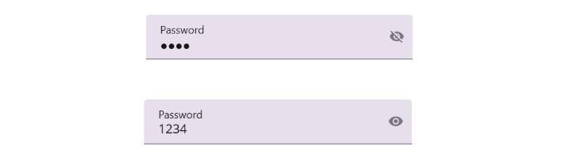
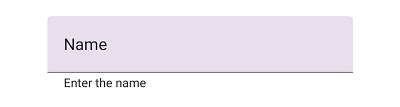
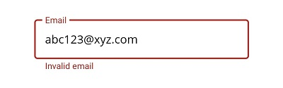
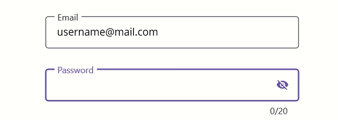
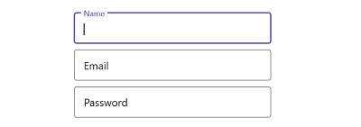

# Assistive Labels in .NET MAUI SfTextInputLayout

Assistive labels provide additional information about the text entered in the input view hosted by the [SfTextInputLayout](https://help.syncfusion.com/cr/maui/Syncfusion.Maui.Core.SfTextInputLayout.html) control.

## Prerequisites

Before using the [SfTextInputLayout](https://help.syncfusion.com/cr/maui/Syncfusion.Maui.Core.SfTextInputLayout.html), ensure the following NuGet package is installed in your .NET MAUI project:

- `Syncfusion.Maui.Core`

For a step-by-step setup, refer to the [Getting Started](https://help.syncfusion.com/maui/textinputlayout/getting-started) documentation.

## Assistive Labels Overview

The following assistive labels are available:

- **Password visibility toggle** — show or hide the characters in an [Entry](https://learn.microsoft.com/en-us/dotnet/maui/user-interface/controls/entry) control.
- **Helper text** — additional guidance shown below the input line.
- **Error text** — error message shown below the input line when `HasError` is set to `true`.
- **Character counter** — live count of characters against a maximum length.
- **Reserved space** — placeholder space reserved for assistive labels so the layout does not shift when they appear.

## Password visibility toggle

The password visibility toggle shows or hides the characters in the input view hosted by the control. Enable it by setting the [EnablePasswordVisibilityToggle](https://help.syncfusion.com/cr/maui/Syncfusion.Maui.Core.SfTextInputLayout.html#Syncfusion_Maui_Core_SfTextInputLayout_EnablePasswordVisibilityToggle) property to `true`.




<VerticalStackLayout>
    <inputLayout:SfTextInputLayout Hint="Password"
                                   EnablePasswordVisibilityToggle="True">
        <Entry Text="1234" />
    </inputLayout:SfTextInputLayout>
</VerticalStackLayout>




var inputLayout = new SfTextInputLayout
{
    Hint = "Password",
    EnablePasswordVisibilityToggle = true,
    Content = new Entry { Text = "1234" }
};
Content = new VerticalStackLayout
{
    Children =
    {
        inputLayout
    }
};




N> The password visibility toggle can be enabled only for the [Entry](https://learn.microsoft.com/en-us/dotnet/maui/user-interface/controls/entry) control. By default, the toggle is disabled.

## Helper text

Helper text conveys additional guidance about the input field, such as how the value will be used. Set the helper text using the [HelperText](https://help.syncfusion.com/cr/maui/Syncfusion.Maui.Core.SfTextInputLayout.html#Syncfusion_Maui_Core_SfTextInputLayout_HelperText) property. Disable the helper text by setting [ShowHelperText](https://help.syncfusion.com/cr/maui/Syncfusion.Maui.Core.SfTextInputLayout.html#Syncfusion_Maui_Core_SfTextInputLayout_ShowHelperText) to `false` (default: `true`).




<VerticalStackLayout>
    <inputLayout:SfTextInputLayout Hint="Name"
                                   HelperText="Enter your name">
        <Entry />
    </inputLayout:SfTextInputLayout>
</VerticalStackLayout>




var inputLayout = new SfTextInputLayout
{
    Hint = "Name",
    HelperText = "Enter your name",
    Content = new Entry()
};
Content = new VerticalStackLayout
{
    Children =
    {
        inputLayout
    }
};




N> Helper text and error text share the same area below the input line. When `HasError` is `true`, the error text replaces the helper text.

## Error message

When the entered text is not accepted, an error message can be displayed below the input line until the user provides a valid value. Set the message with the [ErrorText](https://help.syncfusion.com/cr/maui/Syncfusion.Maui.Core.SfTextInputLayout.html#Syncfusion_Maui_Core_SfTextInputLayout_ErrorText) property. The error is rendered only when the [HasError](https://help.syncfusion.com/cr/maui/Syncfusion.Maui.Core.SfTextInputLayout.html#Syncfusion_Maui_Core_SfTextInputLayout_HasError) property is set to `true`.




<VerticalStackLayout>
    <inputLayout:SfTextInputLayout Hint="Email"
                                   ContainerType="Outlined"
                                   HelperText="Enter your email address"
                                   ErrorText="Invalid email"
                                   HasError="True">
        <Entry />
    </inputLayout:SfTextInputLayout>
</VerticalStackLayout>




var inputLayout = new SfTextInputLayout
{
    Hint = "Email",
    ContainerType = ContainerType.Outlined,
    HelperText = "Enter your email address",
    ErrorText = "Invalid email",
    HasError = true,
    Content = new Entry()
};
Content = new VerticalStackLayout
{
    Children =
    {
        inputLayout
    }
};




N> Validations must be performed in your application logic. Toggle `HasError` based on the validation result and clear the error by setting `HasError = false`.

### Toggle the error programmatically

The following example shows how to flip `HasError` based on the result of a simple email validation. The example uses the `TextChanged` event of the `Entry` control.




var inputLayout = new SfTextInputLayout
{
    Hint = "Email",
    HelperText = "Enter your email address",
    ErrorText = "Invalid email"
};

var entry = new Entry();
entry.TextChanged += OnEmailTextChanged;
inputLayout.Content = entry;
Content = new VerticalStackLayout
{
    Children =
    {
        inputLayout
    }
};

private void OnEmailTextChanged(object? sender, TextChangedEventArgs e)
{
    var isValid = !string.IsNullOrWhiteSpace(e.NewTextValue)
                    && e.NewTextValue.Contains('@')
                    && e.NewTextValue.Contains('.');
    if (sender is Entry parentEntry && parentEntry.Parent is SfTextInputLayout layout)
    {
        layout.HasError = !isValid;
    }
}




## Character counter

The character counter shows the number of characters entered and the configured maximum. Enable it by setting [ShowCharCount](https://help.syncfusion.com/cr/maui/Syncfusion.Maui.Core.SfTextInputLayout.html#Syncfusion_Maui_Core_SfTextInputLayout_ShowCharCount) to `true` (default: `false`) and set the limit with [CharMaxLength](https://help.syncfusion.com/cr/maui/Syncfusion.Maui.Core.SfTextInputLayout.html#Syncfusion_Maui_Core_SfTextInputLayout_CharMaxLength). The counter updates live as the user types and is displayed in the format `current / max` (for example, `7 / 20`).




<VerticalStackLayout>
    <inputLayout:SfTextInputLayout Hint="Password"
                                   ContainerType="Outlined"
                                   ShowCharCount="True"
                                   CharMaxLength="20"
                                   HelperText="Enter 5 to 20 characters">
        <Entry />
    </inputLayout:SfTextInputLayout>
</VerticalStackLayout>




var inputLayout = new SfTextInputLayout
{
    Hint = "Password",
    ContainerType = ContainerType.Outlined,
    ShowCharCount = true,
    CharMaxLength = 20,
    HelperText = "Enter 5 to 20 characters",
    Content = new Entry()
};
Content = new VerticalStackLayout
{
    Children =
    {
        inputLayout
    }
};




N> When the character count reaches `CharMaxLength`, the error color is applied to the hint, border, and counter label. The counter itself does not prevent additional typing; combine it with `Entry.MaxLength` if you need to hard-cap input.

## Reserve space for assistive labels

By default, the control reserves vertical space for assistive labels so that the layout does not shift when helper text, error text, or the character counter appear. Disable this reserved space by setting [ReserveSpaceForAssistiveLabels](https://help.syncfusion.com/cr/maui/Syncfusion.Maui.Core.SfTextInputLayout.html#Syncfusion_Maui_Core_SfTextInputLayout_ReserveSpaceForAssistiveLabels) to `false` (default: `true`).




<VerticalStackLayout>
    <inputLayout:SfTextInputLayout ContainerType="Outlined"
                                   Hint="Name"
                                   ReserveSpaceForAssistiveLabels="False">
        <Entry />
    </inputLayout:SfTextInputLayout>
</VerticalStackLayout>




var inputLayout = new SfTextInputLayout
{
    Hint = "Name",
    ContainerType = ContainerType.Outlined,
    ReserveSpaceForAssistiveLabels = false,
    Content = new Entry()
};
Content = new VerticalStackLayout
{
    Children =
    {
        inputLayout
    }
};




N> Set `ReserveSpaceForAssistiveLabels` to `false` only if the host page already provides a fixed area for assistive labels. Otherwise, controls below the input may shift when an error or counter appears.

## See Also

- [Container Types](https://help.syncfusion.com/maui/textinputlayout/container-type)
- [Custom Icons](https://help.syncfusion.com/maui/textinputlayout/custom-icons)
- [Hint Position](https://help.syncfusion.com/maui/textinputlayout/fixed-hint-position)
