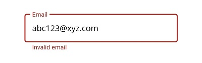

# Assistive Labels in .NET MAUI Text Input Layout (SfTextInputLayout)

Assistive labels provide additional information about the text entered in input view controls, enhancing user experience by offering clarity and guidance.

## Helper Text

Helper text provides additional information about the input field, such as its intended use. This feature is enabled using the [HelperText](https://help.syncfusion.com/cr/maui/Syncfusion.Maui.Core.SfTextInputLayout.html#Syncfusion_Maui_Core_SfTextInputLayout_HelperText) property.

 

 

<inputLayout:SfTextInputLayout Hint="Name"
                               HelperText="Enter your name">
    <Entry />
</inputLayout:SfTextInputLayout>   



 

SfTextInputLayout inputLayout = new SfTextInputLayout();
inputLayout.Hint = "Name";
inputLayout.HelperText = "Enter your name";
inputLayout.Content = new Entry(); 





The visibility of the helper text can be disabled by setting the [ShowHelperText](https://help.syncfusion.com/cr/maui/Syncfusion.Maui.Core.SfTextInputLayout.html#Syncfusion_Maui_Core_SfTextInputLayout_ShowHelperText) property to false. By default, this property is set to true.

## Error Message

When the text input is incorrect, an error message will guide the user on how to rectify the issue. Display error messages using the [ErrorText](https://help.syncfusion.com/cr/maui/Syncfusion.Maui.Core.SfTextInputLayout.html#Syncfusion_Maui_Core_SfTextInputLayout_ErrorText) property, which is visible only when the [HasError](https://help.syncfusion.com/cr/maui/Syncfusion.Maui.Core.SfTextInputLayout.html#Syncfusion_Maui_Core_SfTextInputLayout_HasError) property is set to true.

 

 

<inputLayout:SfTextInputLayout Hint="Email" ContainerType="Outlined"
                               HelperText="Enter your email address"
                               ErrorText="Invalid email"
                               HasError="true">
    <Entry />
</inputLayout:SfTextInputLayout>  
 



 

SfTextInputLayout inputLayout = new SfTextInputLayout();
inputLayout.Hint = "Email";
inputLayout.ContainerType= ContainerType.Outlined;
inputLayout.HelperText = "Enter your email address";
inputLayout.ErrorText = "Invalid email";
inputLayout.HasError = true; 
inputLayout.Content = new Entry(); 





N> Perform error validations at the application level.

## Character Counter

To enforce character limits, the character counter is used. Set the character limit using the [CharMaxLength](https://help.syncfusion.com/cr/maui/Syncfusion.Maui.Core.SfTextInputLayout.html#Syncfusion_Maui_Core_SfTextInputLayout_CharMaxLength) property.

 

 

<inputLayout:SfTextInputLayout Hint="Password" 
                               CharMaxLength="8"
                               ContainerType="Outlined"
                               HelperText="Enter 5 to 8 characters">
    <Entry />
</inputLayout:SfTextInputLayout> 
  



 

SfTextInputLayout inputLayout = new SfTextInputLayout();
inputLayout.Hint = "Password";
inputLayout.CharMaxLength = 8;
inputLayout.ContainerType= ContainerType.Outlined;
inputLayout.HelperText = "Enter 5 to 8 characters";
inputLayout.Content = new Entry(); 





N> When the character count reaches the maximum limit, the error color will be applied to the hint, border, and counter label.

## Reserve Spaces for Assistive Labels

The space reserved for assistive labels can be removed by setting the [ReserveSpaceForAssistiveLabels](https://help.syncfusion.com/cr/maui/Syncfusion.Maui.Core.SfTextInputLayout.html#Syncfusion_Maui_Core_SfTextInputLayout_ReserveSpaceForAssistiveLabels) property to false.





<inputLayout:SfTextInputLayout ContainerType="Outlined" 
                               Hint="Name" 
                               ReserveSpaceForAssistiveLabels="False">
    <Entry />
</inputLayout:SfTextInputLayout>





SfTextInputLayout inputLayout = new SfTextInputLayout();
inputLayout.Hint = "Name";
inputLayout.ContainerType = ContainerType.Outlined;
inputLayout.ReserveSpaceForAssistiveLabels = false;
inputLayout.Content = new Entry(); 





