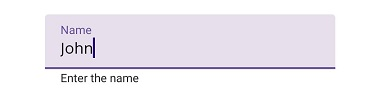
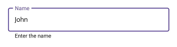
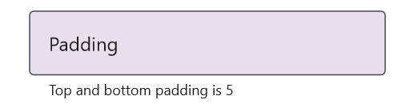
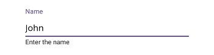

# Container Types in .NET MAUI SfTextInputLayout

Containers improve the discoverability of the input view by creating contrast between the input view and the surrounding assistive elements (helper text, error text, character counter, and password toggle).

## Prerequisites

Before using the [SfTextInputLayout](https://help.syncfusion.com/cr/maui/Syncfusion.Maui.Core.SfTextInputLayout.html), ensure the following NuGet package is installed in your .NET MAUI project:

- `Syncfusion.Maui.Core`

For a step-by-step setup, refer to the [Getting Started](https://help.syncfusion.com/maui/textinputlayout/getting-started) documentation.

## Available Container Types

The [ContainerType](https://help.syncfusion.com/cr/maui/Syncfusion.Maui.Core.SfTextInputLayout.html#Syncfusion_Maui_Core_SfTextInputLayout_ContainerType) property accepts the `ContainerType` enum. The default value is `Outlined`.

| Container Type | Visual Style | When to Use |
|----------------|--------------|-------------|
| [Filled](https://help.syncfusion.com/cr/maui/Syncfusion.Maui.Core.ContainerType.html#Syncfusion_Maui_Core_ContainerType_Filled) | Filled background with a bottom stroke that changes color/thickness with state. | Compact forms, dense lists, and Material-style layouts. |
| [Outlined](https://help.syncfusion.com/cr/maui/Syncfusion.Maui.Core.ContainerType.html#Syncfusion_Maui_Core_ContainerType_Outlined) | Rounded-corner border around the input view. | Emphasized fields, settings pages, and forms that need clear separation. |
| [None](https://help.syncfusion.com/cr/maui/Syncfusion.Maui.Core.ContainerType.html#Syncfusion_Maui_Core_ContainerType_None) | No background; only the standard spacing is preserved. | Inline inputs, embedded editors, and minimalist layouts. |

## Filled

The background of the input view is filled with the container color, and the bottom stroke color and thickness change based on the input view's state (normal, hover, focused, error). Enable the filled style by setting the [ContainerType](https://help.syncfusion.com/cr/maui/Syncfusion.Maui.Core.SfTextInputLayout.html#Syncfusion_Maui_Core_SfTextInputLayout_ContainerType) property to [Filled](https://help.syncfusion.com/cr/maui/Syncfusion.Maui.Core.ContainerType.html#Syncfusion_Maui_Core_ContainerType_Filled).




<ContentPage xmlns="http://schemas.microsoft.com/dotnet/2021/maui"
             xmlns:x="http://schemas.microsoft.com/winfx/2009/xaml"
             xmlns:inputLayout="clr-namespace:Syncfusion.Maui.Core;assembly=Syncfusion.Maui.Core">
    <inputLayout:SfTextInputLayout Hint="Name"
                                   HelperText="Enter the name"
                                   ContainerType="Filled">
        <Entry Text="John" />
    </inputLayout:SfTextInputLayout>
</ContentPage>





using Syncfusion.Maui.Core;

var inputLayout = new SfTextInputLayout
{
    Hint = "Name",
    HelperText = "Enter the name",
    ContainerType = ContainerType.Filled,
    Content = new Entry { Text = "John" }
};

Content = new VerticalStackLayout
{
    Children =
    {
        inputLayout
    }
};




## Outlined

When the [ContainerType](https://help.syncfusion.com/cr/maui/Syncfusion.Maui.Core.SfTextInputLayout.html#Syncfusion_Maui_Core_SfTextInputLayout_ContainerType) property is set to [Outlined](https://help.syncfusion.com/cr/maui/Syncfusion.Maui.Core.ContainerType.html#Syncfusion_Maui_Core_ContainerType_Outlined), the container is drawn with a rounded-corner border around the input view.




<ContentPage xmlns="http://schemas.microsoft.com/dotnet/2021/maui"
             xmlns:x="http://schemas.microsoft.com/winfx/2009/xaml"
             xmlns:inputLayout="clr-namespace:Syncfusion.Maui.Core;assembly=Syncfusion.Maui.Core">
    <VerticalStackLayout>
        <inputLayout:SfTextInputLayout Hint="Name"
                                   HelperText="Enter the name"
                                   ContainerType="Outlined">
            <Entry Text="John" />
        </inputLayout:SfTextInputLayout>
    </VerticalStackLayout>
</ContentPage>




using Syncfusion.Maui.Core;

var inputLayout = new SfTextInputLayout
{
    Hint = "Name",
    HelperText = "Enter the name",
    ContainerType = ContainerType.Outlined,
    Content = new Entry { Text = "John" }
};
Content = new VerticalStackLayout
{
    Children =
    {
        inputLayout
    }
};




### Customize the corner radius of the outline border

The [OutlineCornerRadius](https://help.syncfusion.com/cr/maui/Syncfusion.Maui.Core.SfTextInputLayout.html#Syncfusion_Maui_Core_SfTextInputLayout_OutlineCornerRadius) property controls the corner radius of the outlined border. The default value is `4` (in device-independent units). Any non-negative value is supported; values larger than the container height are clamped.




<ContentPage xmlns="http://schemas.microsoft.com/dotnet/2021/maui"
             xmlns:x="http://schemas.microsoft.com/winfx/2009/xaml"
             xmlns:inputLayout="clr-namespace:Syncfusion.Maui.Core;assembly=Syncfusion.Maui.Core">
    <VerticalStackLayout>
        <inputLayout:SfTextInputLayout Hint="Name"
                                       ContainerType="Outlined"
                                       OutlineCornerRadius="8">
            <Entry />
        </inputLayout:SfTextInputLayout>
    </VerticalStackLayout>
</ContentPage>





using Syncfusion.Maui.Core;

var inputLayout = new SfTextInputLayout
{
    Hint = "Name",
    ContainerType = ContainerType.Outlined,
    OutlineCornerRadius = 8,
    Content = new Entry()
};
Content = new VerticalStackLayout
{
    Children =
    {
        inputLayout
    }
};




N> `OutlineCornerRadius` is only applied when `ContainerType` is set to `Outlined`. The property is ignored for `Filled` and `None`.

### Custom padding

The space between the input view and the outline border can be customized with the [InputViewPadding](https://help.syncfusion.com/cr/maui/Syncfusion.Maui.Core.SfTextInputLayout.html#Syncfusion_Maui_Core_SfTextInputLayout_InputViewPadding) property, which accepts a [Thickness](https://learn.microsoft.com/en-us/dotnet/api/microsoft.maui.thickness) value. The default is `Thickness(8, 8, 8, 8)`. The `Thickness` constructor takes the parameters in the order **left, top, right, bottom**.




<ContentPage xmlns="http://schemas.microsoft.com/dotnet/2021/maui"
             xmlns:x="http://schemas.microsoft.com/winfx/2009/xaml"
             xmlns:inputLayout="clr-namespace:Syncfusion.Maui.Core;assembly=Syncfusion.Maui.Core">
    <VerticalStackLayout>
        <inputLayout:SfTextInputLayout Hint="Padding"
                                   InputViewPadding="0,5,0,5"
                                   ContainerType="Outlined"
                                   HelperText="Top and bottom padding is 5">
            <Entry />
        </inputLayout:SfTextInputLayout>
    </VerticalStackLayout>
</ContentPage>





using Microsoft.Maui;
using Syncfusion.Maui.Core;

var inputLayout = new SfTextInputLayout
{
    Hint = "Padding",
    InputViewPadding = new Thickness(0, 5, 0, 5), // left, top, right, bottom
    ContainerType = ContainerType.Outlined,
    HelperText = "Top and bottom padding is 5",
    Content = new Entry()
};
Content = new VerticalStackLayout
{
    Children =
    {
        inputLayout
    }
};




## None

When the [ContainerType](https://help.syncfusion.com/cr/maui/Syncfusion.Maui.Core.SfTextInputLayout.html#Syncfusion_Maui_Core_SfTextInputLayout_ContainerType) property is set to [None](https://help.syncfusion.com/cr/maui/Syncfusion.Maui.Core.ContainerType.html#Syncfusion_Maui_Core_ContainerType_None), the container renders without a background or border, preserving only the standard spacing between the input view and the surrounding layout.




<ContentPage xmlns="http://schemas.microsoft.com/dotnet/2021/maui"
             xmlns:x="http://schemas.microsoft.com/winfx/2009/xaml"
             xmlns:inputLayout="clr-namespace:Syncfusion.Maui.Core;assembly=Syncfusion.Maui.Core">
    <VerticalStackLayout>
        <inputLayout:SfTextInputLayout Hint="Name"
                                   HelperText="Enter the name"
                                   ContainerType="None">
            <Entry Text="John" />
        </inputLayout:SfTextInputLayout>
    </VerticalStackLayout>
</ContentPage>





using Syncfusion.Maui.Core;

var inputLayout = new SfTextInputLayout
{
    Hint = "Name",
    HelperText = "Enter the name",
    ContainerType = ContainerType.None,
    Content = new Entry { Text = "John" }
};
Content = new VerticalStackLayout
{
    Children =
    {
        inputLayout
    }
};




## Troubleshooting

| Issue | Possible Cause | Recommended Action |
|-------|----------------|--------------------|
| Switching `ContainerType` at runtime has no effect. | The property is set before the view is added to the visual tree, or the platform caches the container template. | Set `ContainerType` after the view is added, or recreate the view. |
| `OutlineCornerRadius` is ignored. | `ContainerType` is not `Outlined`, so the property is not applied. | Set `ContainerType = ContainerType.Outlined` before adjusting the corner radius. |
| `InputViewPadding` value is not honored. | The XAML string is malformed (missing comma or invalid number). | Verify the XAML uses `"left,top,right,bottom"` or assign a `new Thickness(left, top, right, bottom)` in C#. |
| The "Filled" container color does not change on focus. | A custom theme is overriding the focused color. | Check your app's `ResourceDictionary` for any brushes that override `SfTextInputLayout` styles. |

## See Also

- [Getting Started with .NET MAUI SfTextInputLayout](https://help.syncfusion.com/maui/textinputlayout/getting-started)
- [Assistive Labels](https://help.syncfusion.com/maui/textinputlayout/assistive-labels)
- [ContainerType enum reference](https://help.syncfusion.com/cr/maui/Syncfusion.Maui.Core.ContainerType.html)