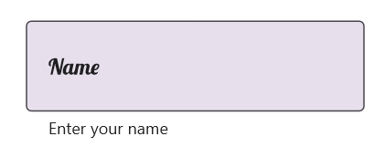
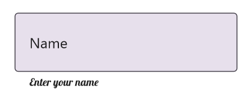

# Font Customization in .NET MAUI Text Input Layout (SfTextInputLayout)

Customize the font appearance (size, attributes, and family) by setting the [FontFamily](https://help.syncfusion.com/cr/maui/Syncfusion.Maui.Core.LabelStyle.html#Syncfusion_Maui_Core_LabelStyle_FontFamilyProperty), [FontSize](https://help.syncfusion.com/cr/maui/Syncfusion.Maui.Core.LabelStyle.html#Syncfusion_Maui_Core_LabelStyle_FontSizeProperty), and [FontAttributes](https://help.syncfusion.com/cr/maui/Syncfusion.Maui.Core.LabelStyle.html#Syncfusion_Maui_Core_LabelStyle_FontAttributesProperty) properties of the [LabelStyle](https://help.syncfusion.com/cr/maui/Syncfusion.Maui.Core.LabelStyle.html). Refer to this [documentation](https://learn.microsoft.com/en-us/dotnet/maui/user-interface/fonts) to configure custom fonts in .NET MAUI.

## Hint

Customize the font of the `hint` label by setting the `FontFamily`, `FontSize`, and `FontAttributes` properties in [HintLabelStyle](https://help.syncfusion.com/cr/maui/Syncfusion.Maui.Core.SfTextInputLayout.html#Syncfusion_Maui_Core_SfTextInputLayout_HintLabelStyle) within [SfTextInputLayout](https://help.syncfusion.com/cr/maui/Syncfusion.Maui.Core.SfTextInputLayout.html).

 



<inputLayout:SfTextInputLayout Hint="Name"
                               ContainerType="Outlined"
                               HelperText="Enter your name">
    <Entry />
    <inputLayout:SfTextInputLayout.HintLabelStyle>
        <inputLayout:LabelStyle FontSize="16" FontFamily="Lobster-Regular"/>
    </inputLayout:SfTextInputLayout.HintLabelStyle>
</inputLayout:SfTextInputLayout> 



 

SfTextInputLayout inputLayout = new SfTextInputLayout();
inputLayout.Hint = "Name";
inputLayout.ContainerType = ContainerType.Outlined;
inputLayout.HelperText = "Enter your name";
inputLayout.HintLabelStyle = new LabelStyle() { FontFamily = "Lobster-Regular", FontSize = 16};
inputLayout.Content = new Entry(); 





## Helper Text

Customize the font of the `helper text` label by setting the `FontFamily`, `FontSize`, and `FontAttributes` properties in [HelperLabelStyle](https://help.syncfusion.com/cr/maui/Syncfusion.Maui.Core.SfTextInputLayout.html#Syncfusion_Maui_Core_SfTextInputLayout_HelperLabelStyle) within [SfTextInputLayout](https://help.syncfusion.com/cr/maui/Syncfusion.Maui.Core.SfTextInputLayout.html).

 



<inputLayout:SfTextInputLayout Hint="Name"
                               ContainerType="Outlined"
                               CharMaxLength="3"
                               HelperText="Enter your name">
    <Entry />
    <inputLayout:SfTextInputLayout.HelperLabelStyle>
        <inputLayout:LabelStyle FontSize="12" FontFamily="Lobster-Regular"/>
    </inputLayout:SfTextInputLayout.HelperLabelStyle>
</inputLayout:SfTextInputLayout> 



 

SfTextInputLayout inputLayout = new SfTextInputLayout();
inputLayout.Hint = "Name";
inputLayout.ContainerType = ContainerType.Outlined;
inputLayout.HelperText = "Enter your name";
inputLayout.HelperLabelStyle = new LabelStyle() { FontFamily = "Lobster-Regular", FontSize = 12};
inputLayout.Content = new Entry(); 





## Error Text

Customize the font of the `error text` label by setting the `FontFamily`, `FontSize`, and `FontAttributes` properties in [ErrorLabelStyle](https://help.syncfusion.com/cr/maui/Syncfusion.Maui.Core.SfTextInputLayout.html#Syncfusion_Maui_Core_SfTextInputLayout_ErrorLabelStyle) within [SfTextInputLayout](https://help.syncfusion.com/cr/maui/Syncfusion.Maui.Core.SfTextInputLayout.html).

 



<inputLayout:SfTextInputLayout
    Hint="Name"
    ContainerType="Outlined"
    HasError="True"
    ErrorText="Enter valid name">
    <Entry />
    <inputLayout:SfTextInputLayout.ErrorLabelStyle>
        <inputLayout:LabelStyle FontSize="12" FontFamily="Lobster-Regular"/>
    </inputLayout:SfTextInputLayout.ErrorLabelStyle>
</inputLayout:SfTextInputLayout> 



 

SfTextInputLayout inputLayout = new SfTextInputLayout();
inputLayout.Hint = "Name";
inputLayout.ContainerType = ContainerType.Outlined;
inputLayout.HasError = true;
inputLayout.ErrorText = "Enter valid name";
inputLayout.ErrorLabelStyle = new LabelStyle() { FontFamily = "Lobster-Regular", FontSize = 12};
inputLayout.Content = new Entry(); 





