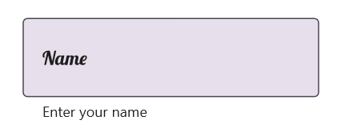
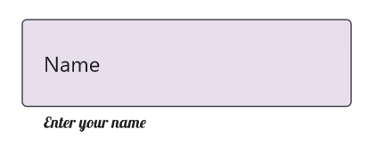

# Font Customization in .NET MAUI SfTextInputLayout

Use the [LabelStyle](https://help.syncfusion.com/cr/maui/Syncfusion.Maui.Core.LabelStyle.html) class to customize the size, family, and attributes of the labels rendered by [SfTextInputLayout](https://help.syncfusion.com/cr/maui/Syncfusion.Maui.Core.SfTextInputLayout.html). Each label type has its own style property on the control.

## Prerequisites

Before using the [SfTextInputLayout](https://help.syncfusion.com/cr/maui/Syncfusion.Maui.Core.SfTextInputLayout.html), ensure the following NuGet package is installed in your .NET MAUI project:

- `Syncfusion.Maui.Core`

For a step-by-step setup, refer to the [Getting Started](https://help.syncfusion.com/maui/textinputlayout/getting-started) documentation.
## Label Styles Overview

The following `LabelStyle` properties are available on `SfTextInputLayout`:

| Property | Applies To | Notes |
|----------|------------|-------|
| [HintLabelStyle](https://help.syncfusion.com/cr/maui/Syncfusion.Maui.Core.SfTextInputLayout.html#Syncfusion_Maui_Core_SfTextInputLayout_HintLabelStyle) | Hint label (floating label). | Always visible. |
| [HelperLabelStyle](https://help.syncfusion.com/cr/maui/Syncfusion.Maui.Core.SfTextInputLayout.html#Syncfusion_Maui_Core_SfTextInputLayout_HelperLabelStyle) | Helper text below the input line. | Replaced by error text when `HasError` is `true`. |
| [ErrorLabelStyle](https://help.syncfusion.com/cr/maui/Syncfusion.Maui.Core.SfTextInputLayout.html#Syncfusion_Maui_Core_SfTextInputLayout_ErrorLabelStyle) | Error text below the input line. | Rendered only when `HasError` is `true`. |

### LabelStyle Properties

`LabelStyle` exposes the following font-related properties. Values are in device-independent units (`FontSize` is `double`; the rest are strings or enums).

| Property | Type | Default | Description |
|----------|------|---------|-------------|
| `FontFamily` | `string` | Platform default | Font family. For custom fonts, the value must match the font file name (without the TrueType or OpenType font extension). |
| `FontSize` | `double` | Platform default | Font size in device-independent units. |
| `FontAttributes` | [FontAttributes](https://learn.microsoft.com/en-us/dotnet/api/microsoft.maui.controls.fontattributes) | `None` | One or more of `Bold` and `Italic` (combined with bitwise OR). |
| `TextColor` | `Color` | Theme default | Text color (useful alongside the font properties). |

## Customize the Hint Label

The floating hint label is rendered using [HintLabelStyle](https://help.syncfusion.com/cr/maui/Syncfusion.Maui.Core.SfTextInputLayout.html#Syncfusion_Maui_Core_SfTextInputLayout_HintLabelStyle). The hint label is always visible.




<inputLayout:SfTextInputLayout Hint="Name"
                               ContainerType="Outlined"
                               HelperText="Enter your name">
    <inputLayout:SfTextInputLayout.HintLabelStyle>
        <inputLayout:LabelStyle FontSize="16"
                                FontFamily="Lobster-Regular" />
    </inputLayout:SfTextInputLayout.HintLabelStyle>
    <Entry />
</inputLayout:SfTextInputLayout>




SfTextInputLayout inputLayout = new SfTextInputLayout
{
    Hint = "Name",
    ContainerType = ContainerType.Outlined,
    HelperText = "Enter your name",
    HintLabelStyle = new LabelStyle
    {
        FontFamily = "Lobster-Regular",
        FontSize = 16
    },
    Content = new Entry()
};
Content = new VerticalStackLayout
{
    Children =
    {
        inputLayout
    }
};




## Customize the Helper Text Label

The helper text below the input line is rendered using [HelperLabelStyle](https://help.syncfusion.com/cr/maui/Syncfusion.Maui.Core.SfTextInputLayout.html#Syncfusion_Maui_Core_SfTextInputLayout_HelperLabelStyle). When `HasError` is `true`, the helper text is replaced by the error text, so `HelperLabelStyle` has no visible effect in that state.



<inputLayout:SfTextInputLayout Hint="Name"
                               ContainerType="Outlined"
                               HelperText="Enter your name">
    <inputLayout:SfTextInputLayout.HelperLabelStyle>
        <inputLayout:LabelStyle FontSize="12"
                                FontFamily="Lobster-Regular" />
    </inputLayout:SfTextInputLayout.HelperLabelStyle>
    <Entry />
</inputLayout:SfTextInputLayout>




SfTextInputLayout inputLayout = new SfTextInputLayout
{
    Hint = "Name",
    ContainerType = ContainerType.Outlined,
    HelperText = "Enter your name",
    HelperLabelStyle = new LabelStyle
    {
        FontFamily = "Lobster-Regular",
        FontSize = 12
    },
    Content = new Entry()
};
Content = new VerticalStackLayout
{
    Children =
    {
        inputLayout
    }
};




## Customize the Error Text Label

The error text is rendered using [ErrorLabelStyle](https://help.syncfusion.com/cr/maui/Syncfusion.Maui.Core.SfTextInputLayout.html#Syncfusion_Maui_Core_SfTextInputLayout_ErrorLabelStyle) and is visible only when `HasError` is set to `true`.




<inputLayout:SfTextInputLayout Hint="Name"
                               ContainerType="Outlined"
                               HasError="True"
                               ErrorText="Enter valid name">
    <inputLayout:SfTextInputLayout.ErrorLabelStyle>
        <inputLayout:LabelStyle FontSize="12"
                                FontFamily="Lobster-Regular" />
    </inputLayout:SfTextInputLayout.ErrorLabelStyle>
    <Entry />
</inputLayout:SfTextInputLayout>




SfTextInputLayout inputLayout = new SfTextInputLayout
{
    Hint = "Name",
    ContainerType = ContainerType.Outlined,
    HasError = true,
    ErrorText = "Enter valid name",
    ErrorLabelStyle = new LabelStyle
    {
        FontFamily = "Lobster-Regular",
        FontSize = 12
    },
    Content = new Entry()
};
Content = new VerticalStackLayout
{
    Children =
    {
        inputLayout
    }
};




## Apply Bold and Italic

Use `FontAttributes` to apply bold or italic styling. The flags can be combined with bitwise OR.




<inputLayout:SfTextInputLayout Hint="Name"
                               ContainerType="Outlined"
                               HasError="True"
                               ErrorText="Enter valid name">
    <inputLayout:SfTextInputLayout.ErrorLabelStyle>
        <inputLayout:LabelStyle FontFamily="Lobster-Regular"
                                FontSize="14"
                                FontAttributes="Italic" />
    </inputLayout:SfTextInputLayout.ErrorLabelStyle>
    <Entry />
</inputLayout:SfTextInputLayout>




SfTextInputLayout inputLayout = new SfTextInputLayout
{
    Hint = "Name",
    ContainerType = ContainerType.Outlined,
    HasError = true,
    ErrorText = "Enter valid name",
    ErrorLabelStyle = new LabelStyle
    {
        FontFamily = "Lobster-Regular",
        FontSize = 14,
        FontAttributes = FontAttributes.Italic,
    },
    Content = new Entry()
};
Content = new VerticalStackLayout
{
    Children =
    {
        inputLayout
    }
};




## Apply a Unified Brand Style

The following example applies a single font family to all three label styles so the input field has a consistent brand appearance.




<inputLayout:SfTextInputLayout Hint="Name"
                               ContainerType="Outlined"
                               HelperText="Enter your name">
    <inputLayout:SfTextInputLayout.HintLabelStyle>
        <inputLayout:LabelStyle FontFamily="Lobster-Regular" 
                                FontSize="16" />
    </inputLayout:SfTextInputLayout.HintLabelStyle>
    <inputLayout:SfTextInputLayout.HelperLabelStyle>
        <inputLayout:LabelStyle FontFamily="Lobster-Regular" 
                                FontSize="12" />
    </inputLayout:SfTextInputLayout.HelperLabelStyle>
    <inputLayout:SfTextInputLayout.ErrorLabelStyle>
        <inputLayout:LabelStyle FontFamily="Lobster-Regular" 
                                FontSize="12" />
    </inputLayout:SfTextInputLayout.ErrorLabelStyle>
    <Entry />
</inputLayout:SfTextInputLayout>




SfTextInputLayout inputLayout = new SfTextInputLayout
{
    Hint = "Name",
    ContainerType = ContainerType.Outlined,
    HelperText = "Enter your name",
    HintLabelStyle = new LabelStyle { FontFamily = "Lobster-Regular", FontSize = 16 },
    HelperLabelStyle = new LabelStyle { FontFamily = "Lobster-Regular", FontSize = 12 },
    ErrorLabelStyle = new LabelStyle { FontFamily = "Lobster-Regular", FontSize = 12 },
    Content = new Entry()
};
Content = new VerticalStackLayout
{
    Children =
    {
        inputLayout
    }
};




## See Also

- [Assistive Labels](https://help.syncfusion.com/maui/textinputlayout/assistive-labels)
- [Container Types](https://help.syncfusion.com/maui/textinputlayout/container-type)
- [LabelStyle API reference](https://help.syncfusion.com/cr/maui/Syncfusion.Maui.Core.LabelStyle.html)
- [MAUI fonts documentation](https://learn.microsoft.com/en-us/dotnet/maui/user-interface/fonts)