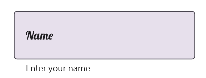
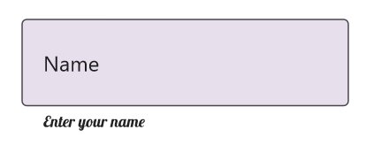

# Font Customization in .NET MAUI Text Input Layout

The [.NET MAUI Text Input Layout](https://help.syncfusion.com/cr/maui/Syncfusion.Maui.Core.SfTextInputLayout.html) control allows to customize the appearance (size, attributes, and family) of the font by setting the [FontFamily](https://help.syncfusion.com/cr/maui/Syncfusion.Maui.Core.LabelStyle.html#Syncfusion_Maui_Core_LabelStyle_FontFamily), [FontSize](https://help.syncfusion.com/cr/maui/Syncfusion.Maui.Core.LabelStyle.html#Syncfusion_Maui_Core_LabelStyle_FontSize), and [FontAttributes](https://help.syncfusion.com/cr/maui/Syncfusion.Maui.Core.LabelStyle.html#Syncfusion_Maui_Core_LabelStyle_FontAttributes) properties of the [LabelStyle](https://help.syncfusion.com/cr/maui/Syncfusion.Maui.Core.LabelStyle.html) class.

Refer to this [documentation](https://learn.microsoft.com/en-us/dotnet/maui/user-interface/fonts) to configure the custom fonts in the .NET MAUI.

## Prerequisites

Before using the [SfTextInputLayout](https://help.syncfusion.com/cr/maui/Syncfusion.Maui.Core.SfTextInputLayout.html), ensure the following NuGet package is installed in your .NET MAUI project:

- `Syncfusion.Maui.Core`

For a step-by-step setup, refer to the [Getting Started](https://help.syncfusion.com/maui/textinputlayout/getting-started) documentation.

## Overview

The following `LabelStyle` properties are available on `Text Input Layout`:

| Property | Applies To | Notes |
|----------|------------|-------|
| [HintLabelStyle](https://help.syncfusion.com/cr/maui/Syncfusion.Maui.Core.SfTextInputLayout.html#Syncfusion_Maui_Core_SfTextInputLayout_HintLabelStyle) | Hint label (floating label). | Always visible. |
| [HelperLabelStyle](https://help.syncfusion.com/cr/maui/Syncfusion.Maui.Core.SfTextInputLayout.html#Syncfusion_Maui_Core_SfTextInputLayout_HelperLabelStyle) | Helper text below the input line. | Replaced by error text when `HasError` is `true`. |
| [ErrorLabelStyle](https://help.syncfusion.com/cr/maui/Syncfusion.Maui.Core.SfTextInputLayout.html#Syncfusion_Maui_Core_SfTextInputLayout_ErrorLabelStyle) | Error text below the input line. | Rendered only when `HasError` is `true`. |

### LabelStyle Properties

[LabelStyle](https://help.syncfusion.com/cr/maui/Syncfusion.Maui.Core.LabelStyle.html) exposes the following font-related properties.

| Property | Type | Default | Description |
|----------|------|---------|-------------|
| `FontFamily` | `string` | Platform default | Font family. For custom fonts, the value must match the font file name (without the TrueType or OpenType font extension). |
| `FontSize` | `double` | Platform default | Font size in device-independent units. |
| `FontAttributes` | `FontAttributes` | `None` | One or more of `Bold` and `Italic`. |
| `TextColor` | `Color` | Theme default | Text color (useful alongside the font properties). |
| `FontAutoScalingEnabled` | `bool` | `false` | Enables automatic font size adjustment based on device settings. |

## Customize the Hint Label

The floating hint label is customized using [HintLabelStyle](https://help.syncfusion.com/cr/maui/Syncfusion.Maui.Core.SfTextInputLayout.html#Syncfusion_Maui_Core_SfTextInputLayout_HintLabelStyle) property. The hint label is always visible.




<inputLayout:SfTextInputLayout Hint="Name"
                               ContainerType="Outlined"
                               HelperText="Enter your name">
    <inputLayout:SfTextInputLayout.HintLabelStyle>
        <inputLayout:LabelStyle FontSize="16"
                                FontFamily="Lobster-Regular" />
    </inputLayout:SfTextInputLayout.HintLabelStyle>
    <Entry />
</inputLayout:SfTextInputLayout>




SfTextInputLayout inputLayout = new SfTextInputLayout
{
    Hint = "Name",
    ContainerType = ContainerType.Outlined,
    HelperText = "Enter your name",
    HintLabelStyle = new LabelStyle
    {
        FontFamily = "Lobster-Regular",
        FontSize = 16
    },
    Content = new Entry()
};
Content = inputLayout;




## Customize the Hint Line Break Mode

The floating hint label behavior is customized using the `HintLineBreakMode` property. This property controls how long hint text is displayed when the available space is limited by applying .NET MAUI `LineBreakMode` values such as wrapping and truncation.

The following example wraps a long hint across multiple lines.




<inputLayout:SfTextInputLayout Hint="Business registration identification number"
                               HintLineBreakMode="WordWrap"
                               ContainerType="Outlined">
    <Entry Text="2026001234" />
</inputLayout:SfTextInputLayout>




var inputLayout = new SfTextInputLayout
{
    Hint = "Business registration identification number",
    HintLineBreakMode = LineBreakMode.TailTruncation,
    ContainerType = ContainerType.Outlined,
    Content = new Entry { Text = "2026001234" }
};

Content = inputLayout;




## Customize the Hint View 

The floating hint label is customized using the `HintView` property. This property allows any .NET MAUI `View` to be displayed as the floating hint label, enabling richer content such as styled text, icons, and other visual elements beyond a text-only hint.

N> When `HintView` is assigned, it takes precedence over `Hint`. The custom view participates in the same floating behavior as the standard hint: it moves to the floating position when the input view receives focus or contains text, and returns to its resting position when appropriate.

The following example uses a styled label as the floating hint view.




<inputLayout:SfTextInputLayout
    ContainerType="Outlined"
    EnableHintAnimation="True">

    <inputLayout:SfTextInputLayout.HintView>
        <Label
            Text="Premium User"
            FontSize="14"
            FontAttributes="Bold"
            TextColor="#512DA8"
            BackgroundColor="#EDE7F6"
            Padding="8,4"
            Margin="2" />
    </inputLayout:SfTextInputLayout.HintView>

    <Entry Placeholder="Enter your name" />

</inputLayout:SfTextInputLayout>




var inputLayout = new SfTextInputLayout
{
    ContainerType = ContainerType.Outlined,
    EnableHintAnimation = true,
    HintView = new Label
    {
        Text = " Premium User",
        FontSize = 14,
        FontAttributes = FontAttributes.Bold,
        TextColor = Color.FromArgb("#512DA8"),
        BackgroundColor = Color.FromArgb("#EDE7F6"),
        Padding = new Thickness(8, 4),
        Margin = new Thickness(2)
    },
    Content = new Entry
    {
        Placeholder = "Enter your name"
    }
};

Content = new VerticalStackLayout
{
    Padding = 20,
    Children =
    {
        inputLayout
    }
};




The `Hint` value is included as a fallback, but it is not displayed while `HintView` is assigned.

## Customize the Helper Text Label

The helper text below the input line is customized using [HelperLabelStyle](https://help.syncfusion.com/cr/maui/Syncfusion.Maui.Core.SfTextInputLayout.html#Syncfusion_Maui_Core_SfTextInputLayout_HelperLabelStyle) property. When `HasError` is `true`, the helper text is replaced by the error text, so `HelperLabelStyle` has no visible effect in that state.




<inputLayout:SfTextInputLayout Hint="Name"
                               ContainerType="Outlined"
                               HelperText="Enter your name">
    <inputLayout:SfTextInputLayout.HelperLabelStyle>
        <inputLayout:LabelStyle FontSize="12"
                                FontFamily="Lobster-Regular" />
    </inputLayout:SfTextInputLayout.HelperLabelStyle>
    <Entry />
</inputLayout:SfTextInputLayout>




SfTextInputLayout inputLayout = new SfTextInputLayout
{
    Hint = "Name",
    ContainerType = ContainerType.Outlined,
    HelperText = "Enter your name",
    HelperLabelStyle = new LabelStyle
    {
        FontFamily = "Lobster-Regular",
        FontSize = 12
    },
    Content = new Entry()
};
Content = inputLayout;




## Customize the Error Text Label

The error text is customized using [ErrorLabelStyle](https://help.syncfusion.com/cr/maui/Syncfusion.Maui.Core.SfTextInputLayout.html#Syncfusion_Maui_Core_SfTextInputLayout_ErrorLabelStyle) property and is visible only when `HasError` is set to `true`.




<inputLayout:SfTextInputLayout Hint="Name"
                               ContainerType="Outlined"
                               HasError="True"
                               ErrorText="Enter valid name">
    <inputLayout:SfTextInputLayout.ErrorLabelStyle>
        <inputLayout:LabelStyle FontSize="12"
                                FontFamily="Lobster-Regular" />
    </inputLayout:SfTextInputLayout.ErrorLabelStyle>
    <Entry />
</inputLayout:SfTextInputLayout>




SfTextInputLayout inputLayout = new SfTextInputLayout
{
    Hint = "Name",
    ContainerType = ContainerType.Outlined,
    HasError = true,
    ErrorText = "Enter valid name",
    ErrorLabelStyle = new LabelStyle
    {
        FontFamily = "Lobster-Regular",
        FontSize = 12
    },
    Content = new Entry()
};
Content = inputLayout;




## Apply a Unified Brand Style

The following example applies a single font family to all three label styles so the input field has a consistent brand appearance.




<inputLayout:SfTextInputLayout Hint="Name"
                               ContainerType="Outlined"
                               HelperText="Enter your name">
    <inputLayout:SfTextInputLayout.HintLabelStyle>
        <inputLayout:LabelStyle FontFamily="Lobster-Regular" 
                                FontSize="16" />
    </inputLayout:SfTextInputLayout.HintLabelStyle>
    <inputLayout:SfTextInputLayout.HelperLabelStyle>
        <inputLayout:LabelStyle FontFamily="Lobster-Regular" 
                                FontSize="12" />
    </inputLayout:SfTextInputLayout.HelperLabelStyle>
    <inputLayout:SfTextInputLayout.ErrorLabelStyle>
        <inputLayout:LabelStyle FontFamily="Lobster-Regular" 
                                FontSize="12" />
    </inputLayout:SfTextInputLayout.ErrorLabelStyle>
    <Entry />
</inputLayout:SfTextInputLayout>




SfTextInputLayout inputLayout = new SfTextInputLayout
{
    Hint = "Name",
    ContainerType = ContainerType.Outlined,
    HelperText = "Enter your name",
    HintLabelStyle = new LabelStyle { FontFamily = "Lobster-Regular", FontSize = 16 },
    HelperLabelStyle = new LabelStyle { FontFamily = "Lobster-Regular", FontSize = 12 },
    ErrorLabelStyle = new LabelStyle { FontFamily = "Lobster-Regular", FontSize = 12 },
    Content = new Entry()
};
Content = inputLayout;




## See Also

- [Assistive Labels](https://help.syncfusion.com/maui/textinputlayout/assistive-labels)
- [Container Types](https://help.syncfusion.com/maui/textinputlayout/container-type)