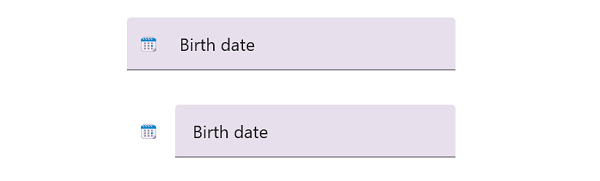
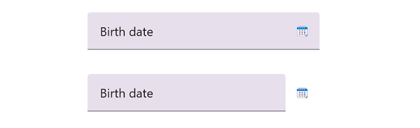
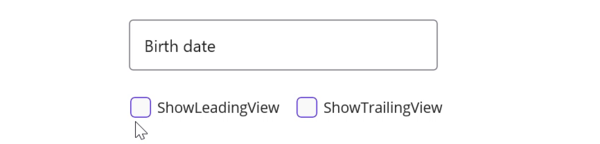

# Custom Icons in .NET MAUI SfTextInputLayout

Add a leading or trailing icon to the input view of [SfTextInputLayout](https://help.syncfusion.com/cr/maui/Syncfusion.Maui.Core.SfTextInputLayout.html) by setting the [LeadingView](https://help.syncfusion.com/cr/maui/Syncfusion.Maui.Core.SfTextInputLayout.html#Syncfusion_Maui_Core_SfTextInputLayout_LeadingView) or [TrailingView](https://help.syncfusion.com/cr/maui/Syncfusion.Maui.Core.SfTextInputLayout.html#Syncfusion_Maui_Core_SfTextInputLayout_TrailingView) property. Any `View` can be used as the icon — a `Label` for Unicode characters or font icons, an `Image`, or even a `Button` for interactive actions.

## Prerequisites

Before using the [SfTextInputLayout](https://help.syncfusion.com/cr/maui/Syncfusion.Maui.Core.SfTextInputLayout.html), ensure the following NuGet package is installed in your .NET MAUI project:

- `Syncfusion.Maui.Core`

For a step-by-step setup, refer to the [Getting Started](https://help.syncfusion.com/maui/textinputlayout/getting-started) documentation.

## ViewPosition Reference

The leading and trailing views can be placed inside or outside the container using the [ViewPosition](https://help.syncfusion.com/cr/maui/Syncfusion.Maui.Core.ViewPosition.html) enum.

| Position | Description |
|----------|-------------|
| [Inside](https://help.syncfusion.com/cr/maui/Syncfusion.Maui.Core.ViewPosition.html#Syncfusion_Maui_Core_ViewPosition_Inside) | Rendered within the input line, adjacent to the input view. |
| [Outside](https://help.syncfusion.com/cr/maui/Syncfusion.Maui.Core.ViewPosition.html#Syncfusion_Maui_Core_ViewPosition_Outside) | Rendered outside the container border. |

Default values:

- `LeadingViewPosition` defaults to `Outside`.
- `TrailingViewPosition` defaults to `Inside`.

## Interactivity

You can wire up gestures or commands on the leading/trailing view to make the icon interactive (for example, a clear-text button or a password show/hide toggle). 

N> Refer to the following links to learn more about font icons:

- [How to create font icons using Syncfusion Metro Studio and export them as TTF](https://help.syncfusion.com/metro-studio/export-icon-font)
- [How to display font icons in MAUI labels](https://learn.microsoft.com/en-us/dotnet/maui/user-interface/fonts?view=net-maui-7.0#display-font-icons)

## Leading view

Display any `View` as a leading icon by setting the [LeadingView](https://help.syncfusion.com/cr/maui/Syncfusion.Maui.Core.SfTextInputLayout.html#Syncfusion_Maui_Core_SfTextInputLayout_LeadingView) property. Use the [LeadingViewPosition](https://help.syncfusion.com/cr/maui/Syncfusion.Maui.Core.SfTextInputLayout.html#Syncfusion_Maui_Core_SfTextInputLayout_LeadingViewPosition) property to position the view inside or outside the container (default: `Outside`).

The following example shows a Unicode calendar emoji rendered as the leading icon, positioned inside the container:




<VerticalStackLayout>
    <inputLayout:SfTextInputLayout Hint="Birth date"
                                   LeadingViewPosition="Inside">
        <inputLayout:SfTextInputLayout.LeadingView>
            <Label Text="&#x1F5D3;" />
        </inputLayout:SfTextInputLayout.LeadingView>
        <Entry />
    </inputLayout:SfTextInputLayout>
</VerticalStackLayout>




var inputLayout = new SfTextInputLayout
{
    Hint = "Birth date",
    LeadingViewPosition = ViewPosition.Inside,
    LeadingView = new Label { Text = "\U0001F5D3" },
    Content = new Entry()
};
Content = new VerticalStackLayout
{
    Children =
    {
        inputLayout
    }
};




## Trailing view

Display any `View` as a trailing icon by setting the [TrailingView](https://help.syncfusion.com/cr/maui/Syncfusion.Maui.Core.SfTextInputLayout.html#Syncfusion_Maui_Core_SfTextInputLayout_TrailingView) property. Use the [TrailingViewPosition](https://help.syncfusion.com/cr/maui/Syncfusion.Maui.Core.SfTextInputLayout.html#Syncfusion_Maui_Core_SfTextInputLayout_TrailingViewPosition) property to position the view inside or outside the container (default: `Inside`).

The following example shows a Unicode eye emoji rendered as the trailing icon, positioned outside the container:




<VerticalStackLayout>
    <inputLayout:SfTextInputLayout Hint="Password"
                                   TrailingViewPosition="Outside">
        <inputLayout:SfTextInputLayout.TrailingView>
            <Label Text="&#x1F5D3;" />
        </inputLayout:SfTextInputLayout.TrailingView>
        <Entry IsPassword="True" />
    </inputLayout:SfTextInputLayout>
</VerticalStackLayout>




var inputLayout = new SfTextInputLayout
{
    Hint = "Password",
    TrailingViewPosition = ViewPosition.Outside,
    TrailingView = new Label { Text = "\U0001F5D3" },
    Content = new Entry { IsPassword = true }
};
Content = new VerticalStackLayout
{
    Children =
    {
        inputLayout
    }
};




## Show or hide the leading and trailing views

The [ShowLeadingView](https://help.syncfusion.com/cr/maui/Syncfusion.Maui.Core.SfTextInputLayout.html#Syncfusion_Maui_Core_SfTextInputLayout_ShowLeadingView) and [ShowTrailingView](https://help.syncfusion.com/cr/maui/Syncfusion.Maui.Core.SfTextInputLayout.html#Syncfusion_Maui_Core_SfTextInputLayout_ShowTrailingView) properties control the visibility of the leading and trailing views. Both default to `true`.




<VerticalStackLayout>
    <inputLayout:SfTextInputLayout Hint="Birth date"
                                   ContainerType="Outlined"
                                   ShowLeadingView="{Binding IsLeadingViewVisible}"
                                   ShowTrailingView="{Binding IsTrailingViewVisible}">
        <inputLayout:SfTextInputLayout.LeadingView>
            <Label Text="&#x1F5D3;" />
        </inputLayout:SfTextInputLayout.LeadingView>
        <inputLayout:SfTextInputLayout.TrailingView>
            <Label Text="&#x1F4C5;" />
        </inputLayout:SfTextInputLayout.TrailingView>
        <Entry />
    </inputLayout:SfTextInputLayout>
    <HorizontalStackLayout Spacing="10">
        <HorizontalStackLayout>
            <CheckBox IsChecked="{Binding IsLeadingViewVisible}" />
            <Label Text="ShowLeadingView" 
                   VerticalOptions="Center" />
        </HorizontalStackLayout>
        <HorizontalStackLayout>
            <CheckBox IsChecked="{Binding IsTrailingViewVisible}" />
            <Label Text="ShowTrailingView" 
                   VerticalOptions="Center" />
        </HorizontalStackLayout>
    </HorizontalStackLayout>
</VerticalStackLayout>




var textInputLayoutViewModel = new TextInputLayoutViewModel();
BindingContext = textInputLayoutViewModel;
var textInputLayout = new SfTextInputLayout
{
    Hint = "Birth date",
    ContainerType = ContainerType.Outlined
};
textInputLayout.SetBinding(SfTextInputLayout.ShowLeadingViewProperty, nameof(textInputLayoutViewModel.IsLeadingViewVisible));
textInputLayout.SetBinding(SfTextInputLayout.ShowTrailingViewProperty, nameof(textInputLayoutViewModel.IsTrailingViewVisible));
textInputLayout.LeadingView = new Label
{
    Text = "\U0001F5D3"
};
textInputLayout.TrailingView = new Label
{
    Text = "\U0001F4C5"
};
textInputLayout.Content = new Entry();
var leadingCheckBox = new CheckBox();
leadingCheckBox.SetBinding(CheckBox.IsCheckedProperty,
    nameof(textInputLayoutViewModel.IsLeadingViewVisible));
var trailingCheckBox = new CheckBox();
trailingCheckBox.SetBinding(CheckBox.IsCheckedProperty,
    nameof(textInputLayoutViewModel.IsTrailingViewVisible));
Content = new VerticalStackLayout
{
    Children = { textInputLayout,
    new HorizontalStackLayout
    {
        Spacing = 10,
        Children =
        {
            new HorizontalStackLayout
            {
                Children =
                {
                    leadingCheckBox,
                    new Label
                    {
                        Text = "ShowLeadingView",
                        VerticalOptions = LayoutOptions.Center
                    }
                }
            },

            new HorizontalStackLayout
            {
                Children =
                {
                    trailingCheckBox,
                    new Label
                    {
                        Text = "ShowTrailingView",
                        VerticalOptions = LayoutOptions.Center
                    }
                }
            }
        }
    }
}
};




public class TextInputLayoutViewModel : INotifyPropertyChanged
{
    private bool isLeadingViewVisible;
    private bool isTrailingViewVisible;

    public bool IsLeadingViewVisible
    {
        get => isLeadingViewVisible;
        set
        {
            isLeadingViewVisible = value;
            OnPropertyChanged();
        }
    }

    public bool IsTrailingViewVisible
    {
        get => isTrailingViewVisible;
        set
        {
            isTrailingViewVisible = value;
            OnPropertyChanged();
        }
    }
    public TextInputLayoutViewModel()
    {

    }
    public event PropertyChangedEventHandler PropertyChanged;
    void OnPropertyChanged([CallerMemberName] string name = null)
    {
        PropertyChanged?.Invoke(this, new PropertyChangedEventArgs(name));
    }
}




## Handle icon taps

Attach a `TapGestureRecognizer` to the leading or trailing view to make it interactive. The following example uses a trailing eye icon to toggle the password visibility of the inner `Entry`.




<VerticalStackLayout>
    <inputLayout:SfTextInputLayout x:Name="PasswordLayout"
                                   Hint="Password">
        <inputLayout:SfTextInputLayout.TrailingView>
            <Label x:Name="EyeIcon"
                Text="&#x1F441;&#xFE0F;">
                <Label.GestureRecognizers>
                    <TapGestureRecognizer Tapped="OnEyeTapped" />
                </Label.GestureRecognizers>
            </Label>
        </inputLayout:SfTextInputLayout.TrailingView>
        <Entry x:Name="PasswordEntry" 
               IsPassword="True" />
    </inputLayout:SfTextInputLayout>
</VerticalStackLayout>




private Entry passwordEntry;
private Label eyeIcon;
private bool isPasswordVisible;

public MainPage()
{
    InitializeComponent();
    var passwordLayout = new SfTextInputLayout
    {
        Hint = "Password"
    };

    eyeIcon = new Label
    {
        Text = "\U0001F441\uFE0F"
    };

    var tapGesture = new TapGestureRecognizer();
    tapGesture.Tapped += OnEyeTapped;
    eyeIcon.GestureRecognizers.Add(tapGesture);
    passwordLayout.TrailingView = eyeIcon;
    passwordEntry = new Entry
    {
        IsPassword = true
    };
    passwordLayout.Content = passwordEntry;
    Content = new VerticalStackLayout
    {
        Padding = 20,
        Children =
        {
            passwordLayout
        }
    };
}

private void OnEyeTapped(object? sender, TappedEventArgs e)
{
    passwordEntry.IsPassword = !passwordEntry.IsPassword;
    eyeIcon.Text = passwordEntry.IsPassword ? "\U0001F441\uFE0F" : "\U0001F576";
}




## See Also

- [Container Types](https://help.syncfusion.com/maui/textinputlayout/container-type)
- [Custom Font](https://help.syncfusion.com/maui/textinputlayout/custom-font)
- [ViewPosition enum reference](https://help.syncfusion.com/cr/maui/Syncfusion.Maui.Core.ViewPosition.html)
