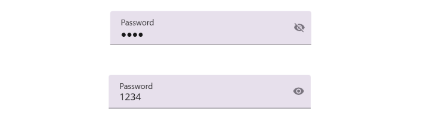

# Getting Started with .NET MAUI TextInputLayout

This section guides you through setting up and configuring a [TextInputLayout](https://help.syncfusion.com/cr/maui/Syncfusion.Maui.Core.SfTextInputLayout.html) in your .NET MAUI application. Follow the steps below to add a basic TextInputLayout to your project.

## Prerequisites

Before proceeding, ensure the following are in place:

1.Install [.NET 7 SDK](https://dotnet.microsoft.com/en-us/download/dotnet/7.0) or later.
2.Set up a .NET MAUI environment with Visual Studio 2022 (v17.3 or later) or VS Code. For VS Code users, ensure that the .NET MAUI workload is installed and configured as described [here](https://github.com/dotnet/maui/wiki/VS-Code-setup).

To get start quickly with our .NET MAUI TextInputLayout, you can check the below video.



## Step 1: Create a New MAUI Project

1.Open Visual Studio or VS Code.
2.Go to **File > New > Project** and choose the **.NET MAUI App** template.
3.Name the project and choose a location, then click **Create**.

## Step 2: Install the Syncfusion MAUI TextInputLayout NuGet Package

1.In **Solution Explorer**, right-click the project and choose **Manage NuGet Packages**.
2.Search for [Syncfusion.Maui.Core](https://www.nuget.org/packages/Syncfusion.Maui.Core/) and install the latest version.
3.Ensure the necessary dependencies are installed correctly, and the project is restored.

## Step 3: Register the Handler

 In the MauiProgram.cs file, register the handler for Syncfusion core.

   
using Microsoft.Maui;
using Microsoft.Maui.Hosting;
using Microsoft.Maui.Controls.Compatibility;
using Microsoft.Maui.Controls.Hosting;
using Microsoft.Maui.Controls.Xaml;
using Syncfusion.Maui.Core.Hosting;

namespace TextInputLayoutSample
{
  public static class MauiProgram
  {
	public static MauiApp CreateMauiApp()
	{
		var builder = MauiApp.CreateBuilder();
		builder
		.UseMauiApp<App>()
		.ConfigureSyncfusionCore()
		.ConfigureFonts(fonts =>
		{
			fonts.AddFont("OpenSans-Regular.ttf", "OpenSansRegular");
		});

		return builder.Build();
	 }
  }
}     



## Step 4:  Add a Basic TextInputLayout

Step 1: Add the NuGet to the project as discussed in the above reference section.

Step 2: Add the namespace as shown in the following code sample.

Add the following namespace to add [.NET MAUI Text Input Layout](https://help.syncfusion.com/cr/maui/Syncfusion.Maui.Core.SfTextInputLayout.html).





    xmlns:inputLayout="clr-namespace:Syncfusion.Maui.Core;assembly=Syncfusion.Maui.Core"
	




    using Syncfusion.Maui.Core;





### Adding the .NET MAUI Text Input Layout control

Add any input view control such as [Entry](https://learn.microsoft.com/en-us/dotnet/maui/user-interface/controls/entry) and [Editor](https://learn.microsoft.com/en-us/dotnet/maui/user-interface/controls/editor), [SfAutocomplete](https://help.syncfusion.com/maui/autocomplete/overview), [SfComboBox](https://help.syncfusion.com/maui/combobox/overview) controls and add hint label (floating label).

## Initialize TextInputLayout

 

 

<inputLayout:SfTextInputLayout>
   <Entry />
</inputLayout:SfTextInputLayout>  



 

var inputLayout = new SfTextInputLayout();
inputLayout.Content = new Entry(); 





### Adding hint
Floating label for the text input layout can be added by setting the [Hint](https://help.syncfusion.com/cr/maui/Syncfusion.Maui.Core.SfTextInputLayout.html#Syncfusion_Maui_Core_SfTextInputLayout_Hint) property. Visibility of the hint can be collapsed by setting the [ShowHint](https://help.syncfusion.com/cr/maui/Syncfusion.Maui.Core.SfTextInputLayout.html#Syncfusion_Maui_Core_SfTextInputLayout_ShowHint) property to `false.` By default, this property is set to `true.`

 

 

<inputLayout:SfTextInputLayout Hint="Name">
   <Entry />
</inputLayout:SfTextInputLayout>  



 

var inputLayout = new SfTextInputLayout();
inputLayout.Hint = "Name"; 
inputLayout.Content = new Entry(); 





When focusing on the input view, the hint label will be moved to the top position; it will be returned to the original position when proceeding further (on unfocused) without entering any value.

Run the project, and check if you get the following output to ensure that the project has been appropriately configured to add the text input layout control.

## Enabling password visibility toggle

The password visibility toggle is used to show or hide the visibility of characters in the input view added to the control. You can enable this toggle by setting the [EnablePasswordVisibilityToggle](https://help.syncfusion.com/cr/maui/Syncfusion.Maui.Core.SfTextInputLayout.html#Syncfusion_Maui_Core_SfTextInputLayout_EnablePasswordVisibilityToggle) property to `true.`

 

 

<inputLayout:SfTextInputLayout  Hint="Name" 
                                EnablePasswordVisibilityToggle="true">
    <Entry Text="1234"/>
</inputLayout:SfTextInputLayout>  
 


 

var inputLayout = new SfTextInputLayout();
inputLayout.Hint = "Password";
inputLayout.EnablePasswordVisibilityToggle = true;
inputLayout.Content = new Entry() { Text = "1234" }; 





N> Password visibility toggle can be enabled only for [Entry](https://learn.microsoft.com/en-us/dotnet/maui/user-interface/controls/entry) control.

You can find the complete getting started sample from this [link.](https://github.com/SyncfusionExamples/maui-textinputlayout-samples)

N> You can refer to our [.NET MAUI Text Input Layout](https://www.syncfusion.com/maui-controls/maui-textinputlayout) feature tour page for its groundbreaking feature representations. You can also explore our [.NET MAUI Text Input Layout Example](https://github.com/syncfusion/maui-demos/tree/master/MAUI/TextInputLayout) that shows you how to render the Text Input Layout in .NET MAUI.
