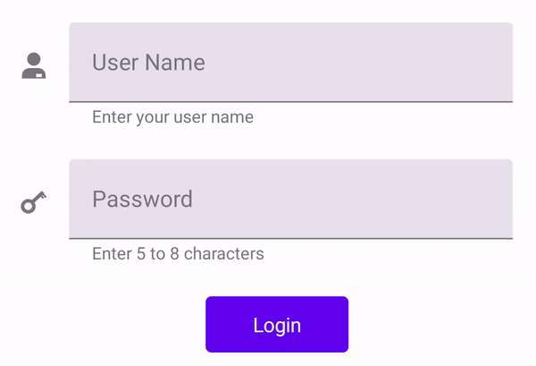

# .NET MAUI Text Input Layout (SfTextInputLayout) Overview

The text input layout adds decorative elements like floating labels, icons, and assistive labels on top of input views such as [`Entry`](https://learn.microsoft.com/en-us/dotnet/maui/user-interface/controls/entry) and [`Editor`](https://learn.microsoft.com/en-us/dotnet/maui/user-interface/controls/editor), [`SfAutocomplete`](https://help.syncfusion.com/maui/autocomplete/overview), [`SfComboBox`](https://help.syncfusion.com/maui/combobox/overview) controls.

## Key features

* Display floating label when the input view is focused.
* Display error label.
* Support filled and outlined container type.
* Display leading and trailing icons.
* Display help label.
* Password visibility toggling.