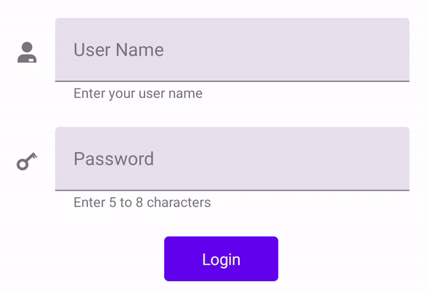

# .NET MAUI Text Input Layout (SfTextInputLayout) Overview

The text input layout adds decorative elements like floating labels, icons, and assistive labels on top of input views such as [`Entry`](https://learn.microsoft.com/en-us/dotnet/maui/user-interface/controls/entry) and [`Editor`](https://learn.microsoft.com/en-us/dotnet/maui/user-interface/controls/editor), [`SfAutocomplete`](https://help.syncfusion.com/maui/autocomplete/overview), [`SfComboBox`](https://help.syncfusion.com/maui/combobox/overview) controls.

## Business use cases

- Form-based applications that require structured and visually enhanced input fields for better usability.  
- Login and authentication screens that use floating labels and password visibility controls.  
- Data entry applications that provide validation messages and guidance using assistive labels.  
- Business applications that require consistent input styling across multiple form fields.  

## Key features

- **Floating label** allows displaying labels that move dynamically based on focus and input state.  
- **Error label** allows showing validation messages for incorrect or missing input.  
- **Container style** allows choosing between filled and outlined input styles.  
- **Leading and trailing icon** allows adding icons to enhance visual clarity and usability.  
- **Assistive label** allows displaying help or hint text below input fields.  
- **Password visibility** allows toggling password input visibility for better user experience.  

## Globalization

The following table summarizes the globalization support available in this control.

 Full Support   
 Not Applicable

<table>
<tr>
<th align="center">Control</th>
<th align="center">Localization</th>
<th align="center">RTL</th>
<th align="center">Time zone</th>
<th align="center">Screen reader</th>
<th align="center">Keyboard navigation</th>
</tr>
<tr>
<td><a href="/maui/textinputlayout/overview">Text Input Layout</a></td>
<td align="center"></td>
<td align="center"></td>
<td align="center"></td>
<td align="center"></td>
<td align="center"></td>
</tr> 
</table>

## Related controls

- [Masked Entry](https://help.syncfusion.com/maui/masked-entry/overview) for formatted and validated text input.  
- [Numeric Entry](https://help.syncfusion.com/maui/numericentry/overview) for numeric data input with formatting support.
- [ComboBox](https://help.syncfusion.com/maui/combobox/overview) for selection-based input with dropdown functionality.  

## See Also

Explore further resources:

- [Getting Started](https://help.syncfusion.com/maui/textinputlayout/getting-started) shows a step‑by‑step guide to begin using the Text Input Layout control.  
- [Font Customization](https://help.syncfusion.com/maui/textinputlayout/custom-font) explains how to adjust fonts to match the app’s style.  
- [States & Colors](https://help.syncfusion.com/maui/textinputlayout/states-and-colors) helps apply colors and states to give clear visual feedback.  
- [UI Kit](https://www.syncfusion.com/demos/maui#maui-ui-control) provides interactive demos and ready‑made UI examples.

## Resources

<!-- Card 1 -->
<a href="https://www.syncfusion.com/maui-controls/maui-textinputlayout" class="form-card" target="_blank">
  

    <h3 class="form-title">Feature Tour</h3>
    

      Walk through highlights and core capabilities.
    

  

</a>
<!-- Card 2 -->
<a href="https://github.com/syncfusion/maui-demos/tree/master/MAUI/TextInputLayout" class="form-card" target="_blank">
  

    <h3 class="form-title">Showcase Samples</h3>
    

      Explore sample scenarios for real apps.
    

  

</a>
<!-- Card 3 -->
<a href="https://www.syncfusion.com/tutorial-videos/maui/textinputlayout" class="form-card" target="_blank">
  

    <h3 class="form-title">Tutorial Videos</h3>
    

      Step‑by‑step guidance through video tutorials.
    

  

</a>
<!-- Card 4 -->
<a href="https://support.syncfusion.com/kb/cross-platforms/category/76" class="form-card" target="_blank">
  

    <h3 class="form-title">Explore KB's</h3>
    

      Find quick solutions and step‑by‑step guidance.
    

  

</a>
<!-- Card 5 -->
<a href="https://www.syncfusion.com/blogs/category/net-maui" class="form-card" target="_blank">
  

    <h3 class="form-title">Explore Blogs</h3>
    

      Read insights, tutorials, and developer journeys.
    

  

</a>
