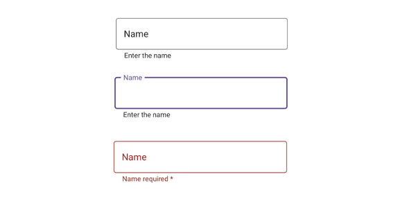
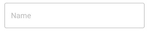

# States and Colors in .NET MAUI Text Input Layout (SfTextInputLayout)

Use the visual state manager to change the [Stroke](https://help.syncfusion.com/cr/maui/Syncfusion.Maui.Core.SfTextInputLayout.html#Syncfusion_Maui_Core_SfTextInputLayout_Stroke) properties based on the visual states set from the code. The applicable visual states are normal, focused, and error.

Based on the states, the colors will be applied to the floated hint label and borders. So, when the input view is in a focused state, the focused state [Stroke](https://help.syncfusion.com/cr/maui/Syncfusion.Maui.Core.SfTextInputLayout.html#Syncfusion_Maui_Core_SfTextInputLayout_Stroke) will be applied; it is similar to other states also. The current stroke can be obtained from the [CurrentActiveColor](https://help.syncfusion.com/cr/maui/Syncfusion.Maui.Core.SfTextInputLayout.html#Syncfusion_Maui_Core_SfTextInputLayout_CurrentActiveColor) property.

N> The error color will not be set to `CurrentActiveColor` when the `HasError` property is set to `true.`

## Stroke
The [Stroke](https://help.syncfusion.com/cr/maui/Syncfusion.Maui.Core.SfTextInputLayout.html#Syncfusion_Maui_Core_SfTextInputLayout_Stroke) property value will be applied to the hint label and border of the SfTextInputLayout.

I> Cursor color of the input view will be same as the `Accent` color of the application in each platform.

 

 

<inputLayout:SfTextInputLayout Hint="User name" 
                               Stroke="#00AFA0"
                               HelperText="Enter your name"
    <VisualStateManager.VisualStateGroups>
        <VisualStateGroupList>
            <VisualStateGroup x:Name="CommonStates">
                    <VisualState Name="Normal">
                        <VisualState.Setters>
                            <Setter Property="Stroke" Value="#79747E"/>
                        </VisualState.Setters>
                    </VisualState>
                    <VisualState Name="Focused">
                        <VisualState.Setters>
                            <Setter Property="Stroke" Value="#6750A4"/>
                        </VisualState.Setters>
                    </VisualState>
                    <VisualState Name="Error">
                        <VisualState.Setters>
                            <Setter Property="Stroke" Value="#B3261E"/>
                        </VisualState.Setters>
                    </VisualState>
            </VisualStateGroup>
        </VisualStateGroupList>
    </VisualStateManager.VisualStateGroups>
    <Entry />
</inputLayout:SfTextInputLayout>  
 


 

var inputLayout = new SfTextInputLayout();
inputLayout.Hint = "User name";
inputLayout.ErrorText = "User name available";
inputLayout.Content = new Entry(); 

VisualStateGroupList visualStateGroupList = new VisualStateGroupList() { };

VisualStateGroup visualStateGroup = new VisualStateGroup();

visualStateGroup.Name = "CommonStates";

VisualState normalState = new VisualState() { Name = "Normal" };
Setter normalStrokeSetter = new Setter() { Property = StrokeProperty, Value = Color.FromArgb("#79747E") };
normalState.Setters.Add(normalStrokeSetter);

VisualState focusedState = new VisualState() { Name = "Focused" };
Setter focusedStrokeSetter = new Setter() { Property = StrokeProperty, Value = Color.FromArgb("#6750A4") };
focusedState.Setters.Add(focusedStrokeSetter);

VisualState errorState = new VisualState() { Name = "Error" };
Setter errorStrokeSetter = new Setter() { Property = StrokeProperty, Value = Color.FromArgb("#B3261E") };
errorState.Setters.Add(errorStrokeSetter);

visualStateGroup.States.Add(normalState);
visualStateGroup.States.Add(focusedState);
visualStateGroup.States.Add(errorState);

visualStateGroupList.Add(visualStateGroup);

Setter mainSetter = new Setter() { Property = VisualStateManager.VisualStateGroupsProperty, Value = visualStateGroupList };

var style = new Style(typeof(SfTextInputLayout));

style.Setters.Add(mainSetter);

Resources = new ResourceDictionary() { style };

inputLayout.Style = style;





## Disabled state

The text input layout is disabled by setting the [IsEnabled](https://help.syncfusion.com/cr/maui/Syncfusion.Maui.Core.SfTextInputLayout.html#Syncfusion_Maui_Core_SfTextInputLayout_IsEnabled) property to `false.` The color of the container and other UI elements will also be changed to the disabled state, but its color cannot be customized.

 

 

<inputLayout:SfTextInputLayout Hint="Name" 
                               IsEnabled="false">
    <Entry />
</inputLayout:SfTextInputLayout>  
 


 

var inputLayout = new SfTextInputLayout();
inputLayout.Hint = "Name";
inputLayout.IsEnabled = false;
inputLayout.Content = new Entry(); 





## Container color
The color of the container can be customized by setting the [ContainerBackground](https://help.syncfusion.com/cr/maui/Syncfusion.Maui.Core.SfTextInputLayout.html#Syncfusion_Maui_Core_SfTextInputLayout_ContainerBackground) property. It is applicable when the [ContainerType](https://help.syncfusion.com/cr/maui/Syncfusion.Maui.Core.SfTextInputLayout.html#Syncfusion_Maui_Core_SfTextInputLayout_ContainerType) property is set to [Filled](https://help.syncfusion.com/cr/maui/Syncfusion.Maui.Core.ContainerType.html#Syncfusion_Maui_Core_ContainerType_Filled) and [Outlined](https://help.syncfusion.com/cr/maui/Syncfusion.Maui.Core.ContainerType.html#Syncfusion_Maui_Core_ContainerType_Outlined).

### Filled

The color of the container is customized when the [ContainerType](https://help.syncfusion.com/cr/maui/Syncfusion.Maui.Core.SfTextInputLayout.html#Syncfusion_Maui_Core_SfTextInputLayout_ContainerType) is [Filled](https://help.syncfusion.com/cr/maui/Syncfusion.Maui.Core.ContainerType.html#Syncfusion_Maui_Core_ContainerType_Filled).

 

 

<inputLayout:SfTextInputLayout Hint="Name" 
                               Stroke="#0450C2"
                               ContainerType="Filled"
                               ContainerBackground="#E6EEF9">
    <Entry />
</inputLayout:SfTextInputLayout>  
 


 

var inputLayout = new SfTextInputLayout();
inputLayout.Hint = "Name";
inputLayout.Stroke = Color.FromHex("#0450C2");
inputLayout.ContainerBackground = Color.FromHex("#E6EEF9");
inputLayout.ContainerType = ContainerType.Filled;
inputLayout.Content = new Entry() { Text = "John" }; 





### Outlined

The color of the container is customized when the [ContainerType](https://help.syncfusion.com/cr/maui/Syncfusion.Maui.Core.SfTextInputLayout.html#Syncfusion_Maui_Core_SfTextInputLayout_ContainerType) is [Outlined](https://help.syncfusion.com/cr/maui/Syncfusion.Maui.Core.ContainerType.html#Syncfusion_Maui_Core_ContainerType_Outlined).

 

 

<inputLayout:SfTextInputLayout Hint="Name" 
                               Stroke="#0450C2"
                               ContainerType="Outlined"
                               ContainerBackground="#E6EEF9">`
    <Entry  />
</inputLayout:SfTextInputLayout>  
 


 

var inputLayout = new SfTextInputLayout();
inputLayout.Hint = "Name";
inputLayout.ContainerType = ContainerType.Outlined;
inputLayout.Stroke = Color.FromHex("#0450C2");
inputLayout.ContainerBackgroundColor = Color.FromHex("#E6EEF9");
inputLayout.Content = new Entry(); 





## Customizing the text color of label

You can customize the text color of the `hint` label, `helper` label, and `error` label using the [TextColor](https://help.syncfusion.com/cr/maui/Syncfusion.Maui.Core.LabelStyle.html#Syncfusion_Maui_Core_LabelStyle_TextColor) property of the [LabelStyle](https://help.syncfusion.com/cr/maui/Syncfusion.Maui.Core.LabelStyle.html).

 

 

<inputLayout:SfTextInputLayout Hint="Name" 
                               ContainerType="Outlined"
                               HelperText="Enter your name"
                               ErrorText="Invalid text">
        
    <inputLayout:SfTextInputLayout.HintLabelStyle>
        <inputLayout:LabelStyle TextColor="Green"/>
    </inputLayout:SfTextInputLayout.HintLabelStyle>
    <inputLayout:SfTextInputLayout.HelperLabelStyle>
        <inputLayout:LabelStyle TextColor="Blue"/>
    </inputLayout:SfTextInputLayout.HelperLabelStyle>
    <inputLayout:SfTextInputLayout.ErrorLabelStyle>
        <inputLayout:LabelStyle TextColor="Maroon"/>
    </inputLayout:SfTextInputLayout.ErrorLabelStyle>
        
    <Entry Text="John" />
        
</inputLayout:SfTextInputLayout>  
 


 

SfTextInputLayout inputLayout = new SfTextInputLayout();
inputLayout.Hint = "Name";
inputLayout.ContainerType = ContainerType.Outlined;
inputLayout.HelperText = "Enter your name";
inputLayout.ErrorText = "Invalid text";
inputLayout.Content = new Entry();

inputLayout.HintLabelStyle = new LabelStyle() { TextColor = Color.Green };
inputLayout.HelperLabelStyle = new LabelStyle() { TextColor = Color.Blue };
inputLayout.ErrorLabelStyle = new LabelStyle() { TextColor = Color.Maroon };





